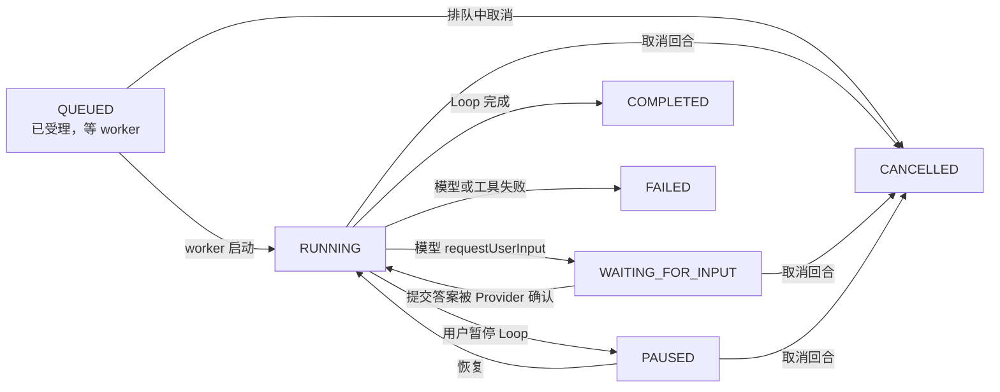
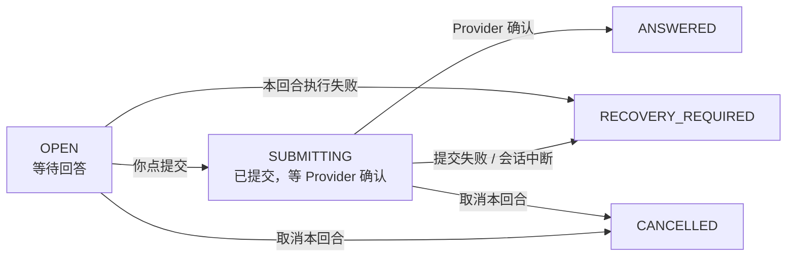
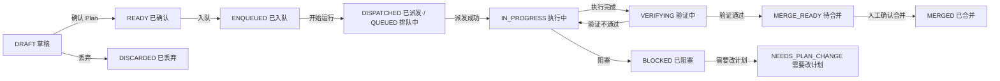
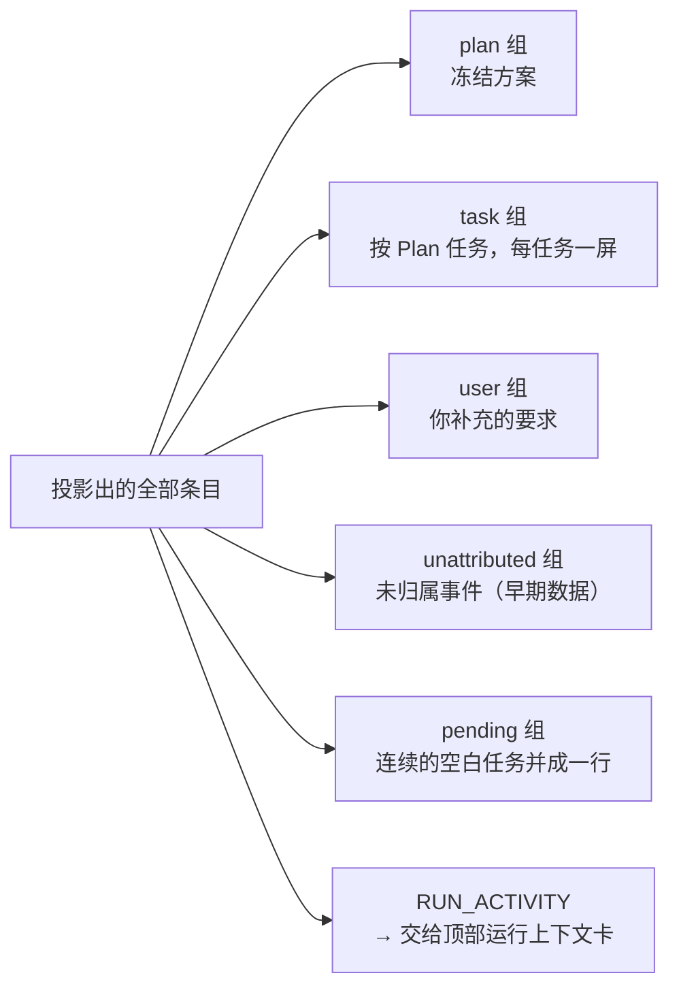
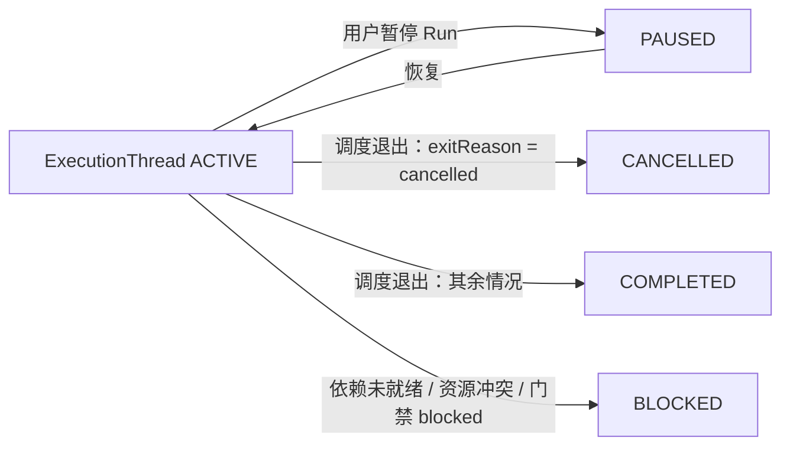
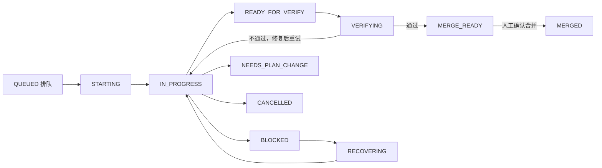
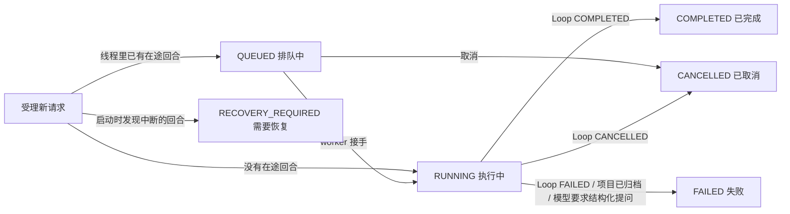
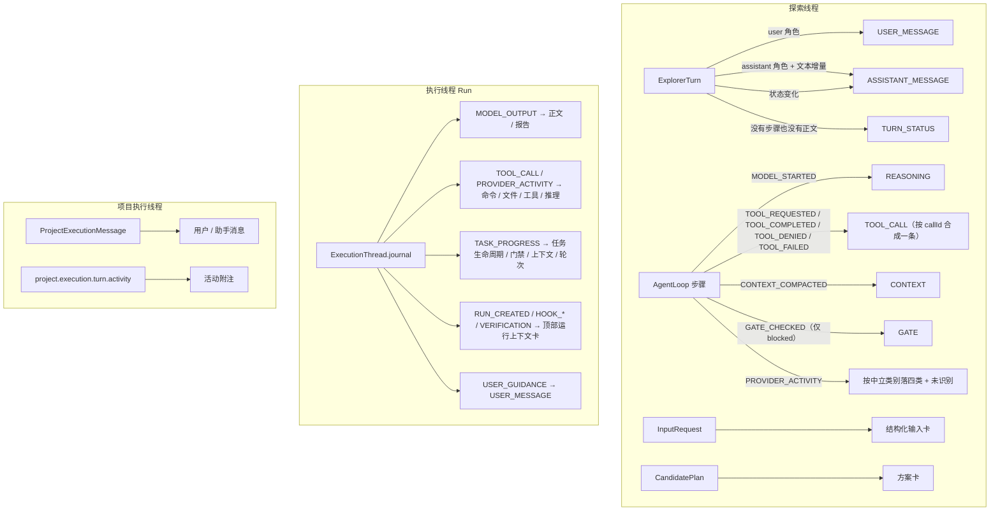
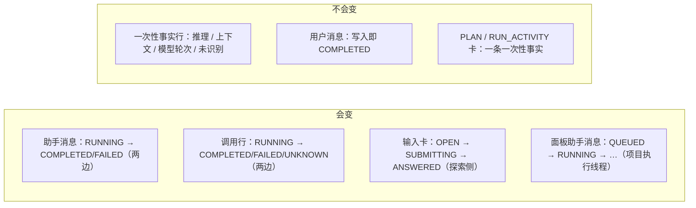

# 消息类型及事件状态机流程图

> 一份**以实现为准**的清点：探索线程与执行线程的对话框里一共有多少种消息类型，每一种是干什么用的、什么时候会出现、由哪个组件渲染，以及有多态的类型的完整状态机。
>
> 代码基线：分支 `main-artechure-switch-claude`。行号会随改动漂移，符号名不会。
> 关键文件：`code/apps/web/src/utils/conversationTypes.ts`（两条线共用的词表）、`utils/explorerPresentation.ts`、`utils/executionStream.ts`、`views/ExplorerView.vue`、`views/RunDetailView.vue`、`components/ProjectExecutionThreadPanel.vue`；领域侧 `packages/domain/src/explorer/explorer-activity.ts`、`agent/agent-loop.ts`、`agent/executor-agent.ts`、`agent/project-execution-thread.ts`。

---

## 0. 两个对话框 + 探索视图的一个模式

能发消息的界面一共三处，但**只有 A、B 是并列的对话框**，C 是探索视图自己的一个模式——
这个区别很要紧，因为 C 在一列抽屉/标签页里是找不到的：

| # | 界面位置 | 怎么进去 | 组件 | 数据源 | 消息类型数 |
|---|---|---|---|---|---|
| A | **探索对话** · 共享抽屉的「探索对话」tab | 左栏「探索」→ 需求清单里点某个需求的「探索中」 | `ExplorerView.vue` 的 `.timeline` | `ExplorerActivityItem` + `ExplorerInputRequest` + `Plan` | **15** |
| B | **Run 执行会话** ·「执行会话」 | 需求抽屉的「Run」页签，或 Run 详情页 | `RunDetailView.vue` 的 `.execution-conversation` | `ExecutionThread.journal` → `projectExecutionJournal()` | **18** |
| C | **项目执行线程** · 探索视图的**模式** | 左栏「探索」面板**顶部第一项**「项目执行线程 · 在项目目录中直接执行」 | `ProjectExecutionThreadPanel.vue` | `ProjectExecutionMessage` + activity 事件 | **2 类消息** ×6 状态 + 3 种活动行 |

合计 **33 种**消息类型（A + B；C 是另一套更简单的模型，单列在 §3）。

其中 **13 种是两条线共用的**（§4.4）：同一个概念在两边必须同一个名字、同一套中文文案。
剩下的是各自独有的——执行侧多出 Plan 任务、执行报告、Run 级事件与恢复流程，
探索侧多出结构化提问与候选方案，逐条理由见 §4.4。

**C 为什么算"模式"而不是第三个对话框**：它是同一个 `ExplorerView` 在路由参数
`?workspace=project-execution` 下的另一种形态——中间对话区换成面板、右侧需求面板隐藏、**连共享抽屉都不渲染**
（模板里抽屉写的是 `v-if="!projectExecutionMode"`）。它复用同一个左栏，所以入口就在左栏里，而不是某个新标签页。
点左栏线程清单里任意一个线程即可退出该模式（`explorerRouteQuery` 会删掉 `workspace` 参数）。

A 与 B 已经做到「**消息类型 → 呈现方式**只由一张表决定」，视图不自己判断某类要不要显示；C 还没有这张表。

> **「呈现方式」= 代码里的 `ExecutionDisplayMode`**：这一类消息渲染成什么样。
> 它是穷举的：表里列出的取值就是全部取值，视图只按它渲染，不自己判断也不新增分支。

| 界面 | 清单表 | 取值 |
|---|---|---|
| A | `EXPLORER_DISPLAY_MODES` | `card` 卡片 / `text` 纯文本一行（你说的）/ `prose` 铺开的正文（模型回复）/ `tool` 调用行 / `reasoning` 推理行 / `divider` 分隔行 / `gate` 判定行 / `turn-status` 状态行 / `hidden` 不渲染 |
| B | `EXECUTION_DISPLAY_MODES` | `card` 卡片 / `text` 纯文本一行 / `line` 紧凑一行 / `folded` 折进 details / `hidden` 不渲染 |
| C | 无（按角色 + 状态渲染，活动行在 `activityLabel()` 里分三支） |

> 两张表的**取值刻意不同**：A 是平铺时间线，没有"步骤"这一层可以折叠，所以它的行型按**语义**分
> （推理、调用、判定各是一种行）；B 按任务分组、组尾本来就有 details，所以它的行型按**占多少地方**分。
> 相同的是**名字**：`card` / `text` / `hidden` 两边同义，共用词表里的每一类在两边都有且只有一行。
>
> A 那边的 `text` 与 `prose` 是同一档重量（都是铺开的正文，都不套气泡）：`text` 靠右带 `›`，是你说的；
> `prose` 靠左带一行 meta，是模型说的。分开两个取值是因为**助手消息是少数会变的那一类**，
> 它那一行状态标签与内嵌方案卡得有地方摆——把两者合成一个取值，渲染就得再按 kind 分叉。

---

## 1. 探索线程（对话框 A）：15 种

时间线不是"一条条原始事件"，而是**投影**出来的，分两步：

1. `projectExplorerActivity()`（领域侧）把 Turn / Loop 步骤 / Provider 活动算成一串**活动条目**——
   相邻的文本增量合成一条助手消息、**同一次调用的开始与结束合成一条调用**、
   Provider 的回声与没信息量的判定不产出条目。这一步在 §1.3 展开。
2. `buildExplorerTimeline()`（web）把**活动条目**与**结构化输入卡**按时间合成一条线，
   渲染前先用 `EXPLORER_DISPLAY_MODES` 过一遍隐显。

「侧」这一列是**它在对话框里靠哪边**：`用户侧` 靠右（你自己说的），`线程侧` 靠左（模型与它的过程）。

> **Provider** 指上游的模型服务（本项目默认是 Codex App Server）。文中的"Provider 活动"是它回传的
> 工具调用 / 推理 / 命令等事件，与 Factory 自己记的 `AgentLoop` 步骤是两条来源、可能描述同一件事。
> 下文简称 **Loop** 的，就是这次模型循环——一个探索回合、或一个 Run 内部，由多次模型步骤组成的那个循环。

### 1.1 清单表

| # | 类型 | 侧 | 呈现方式 | 作用 | 什么时候出现 |
|---|---|---|---|---|---|
| 1 | `USER_MESSAGE` | 用户侧 | `text` | 你发出的那条消息（需求描述就是它） | 你每次发送消息 |
| 2 | `ASSISTANT_MESSAGE` | 线程侧 · 模型 | `prose` | Plan Explorer 的正文 | 模型每产出一段文本 |
| 3 | `CANDIDATE_PLAN` | 线程侧 · 模型 | `card` | 助手消息里**内嵌**的候选方案卡 | 该回合产出了 Plan 且绑定到这条消息 |
| 4 | `INPUT_REQUEST` | 两侧 | `card` | 结构化输入卡（提问 + 回答 + 当前状态） | 模型用原生 requestUserInput 反问 |
| 5 | `REASONING` | 线程侧 · 模型 | `reasoning` | 模型在思考 / Provider 的推理流 | `MODEL_STARTED` 步骤，或 Provider 的中立类别 `reasoning` |
| 6 | `COMMAND` | 线程侧 · 模型 | `tool` | 跑了一条命令 | Provider 的中立类别 `command` |
| 7 | `FILE_CHANGE` | 线程侧 · 模型 | `tool` | 改动了文件 | Provider 的中立类别 `file-change` |
| 8 | `TOOL_CALL` | 线程侧 · 模型 | `tool` | 一次工具调用**的完整生命周期**——开始 → 完成 / 被拒 / 失败是同一条，不是几条 | `TOOL_REQUESTED` 等步骤，或 Provider 的中立类别 `tool` |
| 9 | `MCP_CALL` | 线程侧 · 模型 | `tool` | MCP 服务端的调用 | Provider 的中立类别 `mcp` |
| 10 | `UNCLASSIFIED` | 线程侧 · 模型 | `turn-status` | 认不出来的 Provider 活动 | Provider 的中立类别是 `other`（标签直接摆原生 `itemType`） |
| 11 | `CONTEXT` | 线程侧 · **Factory** | `divider` | 上下文在这里被压缩了一轮 | 每轮 Loop 结束时写一条 |
| 12 | `GATE` | 线程侧 · **Factory** | `gate` | 终止门禁**拦下了这一步** | 门禁判定为 `blocked` 时（其余的判定不占位，见 §1.3） |
| 13 | `TURN_STATUS` | 线程侧 · **Factory** | `turn-status` | 模型轮次的状态行 | `MODEL_COMPLETED` 步骤，或回合既没有步骤也没有正文时 |
| 14 | `PROVIDER_MESSAGE` | —— | `hidden` | Provider 把你那句话回显一次 | 探索侧不渲染：用户消息本身就在时间线上 |
| 15 | `SESSION` | —— | `hidden` | Provider 会话重建 | 探索侧不渲染 |

**「侧」这一列其实有两个层次**：左右（你 / 线程）由布局表达——右侧 `›`、左侧行首一个蓝点；
线程侧里再分**模型**与 **Factory** 两个产者，由行首标签表达（Factory 的那三类写成
`Factory · 执行门禁` / `Factory · 上下文压缩` / `Factory · 模型轮次`，模型那一侧不点名）。
判据是"这是谁说/做的，还是 Factory 自己记的"：终止门禁、上下文压缩、轮次标记与调度占位都是
Factory 的机械记录，挂上线程的名字会把工厂的记录说成模型的发言。

> 14、15 标 `hidden` 是**兜底**：它们的内容在时间线上已经有了（你那句话、回合状态）。
>
> 曾经还有第 16、17 种 `INPUT_REQUIRED` / `INPUT_RESOLVED`（结构化输入的生命周期行）。它们已经被
> **整张输入卡（4）取代**，而且是**到达不了**、不是"偶尔兜一下"：`agent-loop` 写下 `INPUT_REQUIRED`
> 步骤的**同一次调用**里就 emit 了 `agent.input.required`，`thread-service` 收到后立刻落一条
> `input_requests` 行。也就是说只要这两条步骤存在，同一需求里必然有那张卡；而卡上提问、回答、
> 状态俱全，那两行各自只剩一句"有 N 个问题在等" / "你的选择已提交"。实测本机库 **29/29** 个
> 有这两类步骤的回合都有对应的输入请求行。已连同类型、标签、与 `buildExplorerTimeline` 的过滤集
> 一起删掉。
>
> 曾经还有 `plan-created`（游离方案卡），只在"方案没绑到任何一条助手消息"时出现；
> 现代代码里绑不上是不可能的，已删除——见 §5 最后一条。

### 1.2 逐个：含义、呈现、示例

**① `USER_MESSAGE` — 你发的消息**
- **含义**：`ExplorerTurn` 里 `role: "user"` 的那条，原文照存。**需求描述就是这条消息本身**——
  此前时间线顶部另有一张"需求 N / 标题 / 摘要"卡，三行里有两行是同一句话（标题由最新那条用户消息生成），
  第三行又和对话里那条消息重复，已删除；需求序号与标题在左侧清单与抽屉标题上都有。
- **组件**：`<article class="timeline-user-text">`，一个 `›` 记号加上正文本身（`MarkdownMessage`，不折叠、不截断）。
  **没有头像、没有卡片、没有展开按钮**——用户输入是一行原文，不是一份要点提要。整行**靠右**。

```
                                                           › 把探索侧那 8 类活动各行拉开呈现
                                                                                         16:00
```

**② `ASSISTANT_MESSAGE` — Plan Explorer 的正文**
- **含义**：模型在一个回合里的输出。**相邻的文本步骤合并成一张卡片**；中间夹了工具 / 门禁 / Provider 活动就另起一条。
  （步骤本身的落库粒度是"一个文本段一条"，不是每次刷新一条——见 §7。**边界判据是"中间夹了别的步骤"，
  不是"上一条产出了什么"**：门禁这类不再产出条目的步骤同样是接缝，这也是写侧封段与读侧分气泡逐字一致的前提。）
- **组件**：`<article class="timeline-assistant-prose">` —— **正文直接铺开，不套气泡**（与用户消息同一档重量：
  白底边框不承载任何信息）。上面留一行 meta（**线程侧标记点** + 名字 + 状态标签 + 时间），因为这是探索侧少数
  **会变**的类型，"还在跑 / 失败"得有地方说；内嵌的候选方案卡（③）也挂在这一块里。
  状态标签三态：`进行中` / `已完成` / `失败`——它是 **`el-tag`**（`size="small" effect="light"`）。
  正文先过 `readableAssistantText()` 剥掉 Plan 协议块。
- **那行开头的蓝点是"线程侧"的记号**（`.thread-mark`）：用户消息靠右、以 `›` 起头，线程侧就靠左、
  以这个点起头。**线程侧的每一行都有它**——正文、推理、调用、以及 Factory 自己记的那三类都是同一个点，
  所以"这一条是这一侧产生的"一眼可见；`RUNNING` 时它闪动，表示这一轮还在跑。
  再往里一层"是模型还是 Factory"，由行首标签说（见 §1.1 的注解）。

```
●  Plan Explorer   [已完成]   16:01
先看现有的活动投影，再决定每类各摆什么。
```

**③ `CANDIDATE_PLAN` — 内嵌候选方案卡**
- **含义**：这条助手消息产出的 Plan 契约摘要。
- **组件**：助手消息内的 `<div class="inline-plan-card">`，卡片顶部一行小字标「候选方案 · 第 n 版」，带 `.candidate-stats` 四格统计和 `View full plan` / `Confirm plan` 按钮。

```
   候选方案 · 第 3 版                                 [草稿]
   探索侧活动行各自成行
   执行步骤 4 │ Scope entries 2 │ Verification 1 checks │ Merge Human review
   [View full plan]  [Confirm plan]
```

**④ `INPUT_REQUEST` — 结构化输入卡**
- **含义**：模型反问 + 你的回答 + 这一问当前的状态，三者合成一张卡，按**提问时间**插进时间线（回答时间只显示在卡内）。
- **组件**：`<article class="input-request-card timeline-input-request">` + `.input-stream-questions`；有待答问题时行尾出现「回答」按钮，点开 `ExplorerInputDialog`（固定尺寸 `el-dialog`）。

```
✔  Plan Explorer input   [已回答]
   问题生成 10:02    回答提交 10:04
   本轮结构化问题与回答已按原始时间线保留。
   问题与回答
   1  Goal   What should we build?      回答：A
```

**⑤ `REASONING` — 推理行**
- **含义**：模型在思考，或 Provider 的推理流。是背景音，不是内容。
- **组件**：`<article class="timeline-note">`，行首是那个**线程侧标记点**（`进行中` 时闪动）+ 一行灰字；超长截断，无边框无卡片。
- **一次推理只占一行**：Provider 对同一次推理会报两次（`phase: started` / `completed`），投影按 `itemId` 合成一条，
  状态从"进行中"迁到"已完成"。实测本机库：推理那 850 行只是 425 次推理。
- **没有说明时**：`MODEL_STARTED` 这类只有"这一轮跑起来了"的标记**正文留空**，行首退回标签 `推理`——
  纯文本行空着就只剩一个点和时间，而补一句 `Plan Explorer started step 3.` 是把"有没有说明"这个可判定的事实
  变成一句要靠字符串识别才能认出的文案。

```
●  推理                                                        16:02
●  推理                                                        16:03
```

**⑥⑦⑧⑨ `COMMAND` / `FILE_CHANGE` / `TOOL_CALL` / `MCP_CALL` — 调用行**
- **含义**：一次调用。四类的区别只是**在跑什么**：命令、改文件、普通工具、MCP 服务端。**开始与结束是同一条**（见 §1.3 C）。
- **分类判据是 Provider 的"中立类别"（`command` / `file-change` / `tool` / `mcp`），不是 `itemType` 的子串**——
  后者曾把 `userMessage`（Provider 把你那句话回显一次）与 `plan`（整篇规划文档）都渲染成"Tool started / Tool completed"。
- **组件**：`<article class="loop-activity-card activity-tool">`，图标盒 + 标签（`<strong>`）+ **名字**（等宽 `<code>`）+ 时间 + **状态标签**（`el-tag`）+ 正文 + 调用 id（等宽 `<code>`，灰色）。图标只由状态决定：完成是成功、失败与"状态未知"是警告、进行中是信息。
- **名字与正文只摆一次**：Provider 只在 `summary` 里给了内容时（命令原文、文件路径），它就是名字，正文留空；
  名字另外给出来时，`summary` 才是正文。没有可说的就留空——不补"Provider activity completed."这种句子（见 §5）。
- **结束事件没记下来时**：回合已经不在跑、而这条调用没有结束事件，标成 `状态未知` + 「未记录调用的结束状态。」，
  不一直显示"进行中"。

```
⚙  命令   /bin/zsh -lc "pwd && git status --short"    16:04  [已完成]
   exec-995fe9c5-b2e5-493a-a841-b19ff68bd192

✓  工具调用   read_file                                16:05  [已完成]
   call-read-1

⚠  工具调用   shell                                    16:06  [失败]
   策略不允许写仓库目录以外的文件。
   call-write-1

ⓘ  MCP 调用   github/create_issue                      16:07  [已完成]
   已创建 issue #42：活动行需要各自成行
   item-mcp-1
```

**⑩ `CONTEXT` — 分隔行（Factory 的）**
- **含义**：Loop 把上下文压缩后继续。它是会话边界，不是事件。
- **组件**：`<article class="timeline-divider">`，左右两条横线夹一个标签 + 时间；标签里带着线程侧标记点，
  并写明 `Factory · 上下文压缩`——它是 Factory 记的，不是模型说的。

```
——————  ● Factory · 上下文压缩 · 18 条消息  ——————  16:10
```

**⑪ `GATE` — 门禁判定行（Factory 的）**
- **含义**：Factory 自己的终止门禁**拦下了这一步**（`action: blocked`）。放行与继续不占位。
- **为什么只留拦截**：实测本机库 90 条判定里 `complete` 51 / `continue` 39 / **`blocked` 0**——
  每轮都写一行"一切正常"是刷屏，而"这一轮为什么停下"已经由助手正文上的状态标签说清了。
- **组件**：`<article class="loop-activity-card activity-gate">`，左侧带一道竖线，判定动作单独占一格。

```
│ ⚠  Factory · 执行门禁  blocked    16:09  [失败]
│    连续两步没有进展，停下等人确认。
```

**⑫ `TURN_STATUS` — 模型轮次行（Factory 的）**
- **含义**：**模型轮次**（model step）结束的标记（`MODEL_COMPLETED`），或回合既没有步骤也没有正文时的占位
  （"正在处理 / 等待输入 / 已排队"）。标签写 `Factory · 模型轮次`——它是 Factory 记的时间点，不是模型说的话；
  叫"回合状态"会让人以为整个回合结束了，而回合的完成度由助手正文那张卡上的状态标签说。
- **组件**：`<article class="loop-activity-card activity-turn-status">`，虚线边框、透明底，比调用行更淡；
  正文留空——状态标签已经说了这一轮怎么了，不必再补一句 `The model step completed.`。

```
ⓘ  Factory · 模型轮次   16:12  [已完成]
```


### 1.3 状态机

探索侧只有**三类**消息真的会「变」：助手消息、结构化输入卡，以及**一次调用**（`TOOL_CALL` / `COMMAND` /
`FILE_CHANGE` / `MCP_CALL` / `REASONING`）——它们从"进行中"迁到结束态，所以是**一条**。
其余的活动行是**一次性的投影**：一条 Loop 步骤产出一行，状态在产生时就固定，不会再迁移
（同一件事出现第二行，是又发生了一次）。理解这一点，下面的图才有意义。

#### A. 助手消息（由 `ExplorerTurn.status` 驱动）

回合状态存在 `ExplorerTurn` 上，投影时由 `assistantActivityStatus()` **映射成**活动行的 4 种标签。



| 回合状态 | 卡片上的标签 | 触发条件 |
|---|---|---|
| `QUEUED` | `等待中` | 回合已受理但 worker 还没接手 |
| `RUNNING` | `进行中` | 开始执行；也是「等待输入结束」的回归态 |
| `WAITING_FOR_INPUT` | `等待中` | 模型发起结构化提问 |
| `PAUSED` | `进行中` | 用户暂停 Loop |
| `COMPLETED` | `已完成` | Loop 正常结束 |
| `FAILED` | `失败` | 模型调用失败 / 启动恢复判定为中断 |
| `CANCELLED` | `已完成` | 用户取消 |

> 注意 `PAUSED` 在界面上仍显示 `进行中`——`assistantActivityStatus` 只把它归到 4 种里的 RUNNING，暂停感只体现在头部状态卡。

#### B. 结构化输入卡（5 个服务端状态 + 1 个只在浏览器里的临时状态）



| 状态 | 卡片文案 | 触发条件 | 下一个状态 |
|---|---|---|---|
| `OPEN` | 等待回答 | 模型提问，写入 `input_requests` | `SUBMITTING` / `CANCELLED` / `RECOVERY_REQUIRED` |
| `SUBMITTING` | 提交中 | 你提交答案，服务端标记 | `ANSWERED` / `RECOVERY_REQUIRED` / `CANCELLED` |
| `ANSWERED` | 已回答 | Provider 确认收到答案 | 终态 |
| `CANCELLED` | 已取消 | 取消回合（`cancelTurn`） | 终态 |
| `RECOVERY_REQUIRED` | 需要恢复 | 提交失败、回合失败、或启动时发现未闭合请求 | 终态（需人工恢复） |

另外有一个**不落库（不写进数据库）的客户端状态**：提交后、服务端还没变 `SUBMITTING` 之前，前端用 `inputAnswerInFlight` 抢先显示 `提交中`（`inputStatusLabel` 的第二个参数）。它只存在于浏览器内存，刷新即消失。

#### C. 一次调用为什么只占一行（其余活动行的状态机）

**「一次调用」的生命周期是 `TOOL_REQUESTED → TOOL_COMPLETED` 两端，投影把它们合成一条**，后到的事件覆盖
状态与正文。身份键是 Loop 步骤的 `callId`、Provider 活动的 `itemId`——同一套合并规则执行侧早就在用
（`projectExecutionJournal` 的 `TOOL_CALL` / `PROVIDER_ACTIVITY` 两个分支），探索侧此前没有，于是同一个工具永远占两行。

合并时两条各只说了一半：**名字（工具名）只有开始那一条有，原因（被拒 / 失败 / 结束状态没记下来）只有结束那一条有**，
所以名字留住先到的、正文覆盖成后到的。

| 类型 | 状态集合 | 说明 |
|---|---|---|
| `COMMAND` / `FILE_CHANGE` / `TOOL_CALL` / `MCP_CALL` | RUNNING → COMPLETED / FAILED / UNKNOWN | **一条**的生命周期：开始给 RUNNING，结束按 Provider 的中立成败给 COMPLETED / FAILED；回合已经不在跑却始终没有结束事件，给 UNKNOWN（"没记录到它是怎么结束的"，不是失败） |
| `REASONING` | RUNNING → COMPLETED | Provider 对同一次推理报两次，同样按 `itemId` 合成一条；它没有成败概念，回合结束时按"流结束了"收尾 |
| `CONTEXT` | COMPLETED | 一次事实 |
| `GATE` | FAILED | 只有 `action: blocked` 会产出条目，所以只有一种状态 |
| `TURN_STATUS` | RUNNING / WAITING / FAILED / COMPLETED | 由回合状态或 `MODEL_COMPLETED` 决定；标签写 `Factory · 模型轮次` |

`TOOL_FAILED` 与 `TOOL_NEEDS_RECONCILIATION` 这两个步骤类型**此前在探索时间线上连一行都没有**
（投影里没有分支，静默掉了）——也就是"工具失败了"看不见。现在它们与 `TOOL_DENIED` 一样落进同一条
`TOOL_CALL`，状态为失败、原因进正文。

#### D. 方案卡（`CANDIDATE_PLAN`）

卡片本身无状态机，它显示的是 **Plan 的生命周期状态**（右上角 el-tag）。这个状态由多个写入点推进（`updatePlanStatus` 只是带 `fromStatus → toStatus` 事件写库，**没有集中的转换表**）：



卡片上还会因 Plan 是「对话产物」而多一条警告（`candidate-notice`）：这种 Plan 确认后仍不能入队执行。

**这一格里的文案（含右上角 `el-tag` 的文字与颜色）只有一份定义**：文案在
`apps/web/src/utils/planStatus.ts` 的 `planStatusLabel`，语气色在 `utils/statusVisual.ts` 的
`PLAN_STATUS_TONES`。收拢之前同一个状态在界面上能有两三个词：

| 状态 | 曾经的三处 | 现在 |
|---|---|---|
| `DRAFT` | 抽屉里 `DRAFT`（**直接渲染枚举值**）、候选卡上 `Candidate`、工作台上 `Draft` | 草稿 |
| `READY` | `Confirmed` / `Ready` | 已确认 |
| `MERGE_READY` | `Ready for review` / `Needs review` | 待合并 |
| `MERGED` | `Merged` / `Merged` / **`Completed`**（生命周期条那一份另有一个词） | 已合并 |

> `PlanDetailContent.vue` 此前那句 `<el-tag>{{ plan.status }}</el-tag>` 是把**枚举值**端给用户看，
> 所以"View full plan"抽屉里显示的是 `DRAFT`；`statusVisual.ts` 则另有一张自己的文案表
> （`DRAFT: "Draft"` / `READY: "Ready"` / `MERGE_READY: "Needs review"`），与 `planStatusLabel`
> 早已漂成两套词——同一个 Plan 在抽屉里一个词、在工作台上另一个词。
> 现在后者只保留 PlanStatus **之外**的派发 / 等待状态，Plan 状态的文案一律从前者取
> （`statusVisual.test.ts` 钉住这条：源文件里不许再出现同名条目）。
>
> 这条与 §4.2 最后那条"文案也是同一套词"是同一条原则的另一半：**状态词在界面上只有一个来源**，
> 无论是探索侧、执行侧还是 Plan 侧。

> 上图只是主路径。`PlanStatus` 的完整取值是：`DRAFT` / `DISCARDED` / `DESIGNED` / `PLANNED` / `READY` / `ENQUEUED` / `DISPATCHED` / `QUEUED` / `IN_PROGRESS` / `VERIFYING` / `MERGE_READY` / `MERGED` / `BLOCKED` / `NEEDS_PLAN_CHANGE`——因为**没有集中的转换表**，中间几个状态由各自的写入点直接落库，读代码时不要假设上图的边是唯一路径。

> **已修 #1：方案卡曾经只在方案处于 `DRAFT` 或 `READY` 时出现。** 入队 / 派发之后卡片会从聊天流里
> 消失——不是被删了，是它压根进不了绑定表。链路是：
>
> 1. `allPlans` = candidate ∪ confirmedPlans ∪ enqueued ∪ dispatched；
> 2. `/confirmed-plans` **只返回 `status === "READY"`** 的 plan（服务端筛一次，web 又筛一次），
>    所以过了 READY 的 plan 只能从 `enqueued` / `dispatched` 两个桶进来，而这两个桶都来自 `/plans`；
> 3. `/plans` 的行由 `plan/service.ts` 的**查询投影路径**拼出（`decoratePlanRows` 只做 `...row`），
>    而查询投影表没有 `explorer_plan_id` 这一列，那条路径**没有复制 `explorerPlanId`**
>    ——同一个文件里从 `store.listPlans()` 出发的那条构造函数是复制的；
> 4. web 侧 `belongsToExplorerPlan(plan.explorerPlanId, activeExplorerPlanId)` 拿到 `undefined` 判否，
>    plan 被挡在 `activeTaskPlans` 之外 → `planBindings` 为空 → 助手消息里那张卡不渲染。
>
> **修法**：那一行里 `plan` 已经取到了，顺手带上 `plan.explorerPlanId`。**定位与修复都实测过**——
> 修前 `/plans` 返回的四条 MERGE_READY plan **连这个键都没有**，那条已合并的需求渲染 0 张卡；
> 修后四条都带上了值，同一需求渲染出 1 张候选方案卡。（`/confirmed-plans` 那批行一直是
> 完整的 `CandidatePlan` 对象，所以 READY 的方案从来不受影响。）

---

## 2. 执行线程（对话框 B）：Run 执行会话 — 18 种

**`ExecutionThread.journal` 是一次 Run 的只追加执行记录**（模型输出、工具调用、任务进度、验证、你补充的要求），
本节以下简称为 journal。

时间线不是「一条条事件」，而是 `projectExecutionJournal()` 对它的**投影**：合并重复、按 `callId` 合并工具调用、
把 Provider 原生词翻成中立类别，再按 Plan 任务分组。

「侧」这一列与 §1.1 同义：`用户侧` 靠右（你自己说的），`线程侧` 靠左（模型与它的过程）。

### 2.1 清单表

| # | 类型 | 侧 | 呈现方式 | 作用 | 什么时候出现 | 渲染组件 |
|---|---|---|---|---|---|---|
| 1 | `PLAN` | 线程侧 | `card` | 冻结方案摘要 | 每个 Run 一条（投影时前置） | `Plan 卡 + MarkdownMessage + 展开摘要` |
| 2 | `ASSISTANT_MESSAGE` | 线程侧 | `card` | Executor 在做什么、发现了什么 | `MODEL_OUTPUT` 里没有执行报告标记 | `MarkdownMessage` |
| 3 | `MODEL_REPORT` | 线程侧 | `card` | 结构化完成报告 | `MODEL_OUTPUT` 带 `<pipeline-factory-execution-report>` | `MarkdownMessage` |
| 4 | `USER_MESSAGE` | 用户侧 | `text` | **你**在执行线程里补充的要求 | `USER_GUIDANCE` | `› + MarkdownMessage`，无头像 |
| 5 | `COMMAND` | 线程侧 | `line` | 跑了一条命令 | Provider 活动 `activityKind: command` | 活动行（标题 + `detail`） |
| 6 | `FILE_CHANGE` | 线程侧 | `line` | 改动了文件 | Provider 活动 `activityKind: file-change` | 同上 |
| 7 | `TOOL_CALL` | 线程侧 | `line` | 工具调用 | Provider 活动 `tool`，或 `TOOL_CALL` | 同上 |
| 8 | `MCP_CALL` | 线程侧 | `line` | MCP 服务端的调用 | Provider 活动 `mcp` | 同上 |
| 9 | `REASONING` | 线程侧 | `folded` | 模型的推理摘要 | Provider 活动 `activityKind: reasoning` | `details` 折叠列表 |
| 10 | `PROVIDER_MESSAGE` | —— | `hidden` | Provider 回显的用户消息 | Provider 活动 `activityKind: message` | 不渲染 |
| 11 | `SESSION` | —— | `hidden` | Provider 会话重建 | Provider 活动 `activityKind: session` | 不渲染 |
| 12 | `TASK_LIFECYCLE` | 线程侧 | `line` | 任务开始 / 完成 / 阻塞 | `TASK_PROGRESS` 的 `task-lifecycle`、`task-status` | 活动行 |
| 13 | `GATE` | 线程侧 | `folded` | 执行门禁判定与暂停/恢复 | `agent.gate.checked`、`paused`、`resumed` | `details` 折叠列表 |
| 14 | `CONTEXT` | 线程侧 | `folded` | 上下文压缩、旧版修订提示 | `agent.context.compacted`、`legacy_plan_revision` | `details` 折叠列表 |
| 15 | `TURN_STATUS` | 线程侧 | `folded` | 模型轮次开始 / 结束 | `agent.step.started`、`agent.model.completed` | `details` 折叠列表 |
| 16 | `RUN_ACTIVITY` | —— | `card` | Run 级事件：创建、钩子、验证 | `RUN_CREATED` / `HOOK_*` / `VERIFICATION` | **不在会话里**，渲染在顶部「运行上下文」卡 |
| 17 | `UNCLASSIFIED` | 线程侧 | `folded` | 认不出来的活动 | 未知 `itemType` 或未知 journal 类型 | `details` 折叠列表 |
| 18 | `RECOVERY` | 线程侧 | `card` | 阻塞、取消、需要恢复 | `RECOVERY`、`state: BLOCKED/CANCELLED` | 活动行（红） |

> **第 16 类要在入口处理解**：`RUN_ACTIVITY` 的判定是「`kind === "activity"` 且**没有** taskId」，这些条目被 `RunDetailView` 从会话里滤掉，交给头部 `ExecutionHeaderStatus` 的「Run 级活动」一节。所以它虽然是一类消息，却不在对话框中。

### 2.2 逐个示例

> 示例最左边的前缀是消息来源：`PL` = 冻结方案卡、`EX` = Executor 的正文 / 报告、`LS` = 你（本地用户）。

```
PL  Plan received                          16:00  [已完成]
    把探索侧那 8 类活动各行拉开呈现
    4 tasks │ 3 acceptance criteria │ 1 verification commands
    [展开 Plan 摘要]  [View full plan]

EX  执行说明                                16:01  [进行中]
    先读一遍现有的活动投影，再决定每一类各摆什么。

EX  执行报告                                16:04  [已完成]  详情
    八类已各自成行。
    已完成 4 个任务 · 改动 5 个文件

                                           › 不要动 styles.css 的既有行。
                                                                   16:05

·   命令 · pnpm --filter @pipeline-factory/web test   16:06  [已完成]
    执行成功
·   文件变更 · apps/web/src/utils/explorerPresentation.ts  16:07  [已完成]
·   工具调用 · read_file · Provider              16:08  [已完成]
    Turn #1 · Call call-1

▸ 3 条过程记录
   16:01  模型轮次 · #1        模型轮次已结束
   16:02  推理 · 对照呈现方式表   执行成功
   16:03  执行门禁          判定拦截 · PATH_OUTSIDE_SCOPE
```

> 你自己说的话那一行与探索侧同形（`› + 纯文本`、靠右、没有头像）：两条线里"我发的"就该长得一样。

### 2.3 状态机

#### A. 消息条目状态（6 种）

条目的状态**不是运行时字段**，而是投影时由 `(journal, threadState)` 算出来的纯函数。所以「状态机」表现为一组**重算规则**：


三条容易看漏的规则：

1. **RUNNING → COMPLETED/FAILED 靠合并**：`TOOL_CALL` 与 `PROVIDER_ACTIVITY` 按 `callId` / `providerItemId` 找同一条，后到的状态覆盖先到的。
2. **RUNNING → UNKNOWN 只在线程非 ACTIVE 时发生**：这是「Loop 已经停了，这条调用没记录结束」的诚实表达，不是失败。唯一例外是 `TURN_STATUS` 类条目：PAUSED 时给 `WAITING`。
3. **反向的 RUNNING 是乐观标注**（还没等到结束事件，先按"它应该还在跑"标上）：线程仍 ACTIVE 且条目属于当前 `modelStep` 时，模型条目被现标成 RUNNING。

#### B. 对话分组（5 种分组头）

会话不是平铺的，而是先分组再渲染：



task 组头是折叠开关，显示「N 条 / N 条过程记录」；`folded`（折叠）的条目**收进**组尾的 `details`。

#### C. 上层：ExecutionThread 与 Run

会话条目的状态最终由这两层驱动。



写入点只有两处：`scheduler.setThreadState()`（暂停、恢复、阻塞、退出）与 `executor-agent` 收尾时按 Run 状态同步（`READY_FOR_VERIFY → COMPLETED`、`BLOCKED → BLOCKED`、其余 → `CANCELLED`）。**BLOCKED 没有回首 ACTIVE 的边**——这正是恢复流程（`recovery-coordinator`）存在的原因。

另外：这条线上的 Executor Loop 启动时带 `allowStructuredInput: false`。模型若发起结构化提问，会被当作**能力不匹配**而阻塞（`STRUCTURED_INPUT_UNSUPPORTED`），不会停在一个没有回答入口的等待态上。



界面上方的四阶段条（准备 / 执行 / 验证 / 合并）就是按 Run 状态 + 验证结果 + Merge 状态推出来的。

---

## 3. 模式 C：项目执行线程面板

**入口与形态见 §0**：它是探索视图在 `?workspace=project-execution` 下的形态，不是独立页面，
所以在抽屉或标签页里找不到它——入口在左栏「探索」面板的顶部第一项。

这是**另一套模型**：它没有 journal 投影，直接渲染 `ProjectExecutionMessage`（只有 user / assistant 两个角色），活动作为附注挂在所属助手消息下面。

### 3.1 清单

| 类型 | 侧 | 作用 | 什么时候出现 | 组件 |
|---|---|---|---|---|
| 用户消息 | 用户侧 | 你在项目根目录下达的请求 | 每次提交 | `<div class="project-execution-user-text">` + `›` + Markdown（不套卡片） |
| 助手消息 | 线程侧 | 模型的回应 + 本轮活动附注 + 取消按钮 | 每次提交产生一条 | `<article class="project-execution-message">` + `.project-execution-activities` + `取消本轮` 按钮 |
| 活动附注 | 线程侧 | 本轮里发生的工具 / 输入事件 | 收到 `project.execution.turn.activity` 事件 | `.project-execution-activity`（圆点 + 一行字） |

活动附注只有 **3 个渲染分支**（`activityLabel()`）：取 `title` → 取 `summary` → `agent.tool.*` 显示「工具 xxx」→ 兜底「执行进度」。没有"等待输入"那一支——见 §3.2 的说明。

```
                                     › 把 README 的安装步骤补上。
                                                              16:00

项目执行助手                       16:00  [执行中]
（正文流式输出中…）
• 命令        pnpm install
• 工具completed
• 执行进度
[取消本轮]
```

### 3.2 状态机（助手消息，6 状态）



| 状态 | 标签文案 | 触发条件 | 下一个状态 |
|---|---|---|---|
| `QUEUED` | 排队中 | 受理时线程里已有在途回合（同线程串行） | `RUNNING` / `CANCELLED` |
| `RUNNING` | 执行中 | 受理时无在途；或 worker 接手排队项 | `COMPLETED` / `FAILED` / `CANCELLED` |
| `COMPLETED` | 已完成 | Loop 正常结束 | 终态 |
| `FAILED` | 失败 | Loop 失败、项目已归档/不存在、**或模型要求结构化提问** | 终态 |
| `CANCELLED` | 已取消 | 用户取消 | 终态 |
| `RECOVERY_REQUIRED` | 需要恢复 | 进程重启时发现有 `RUNNING` 的回合 | 终态 |

> **没有 `WAITING_FOR_INPUT`**：这条线没有回答入口（API 只有提交 / 取消 / 偏好三条路由），
> 挂进"等待输入"就是把回合停在一个永远等不到答案的状态上。所以它启动 Loop 时传
> `allowStructuredInput: false`，模型真要提问时 Loop 直接以 `STRUCTURED_INPUT_UNSUPPORTED`
> 阻塞，回合以 FAILED 收尾——**至少看得见、取消得掉**。

---

## 4. 汇总：三张总图

### 4.1 一条消息从哪来、到哪去



### 4.2 所有多态类型一览

| 对话框 | 类型 | 状态数 | 状态集合 | 由谁驱动 |
|---|---|---|---|---|
| A | 助手消息（`prose`） | 3 种标签（7 个原始状态） | 进行中 / 等待中 / 已完成 / 失败 | `ExplorerTurn.status` |
| A | 结构化输入卡 | 5 | OPEN / SUBMITTING / ANSWERED / CANCELLED / RECOVERY_REQUIRED | `input_requests` |
| A | 调用行（`TOOL_CALL` 等四类） | 5 | 进行中 / 已完成 / 失败 / 状态未知 / 等待中 | 同一条的生命周期，按身份键合并 |
| A | 方案卡 | 14 | Plan 生命周期状态（见 §1.3 D） | `CandidatePlan.status` |
| B | 全部条目 | 6 | 进行中 / 已完成 / 失败 / 等待中 / 信息 / 状态未知 | journal + threadState 重算 |
| B | 分组头 | 5 | plan / task / user / unattributed / pending | 投影分组 |
| B | ExecutionThread | 5 | ACTIVE / PAUSED / BLOCKED / CANCELLED / COMPLETED | Run 控制 |
| B | Run | 11 | QUEUED … MERGED + BLOCKED / NEEDS_PLAN_CHANGE / STALE / RECOVERING / CANCELLED | 执行引擎 |
| C | 助手消息 | 6 | 排队中 / 执行中 / 已完成 / 失败 / 已取消 / 需要恢复 | `ProjectExecutionMessage.status` |
| C | 活动附注 | 4 分支 | title / summary / input_required / agent.tool.* | 事件载荷 |
| 其它 | Agent Loop（Run 头与探索头） | 10 | 已创建 / 运行中 / 等待输入 / 已暂停 / 需要恢复 / 已阻塞 / 已完成 / 失败 / 已取消 / 需要对账 | `AgentLoop.state` |
| 其它 | Run 审阅阶段（Run 头 REVIEW 卡） | 7 | 尚未开始 / 等待验证 / 进行中 / 待人工审阅 / 等待合并 / 已合并 / 需要处理 | 验证结果 + MergeRequest + `Run.status` |
| 其它 | Plan 任务状态 | 5 | 待处理 / 进行中 / 已完成 / 已阻塞 / 状态未知 | `ExecutionTask.status` |
| 其它 | 验证结果 | 4 | 验证通过 / 验证未通过 / 验证被阻塞 / 验证已跳过 | `VerificationRun.status` |
| 其它 | 左侧栏实体状态 | 2 + 4 | Project：启用中 / 已归档；ExplorerThread：启用中 / 等待输入 / 已压缩 / 已归档 | `Project.status` / `ExplorerThread.state` |

> **状态的"文字"一律是 `el-tag`**（`size="small" effect="light"`），颜色由 `type` 决定；
> "哪个状态配哪个 type"的**唯一定义处**是 `apps/web/src/utils/statusTag.ts`——七张表：
> 上面表格里的四类（消息与活动 `statusTagType`、提问卡 `inputStatusTagType`、项目执行线程面板
> `projectExecutionStatusTagType`、需求清单的 tone `requirementStatusTagType`），
> 加上本文三张对话框之外的界面（左侧栏的项目头与项目切换列表 `projectStatusTagType`、
> 线程列表 `explorerThreadStatusTagType`、Run 会话头部的实时流状态 `streamStatusTagType`）；
> 它们列在这里是因为共用同一套映射——同一个词在任何位置都不该是另一种颜色。
>
> **"标记"不是标签**：列表行首那个圆底图标——任务列表的 `.execution-task-marker` 与方案完整度清单
> （`ExplorerPlanRequirements.vue`）的 `.plan-requirement-status`——用的是 Element Plus 的图标组件
> （完成 `<CircleCheck>`、问题 `<Warning>`、进行中或待补齐是一个圆点），不是 `el-tag`。
> 这两处必须长得一样：此前一个用 svg 图标、一个把 `✓` / `!` / `·` 当图标用，正是这轮统一掉的。
>
> 改颜色**不要去翻 `styles.css`**：为状态标签写的那几条规则已经删掉，剩下的只是布局类。
> 需求清单那两个外面还套着一个 `<button>`（点它打开探索对话 / Run）。
>
> **文案也是同一套词**：同一种状态在三个对话框里必须是同一个中文词。此前探索侧写的是
> `Running` / `Read only` / `Failed`、执行侧写 `进行中` / `已完成` / `失败`——同一件事两套语言，
> 读的人得自己翻译一遍才知道它们是一回事。状态词的定义处是
> `utils/explorerPresentation.ts` 的 `activityStatusLabel` / `assistantActivityLabel` / `inputStatusLabel`
> 与 `RunDetailView.vue` 的 `executionMessageStatusLabel`、项目执行线程面板里的那一串。
>
> 同一条原则管**全部**上面这些状态机。它们的文案各有各的出处——**每套状态机一张表，
> 但同一个概念只有一种说法**：
>
> | 状态机（状态集合在哪儿） | 文案的定义处 | 颜色 / 语气的定义处 |
> |---|---|---|
> | 消息与活动条目（探索侧） | `utils/explorerPresentation.ts` 的 `activityStatusLabel` / `assistantActivityLabel` / `inputStatusLabel` | `utils/statusTag.ts` |
> | 消息与活动条目（执行侧） | `views/RunDetailView.vue` 的 `executionMessageStatusLabel` | 同上 |
> | 项目执行线程面板 | `components/ProjectExecutionThreadPanel.vue` | 同上（`projectExecutionStatusTagType`） |
> | Plan 生命周期 | `utils/planStatus.ts` 的 `planStatusLabel` | `utils/statusVisual.ts` 的 `PLAN_STATUS_TONES` |
> | Run / 派发状态 | `utils/statusVisual.ts`（PlanStatus 之外的那几个） | 同文件 |
> | Agent Loop | `utils/agentLoopPresentation.ts` | `components/*HeaderStatus.vue` 的 `tone-*` 类 |
> | Run 审阅阶段（REVIEW 卡） | `components/ExecutionHeaderStatus.vue` 的 `review` | 同处算出的 `tone` |
> | Plan 任务状态 / 验证结果 | `utils/executionTasks.ts` | 同文件（`executionTaskStatusType`） |
> | 左侧栏实体状态 | `utils/entityStatus.ts` | `utils/statusTag.ts`（`projectStatusTagType` / `explorerThreadStatusTagType`） |
> | 需求清单 tone | `utils/explorerRequirementRows.ts` | `utils/statusTag.ts`（`requirementStatusTagType`） |
>
> **颜色与文案分开两处**是有意的：文案常常还要当纯文本用（`aria-label`、`title`、句子里），
> 颜色只给 `el-tag`。但**同一套状态机的文案只允许有一份**——`statusVisual.ts` 此前自带的那份
> Plan 文案（`Draft` / `Ready` / `Needs review`）与 `planStatusLabel` 漂成两套，正是这轮收掉的。
>
> 收拢之前，界面上同一时刻能同时出现 `DRAFT`（裸枚举）、`Candidate`、`Draft` 三个词指同一个状态；
> Agent Loop 的 `PAUSED` 在两处分别是 `Paused` 与 `已暂停`；`Active` / `Archived` 各写了三份。
>
> **小节标题也不再是"装饰性英文"。** 上面那张表里的状态最终都落在卡片与分节里，而卡片的标题行
> 此前一律是 ASCII 大写——`RUN CONTEXT` / `PLAN PROGRESS` / `AGENT LOOP` / `RUN CONTROL` / `REVIEW` /
> `EXECUTION STEPS` / `VERIFICATION RUN` / `REQUIREMENTS` / `PROVIDER LOOP` / `EXPLORATION` /
> `LIFECYCLE HOOKS` / `ACTIVITY CENTER` / `THREAD ACTION` / `TASK` …，契约区与遥测区的字段标签
> （`AUDIENCE` / `INCLUDE` / `EXCLUDE` / `OUT OF SCOPE` / `FROZEN PROJECT` / `REPAIR LIMIT` /
> `BASE BRANCH` / `EXECUTION BRANCH` / `SOURCE COMMIT` / `TARGET` / `MODEL` / `REASONING` /
> `TOKENS USED` / `EXECUTION TIME` / `WORKSPACE` / `THREAD` …）也一样。它们现在都是中文，
> 与它们标的那一格值同一种语言——大写只是排版，不该是"这一行还没翻译"的记号。
> 卡片里的计数单位同样（`Turns 1/40` → `回合 1/40`、`1/40 steps` → `1/40 步`）。
>
> 界面上的**其余英文也一并中文化了**：表单字段名与说明（`Worktree root` / `Max attempts` /
> `Save Project configuration` / `Controls append facts to the ExecutionThread…`）、动作按钮
> （`View full plan` / `Confirm plan` / `Pause loop` / `Cancel` / `Retry` / `Back` / `Done`）、
> 提示消息（`Plan discarded` / `Confirm revision failed` / `Request failed: 500`）、
> 空态与占位符（`No include paths` / `The execution conversation will appear here when the Run starts.`）、
> 以及左侧栏与项目卡片上的 `Active` / `Archived` / `Settings` / `Archive`。
>
> **仍然保留英文的只剩两类**：产品名与专有名词
> （`PIPELINE FACTORY` / `Agent` / `Executor` / `Provider` / `Explorer` / `Plan` / `Run` / `MCP` /
> `Worktree` / `Git`），以及命令、标签、路径这类**本来就是英文的值**
> （`pnpm test` / `unit, types, docs` / `/Users/you/Project/repository`）。
> 判据是"这是界面在说话，还是数据本身长这样"——前者中文，后者原样。

### 4.3 一条消息的状态迁移能力（关键差异）



**这条差异是所有呈现决策的前提**：只有「会变」的类型值得为它设计过渡态（闪动、等待、重连提示）；
「不会变」的类型每次都是新行，重复出现要靠合并或折叠来解决，而不是靠状态——
**而"两条线一致"就是把同一件事归到同一个类型里**：一次调用在两边都只占一条、都会变，
所以两边都不该出现"开始一行、结束另一行"。

### 4.4 两条线共用的词表

两边各有一套消息类型，但**同一个概念必须同一个名字**——否则"两边到底一不一致"只能靠人肉对照，
改一边漏一边没人拦得住。共用项集中在 `apps/web/src/utils/conversationTypes.ts`，
两张呈现表都必须为其中每一项给出一行；`type-parity.test.ts` 在编译期、
`conversationTypes.test.ts` 在运行时各拦一道。

**共用的 13 类**：

| 概念 | 共用名 | 探索侧原用 | 执行侧原用 |
|---|---|---|---|
| 你发的消息 | `USER_MESSAGE` | `USER_MESSAGE` | `guidance` |
| 模型正文 | `ASSISTANT_MESSAGE` | `ASSISTANT_MESSAGE` | `model-prose` |
| 推理 | `REASONING` | `REASONING_SUMMARY` | `reasoning` |
| 命令 | `COMMAND` | （混在 `TOOL_STARTED` 里） | `command` |
| 文件变更 | `FILE_CHANGE` | （混在 `TOOL_STARTED` 里） | `file-change` |
| 工具调用 | `TOOL_CALL` | `TOOL_STARTED` / `TOOL_COMPLETED` / `TOOL_DENIED` 三条 | `tool` |
| MCP 调用 | `MCP_CALL` | `MCP_ACTIVITY` | （并进 `tool`） |
| 门禁 | `GATE` | `GATE_CHECKED` | `gate` |
| 上下文压缩 | `CONTEXT` | `CONTEXT_COMPACTED` | `context` |
| 回合 / 轮次状态 | `TURN_STATUS` | `TURN_STATUS` | `loop` |
| 未识别 | `UNCLASSIFIED` | （误当工具行） | `unclassified` |
| Provider 回声 | `PROVIDER_MESSAGE` | （误当工具行） | `provider-message` |
| 会话重建 | `SESSION` | （无） | `session` |

命名一律大写下划线，因为它同时是领域枚举（`ExplorerActivityKind`）的取值形态——
两类符号长得一样，读代码时不必再问"这个串是哪一边的"。

**只有执行侧有的 5 类**（保留，不是不一致）：

| 类型 | 为什么只有执行侧 |
|---|---|
| `PLAN` | 冻结方案摘要。探索侧对应的是**还没确认的**候选方案，那是另一件事（`CANDIDATE_PLAN`） |
| `MODEL_REPORT` | Executor 的完成报告协议（`<pipeline-factory-execution-report>`）；探索侧的模型不写这种报告 |
| `TASK_LIFECYCLE` | Plan 任务这一层：任务开始 / 完成 / 阻塞。探索阶段还没有任务在执行 |
| `RUN_ACTIVITY` | Run 级事件（创建、生命周期钩子、验证）。探索回合没有这些环节 |
| `RECOVERY` | 阻塞、取消、需要恢复。Run 有恢复流程（`recovery-coordinator`），探索回合没有 |

**只有探索侧有的 4 类**：

| 类型 | 为什么只有探索侧 |
|---|---|
| `CANDIDATE_PLAN` | 候选方案卡：Plan 还没确认时的样子 |
| `INPUT_REQUEST` | 结构化提问卡。**只有这里能反问**——另外两处启动 Loop 时都传 `allowStructuredInput: false` |
| （曾经的 `INPUT_REQUIRED` / `INPUT_RESOLVED`） | 已收掉：被整张输入卡取代，而且到不了（见 §1.1 的注解） |

---

## 5. 附录：清点出来的空转项（已清理）

做这份清点时发现 8 处「声明了但没有生产者 / 到不了 / 不该编」的东西，已一并清掉：

| 项 | 位置 | 处理 |
|---|---|---|
| `AUTO_RESOLVED` | `ExplorerInputRequestStatus` | **删除**——类型、界面文案、样式类都写好了，全仓没有任何写入点 |
| `REPAIR` / `COMMIT` | `JournalEntryType` | **删除**——没有写入点；真出现只会掉进执行会话的 `UNCLASSIFIED` |
| `suspend` | `GateDecision` | **删除**——没有任何门禁返回它，Loop 也没有对应分支 |
| `WAITING_FOR_INPUT` 的两条死路 | `ProjectExecutionTurnStatus` + Run 的 executor Loop | **删除状态**，并让**两处**启动 Loop 时都带 `allowStructuredInput: false`（`project-execution-thread` 与 `executor-agent` 的两个入口）：模型真要提问时直接以 `STRUCTURED_INPUT_UNSUPPORTED` 阻塞，回合/循环以 FAILED 收尾 |
| `TaskLifecycleCard.vue` | `apps/web/src/components/` | **删除**组件、它的测试和配套 CSS——只有自己的测试引用 |
| `buildExplorerMessageTimeline()` | `utils/explorerTimeline.ts` | **删除**函数、类型与测试——定义了「消息 / 提问 / 回答」三态导航，没有调用方 |
| `Provider activity started.` / `completed.` | `explorer-activity.ts` 的 `PROVIDER_ACTIVITY` 分支 | **删除占位句**——Provider 没给摘要时改交**空串**。那两句把"有没有摘要"这个可判定的事实，变成了一句要靠字符串识别才能认出的文案，而它本身什么都没说 |
| `plan-created`（游离方案卡） | `EXPLORER_DISPLAY_MODES` + 时间线投影 + 卡片模板 | **删除**——见下 |
| 同一次调用占两行 | `explorer-activity.ts` 的投影 | **改成一条**——开始与结束按身份键合成一条（见 §1.3 C） |
| `TOOL_FAILED` / `TOOL_NEEDS_RECONCILIATION` | 同上 | **补上**——投影里此前没有分支，它们**连一行都没有**，"工具失败了"在时间线上看不见 |
| 门禁刷屏 | 同上 | **只在 `blocked` 时产出条目**——实测 90 条判定里放行与继续占 90 条，拦截 0 条 |
| Provider 回声伪装成工具行 | 同上 | **改按中立类别归类**——`userMessage`（你那句话的回声）与 `plan`（整篇规划文档）此前都渲染成"Tool started / Tool completed"：实测 112 个与 29 个 |
| `INPUT_REQUIRED` / `INPUT_RESOLVED` | `ExplorerActivityKind` + 呈现表 + `buildExplorerTimeline` 的过滤集 | **收掉**——被整张输入卡取代，而且**到不了**：写这两条步骤的同一次调用里必然落了 `input_requests` 行，实测 29/29。见 §1.1 |
| Plan 状态的三份文案 | `planStatus.ts` / `statusVisual.ts` / `PlanDetailContent.vue` | **收成一份**——同一个 `DRAFT` 在三处分别是 `Candidate`、`Draft` 与**枚举值本身**（抽屉标题那格直接渲染 `{{ plan.status }}`），`MERGED` 还有第四种写法 `Completed` |
| Agent Loop / REVIEW 卡 / Run 级活动还是英文 | `agentLoopPresentation.ts` / `ExecutionHeaderStatus.vue` / `executionStream.ts` | **中文化**——它们是另外两套状态机，与 Plan 状态同时出现在 Run 头部，留着就是"半张脸中文" |
| 左侧栏实体状态的三份文案 | `ProjectCatalogView.vue` / `ProjectManagementDialog.vue` / `ThreadRail.vue` | **收成一份**（新增 `utils/entityStatus.ts`）——Project 那句 `Active` / `Archived` 写了三遍；ExplorerThread 那份还把"等待输入"与"已压缩"一并读成 `Completed` |

> 上面四条的依据都是本机运行库的实测。收完之后，**同一个需求渲染出来的行数从 432 降到 229**
> （27 个需求合计 1,274 → 653）——少掉的不是信息，是同一次事实的第二行、每一轮的"一切正常"，
> 以及内容在别处已经有的回声。

**最后一条单独说明，因为它的判据不是"没有写入点"，而是"这个状态已经到不了"：**

方案卡绑到哪条助手消息，判据是 `planTimeline.ts` 的 `planActivityBindings`：Plan 要有 `sourceTurnId`，
且那个回合里要有一条 title 相同、`status === READY` 的 `planProtocol` 活动。而领域侧写 plan 时
（`thread-service.ts` 的 `finalizeExplorerLoop` → `createCandidatePlan` / `reviseCandidate`），
**标题与 `sourceTurnId` 都来自同一次协议解析**——`reviseCandidate` 更是每次都用新回合原地改写这两个字段。
三条创建路径（新建、修订、确认修订草稿）都满足绑定条件，`createCandidatePlan` 全仓也只有一个调用方、
必然带上 source。所以"绑不上"只可能出现在 `source_turn_id` 这一列还不存在的年代
（`sqlite-store.ts:570` 有一次 `ALTER TABLE candidate_plans ADD COLUMN source_turn_id`，说明那批老数据确实存在过）。

实测：本机库里 **21 个候选计划，0 个绑不上**（按上面对齐领域逻辑的规则，用 `agent_loop_steps`
里的文本增量复原回合文本后逐条比对）。既然那条卡片一次都不会出现，它连同
`buildExplorerTimeline` 的第三个参数、`useExplorerTimeline` 的 `detachedPlans`、
模板里的 `PLAN CREATED` 分支与配套 CSS 一起删掉了。

代价：极老的库里若真有 `source_turn_id` 为空的 plan，它在聊天流里不再有卡片——但它仍然出现在右侧的
候选 / 已确认等列表里，确认与入队也照常点得到，功能没有少。

顺带清掉的第 9 处：`explorerPresentation.inputRequestTarget()` 与 `explorerTimeline` 里的同名函数是**重复定义**，前者只被自己的测试引用。

对最后一条的配套处理：空串在呈现层表示"没有可说的"——工具行本来就靠名字 + 调用 id 说清了，
推理行是纯文本行，空着只剩一个点和时间，所以**退回标签**顶上（见 §1.2 ⑤）。

> 顺带记一条**现在只有探索线程能做的事**：结构化提问（`turn.input.required`）只在这一个对话框里
> 有回答入口。Run 执行会话与项目执行线程都把 `allowStructuredInput` 传成 `false`，模型在那两处
> 发起提问会被当作一次明确的能力不匹配而阻塞，不会留在"等待输入"上。

---

## 6. 附：V1 兼容路径清点

V2 的命名被扶正之后（§5 最后一条），代码里仍留着一整套 **V1 形状的读写路径**。本节把它们逐条列出来。
判据是**本机所有库里的实际数据**：

> 4 个库（本机运行库 + acceptance / dialog / routing 三个 fixture），合计 35 份候选计划、35 个 Revision：
> `contract.schemaVersion = 1` 的 **0 份**、没有 `generatedSpec` 的 **0 份**、
> `provenance = 'LEGACY'` 的 Revision **0 个**。

### 6.1 逐条清单

| # | 路径 | 位置 | 什么时候会走到 | 数据里的情况 | 处置 |
|---|---|---|---|---|---|
| 1 | `PlanContract`（V1 扁平合同，已 @deprecated） | `plan/types.ts` | —— | 没有一份是 V1 | **已删**（含 `PlanTask`） |
| 2 | `validatePlanContract`（V1 结构的运行时校验） | `plan/contract.ts` | 每次 confirm / 确认修订草稿 / 配置修订都跑 | live：校验的正是那份镜像 | **已删**（任务图校验由 `validateGeneratedPlanSpec` 承担） |
| 3 | 扁平产物解析分支 | `plan/completion.ts` | 助手文本里没有 `schemaVersion: 2` | 从未走到 | **已删** |
| 4 | `{ contract, schemaVersion: 1 }` 回退产物 | `plan/completion.ts` | 同上 | 从未走到 | **已删** |
| 5 | `defaultPlanContract`（兜底合同） | `plan/service.ts` | 建 Plan 时既无 `generatedSpec` 也无 `contract` | 只服务老路径 | **已删**：没有契约就直接拒绝建 Plan |
| 6 | **`executionContractFromResolved`（已解析契约 → V1 形状）** | `plan/service.ts` | **每次建 / 改 Plan 都走** | **live：每份 Plan 都写了这个镜像** | **已删**（B 的第二步） |
| 7 | 三处「V1 只读」闸门 | `plan/service.ts` 的 `confirm` / `enqueue` / `dispatch` | `contract.schemaVersion === 1` | 从未触发 | **已删**：没有可表达的 V1 形状，闸门成了空转 |
| 8 | 落盘回退到 V1 投影 | `plan/plan-archive.ts` | 没有 `resolvedContract` 时 | 从未走到 | **已删**：落盘只认 `resolvedContract` |
| 9 | web 的 V1 解析与摘要分支 | `utils/planProtocolDisplay.ts` | 助手文本是 V1 形状 | 从未走到 | **已删** |
| 10 | `Legacy V1 · read only` 文案 | `PlanDetailContent.vue` | 既无 `resolvedContract` 也无 `generatedSpec` | 从未走到 | **已删** |
| 11 | **V1 镜像的读取（无条件）** | `plan/query.ts` 的 `planQueryProjectionFor`：`goal` 与 `priority` | 每次落投影 / 每次查询 | **live** | **已改**：改成优先读 `resolvedContract` |
| 12 | 其余读点（优先 `resolvedContract`，缺它才回退到镜像） | `run/scheduler.ts` 的 `missingVerificationCommands`、`plan/plan-archive.ts`、`plan/contract.ts`、web 的 `utils/planContract.ts` | 没有 `resolvedContract` 时 | 从未走到 | **已删**（只剩 `resolvedContract → generatedSpec` 两层） |

### 6.2 分三类看（含本轮处置）

**A. 只为老数据存在的读取路径（1、3–5、7–10）—— 已删。**
（第 1 条的**类型**当时留下陪镜像，随 B 的第二步一起删；这里说的是它的读取路径。） 数据里归零（3 个库、35 份计划，
`schemaVersion = 1` 的 0 份），按"不再支持老库"收掉：

- 助手文本的 **V1 解析分支**：`assessPlanArtifact` 只认 `schemaVersion: 2` 的 generated spec；
  web 的 `planProtocolDisplay` 与领域侧 `explorer-activity` 是**一对镜像**，两边同步去掉各自的
  V1 字段回退——parity 测试把 V1 那一格挪进了"两边都判为非法"，比原来更能说明问题。
- web 的 **V1 契约视图**：`planContractView` 只剩 `resolvedContract → generatedSpec` 两层，
  `'Legacy V1 · read only'` 文案删掉。
- **旧数据也一并清**：启动时删除 V1 扁平合同的 CandidatePlan，连同它的 revisions / drafts /
  versions / dispatch / query 投影。**带 Run 的跳过**——`runs.plan_id` 没有外键约束，
  硬删会让 Run 指向一个不存在的 Plan。本机库上是空操作（0 份 V1）。
  这一步的实现（`pruneLegacyV1Plans`）已在 B 的第二步里删掉：它靠
  `json_extract(contract_json, ...)` 找行，列一没就没有识别依据。

**B. 仍在用的 V1 形状（2、6、11）—— 两步都已完成，镜像整个收掉。**
`contract` 字段是**已解析契约的有损投影**（`dependsOnPlanIds` 填 []、`priority` 归 0），
`executionContractFromResolved` 每次建 / 改 Plan 都重新投影它，`validatePlanContract` 每次确认都校验它。

- **第一步**：`planQueryProjectionFor` 改成优先读 `resolvedContract`——它曾是这份镜像**最后一个
  无条件读者**。顺带发现 `priority` 对当前形状**恒为 0**（模型不提供优先级），也就是说
  "按优先级排序"一直是空转，排序靠时间兜底；Plan Center 的 `priority` 排序选项因此名不副实。
- **第二步（已做）**：镜像整个删掉——类型、投影函数、兜底合同、V1 校验器、四张表的
  `contract_json` 列（老库启动时 `DROP COLUMN`），以及 domain / api / web 的约 60 处读点。
  `Plan.contract` 这个 API 响应字段没了，web 侧只剩 `resolvedContract → generatedSpec` 两层。
  `priority` 的去处：`PlanIndexRow.priority` 保留（响应形状与 `sort=priority` 选项还引用它）
  但恒为 0，dispatch 的优先级排序也一并删掉——它是空转。

  **第二步暴露的一个真问题**：`dependsOnPlanIds` 与 `dependencies` 原先共用镜像的同一个字段，
  而 `resolvePlanContract` 往 `dependencies` 里填的是模型写的**自然语言先决条件**
  （"需要 Node.js 22"）。镜像一删，这两条读点就会把先决条件当成 Plan id 去等一个不存在的 Plan
  （`dispatch-coordinator.test.ts` 的"不把 V2 自然语言先决条件当 Plan 依赖"正是这条用例）。
  处置：`ResolvedPlanContract` 新增 Factory-owned 的 `dependsOnPlanIds`（解析时恒为 `[]`，
  只有 `setDependencies` 能写），`dependencies` 保持原义。

  **第二步暴露的第二个问题**：`change_proposals` 的契约原先存在 `contract_json` 列里，
  改成 `resolved_contract_json` 时漏了建表——**内存实现不经过 SQL 列，全部用例照样绿**，
  只有真开一个 SQLite 库才暴露出来（`/runs/:id/change-proposals` 一读就报
  "ChangeProposal ... has no resolved contract"）。已补列、补迁移、补一条 SQLite 往返用例。

  实测升级：重启服务后本机运行库 **21 份 Plan / 21 个 Revision / 6 份草稿**全部读得出契约，
  `contract_json` 四列成功丢弃。随后又加了一条启动期回填，把新增的必填字段
  `dependsOnPlanIds` 补进老行（回填前库里这 48 行都缺这个键；读点虽然都写了 `?? []`，
  但让数据对得上比要求未来每个读点都记得兜底可靠）。
  API 侧实测：`/workbench`、`/plans/:id`、Plan Center 查询返回的都是 `resolvedContract`，
  没有 `contract` 字段，`sort=priority` 的游标分页仍然可用。

  同轮还收掉了 `PlanArtifact.contract`（上一轮为了给测试夹具留入口而保留）：现在程序化调用方
  交的是 `resolvedContract`——它本来就是要执行的那份形状，不是"另一种输入"。代价是测试侧要显式
  给契约，因此新增了跨包夹具 `plan/plan-fixture.ts`（不再有兜底合同之后，造一个 Plan 必须给契约）。

**C. `revision_lifecycle_projection` 只写不读（与 V1 无关，同一类毛病）—— 已删。**
表（老库启动时 `DROP TABLE`）、5 个写入点、启动回填、两个 store 方法、类型与导出、以及 API 与 web
客户端里那个没人消费的 `lifecycle` 字段一起删。顺带修掉回填把"直接确认"的 Plan 标成 `LEGACY`
的那个 bug（实测 17 行、含前一天刚建的）。同族的 `plan_revisions.provenance` 也删了：
回填没有了之后它恒为 CURRENT、且从不参与任何分支。

**D. 旁支的 LEGACY 标记：四个都不触发，建议两删两留。**
实测：本机 3 个库、24 条 ExplorerThread、35 条 Revision、5 个项目。

| 标记 | 实测 | 建议 |
|---|---|---|
| `ExplorerThread.contextMode === "LEGACY"` | 写它的启动迁移在，但**读它的代码只有 `=== "FRESH"` 一处**；库里 0 行 | **可删**：连同那条启动 UPDATE（老行另置 `FRESH`，行为等价），或只删类型里的成员 |
| `LEGACY_AUTO_TITLES`（`records.ts`） | 0 条命中 | **建议留**：它做的是"读时把老自动标题换成占位标题"，是一行的显示兜底；它不是"读老形状"，删了只会在遇到老标题时露出垃圾标题 |
| `LEGACY_DEEPSEEK_MODEL_SLUG`（`project.ts`） | 0 个项目仍配它（迁移早已完成） | **可删**：一次性迁移，对象已不存在；留着也只是每个项目一次字符串比较 |
| `projectConfigStatus: "LEGACY"` | 0 条缺快照的 Revision | **建议留**：它表达的是"这条 Revision 没有配置快照"这个**事实**，不是版本标记；删掉会让缺快照的修订显示成 CURRENT/CHANGED，那是在说谎 |

## 7. 附：正文的落库粒度与启动期收缩

§1 / §2 讲的是**投影出来的消息**，这一节讲**事实是怎么落库的**——两者很容易混：页面上"一条消息"
在库里从来不是一行。

### 7.1 写侧：一个"文本段"一条

正文的刷新节奏由 `agent-loop.ts` 决定：**160 字符阈值或 40ms 定时器**。低速率输出下定时器主导，
于是刷新出来的每一片都很小——实测本机旧数据里 `MODEL_OUTPUT` 的文本长度**中位数 2 个字符**、
66% 不超过 3 个（单 Run 最多 1,536 行）。逐片落库的代价有三重：三张表被碎片灌满、
每个碎片触发一次前端重投影，以及同一份碎片被镜像进 `domain_events`。

现在的分工是：

- `agent.model.text.delta` **仍然每次刷新都派发**，而且是 `durable: false`（只给进程内消费者，不落库）。
  Explorer 的 turn 正文（`thread-service`）与 `project.execution.turn.text.delta` 都靠它累积——
  **在线可见性不能丢**，这条派发的节奏与落库粒度是两件事。
- 落库只在**段结束时**写一条：`agent_loop_steps` 的 `MODEL_TEXT_DELTA`，以及 journal 的 `MODEL_OUTPUT`。

段的边界与各自的**读取方逐字相同**，所以页面上一条都不变：

| 落库处 | 段的边界 | 谁在读 |
|---|---|---|
| `agent_loop_steps` 的 `MODEL_TEXT_DELTA` | 同 loop 内**连续**的文本步骤——中间夹任何别的步骤就断开 | `explorer-activity` 合并 `ASSISTANT_MESSAGE`（§1 的助手卡片） |
| journal 的 `MODEL_OUTPUT` | 连续、且 `modelStep` 与 `providerItemId` 都不变 | `projectExecutionJournal`（§2 的执行会话） |
| 事件里的两簇镜像 | 载荷里的序号（**步骤号** / **journal 号**）相邻 | 没有读者；这样分是为了与上两行一一对应 |

**读侧的分段判据必须是"中间夹了别的步骤"，不能写成"上一条产出的是什么"。** 两者在早期等价，
但投影一旦开始丢弃不产出条目的步骤（门禁、Provider 回声），后者就会让本该分开的两段正文被粘成一条——
而写侧封段仍按步骤断开，于是"页面上一条都不变"这条不变量被破坏。`explorer-activity` 现在用一个
显式的"当前气泡还开着吗"标记来守这条边界。

`run/dispatch-coordinator.ts` 那条 `isStreamingEvent` 说的是"哪类事件影响展示进度、不需要逐条
reconcile"，与本节的粒度无关，别拿它当依据。

### 7.2 启动期收缩（`sqlite-store` 的构造期）

老库里的碎片由启动迁移处理。**合并的规则与上表的段边界逐字相同**，所以读到的内容一个字不变；
**删除**只发生在能逐个聚合证明"另有副本"的两簇上。

| 对象 | 处置 | 判据 | 实测（本机运行库） |
|---|---|---|---|
| `agent_loop_steps` 的文本步骤 | 合并成段 | 同 loop 内连续 | 57,445 → 247 行 |
| `execution_journal` 的 `MODEL_OUTPUT` | 合并成段 | 连续 + `modelStep`/`providerItemId` 不变 | 3,933 → 125 行 |
| `execution_threads.journal_json`（journal 的整体快照） | **删除该列** | 读路径早已只读 `execution_journal` 表；实测 18 个线程里 **13 个的快照与表已经对不上**（`appendExecutionJournal` 只写表、不更新快照） | 先搬行再 `DROP COLUMN`；每次 `saveExecutionThread` 少序列化一份（最大 579 KB） |
| `domain_events` 的 `agent.step.model_text_delta` | 合并成段 | 载荷里的**步骤号**相邻 | 40,245 → 221 行 |
| `domain_events` 的 `run.executor.event`（MODEL_OUTPUT） | 合并成段 | 载荷里的 **journal 号**相邻 | 3,529 → 120 行 |
| `domain_events` 的 `agent.model.text.delta` | **删除** | 该 loop 的重复正文 ≤ 该 loop 步骤行的正文 | 35,961 → 0 行 |
| `domain_events` 的 `explorer.turn.text.delta` | **删除（逐个回合验证）** | 剥掉计划协议块后**逐字等于** `explorer_turns.content` | 35,007 → **489 行** |

几点必须记住的：

1. **删除前会重新验证**：每次启动重判一遍。所以"当时验不过"的行不会被误删，副本将来补齐了也还会被清掉。
2. 那**留下的 489 行**不是漏网：它们是 **3 个回合**，副本真的不成立——两个被取消的回合
   （`content` 被替换成"本轮已取消"，模型的原始输出只在这批事件里）与一个 `content` 被后续覆盖的回合。
   **不要把它们当垃圾清掉**，那是删唯一记录。
3. 判据用的 `stripPlanProtocol` 与 §1 展示投影共用一份（`plan/completion.ts`）。两处各写一份，
   "验证通过"的那批里迟早混进有损的行。
4. **删行后空间要 `VACUUM` 才还回来**，而 `VACUUM` 需要独占库：顺序是「停服 → 收缩 → VACUUM → 起服」。
   本机这一轮：库文件 81.58 MB → 12.20 MB。
