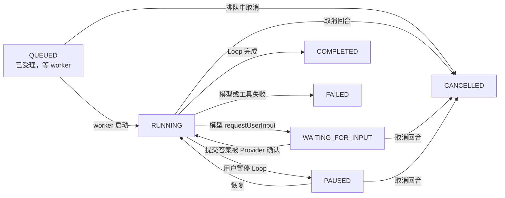
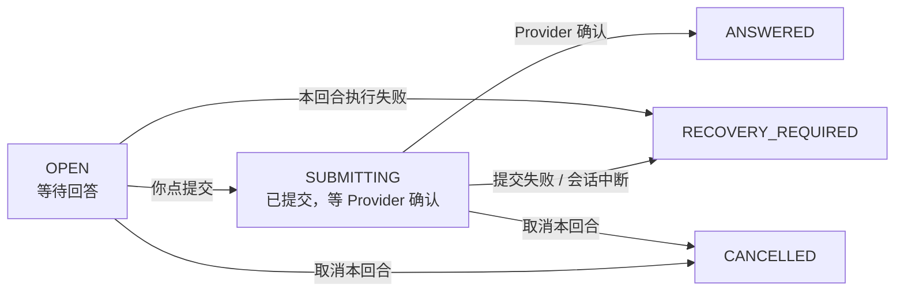
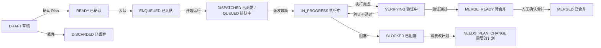
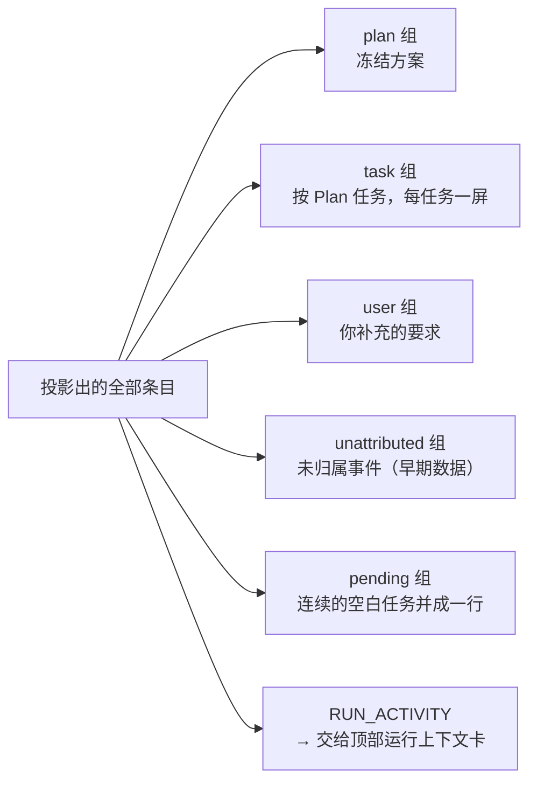
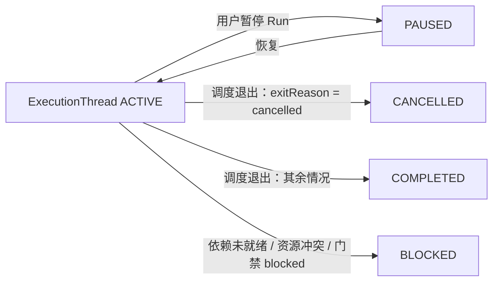
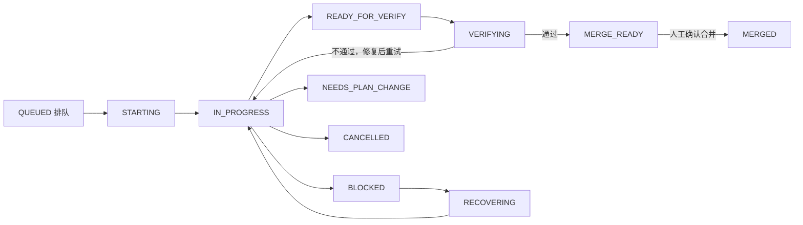
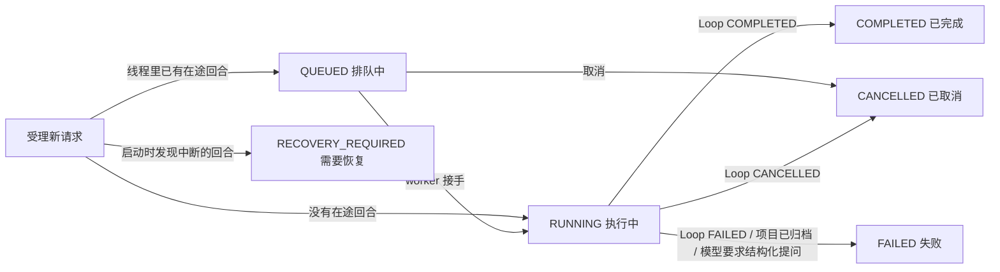
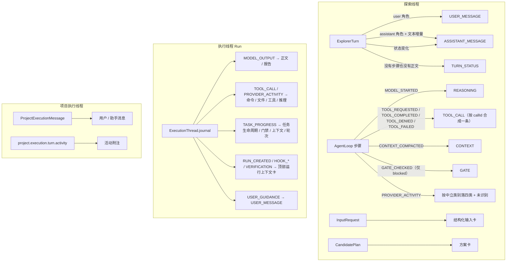
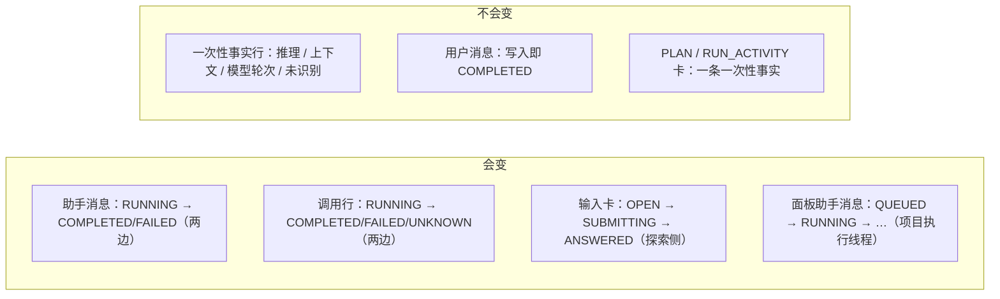

# 消息类型及事件状态机流程图

> 一份**以实现为准**的清点：探索线程与执行线程的对话框里一共有多少种消息类型，每一种是干什么用的、什么时候会出现、由哪个组件渲染，以及有多态的类型的完整状态机。
>
> 代码基线：分支 `main-artechure-switch-claude`。行号会随改动漂移，符号名不会。
> 关键文件：`code/apps/web/src/utils/conversationTypes.ts`（两条线共用的词表**与五类划分**）、`utils/explorerPresentation.ts`、`utils/executionStream.ts`、`utils/sensitiveValue.ts`（脱敏与截断的唯一定点）、`views/ExplorerView.vue`、`views/RunDetailView.vue`、`components/ExecutionMessageRow.vue`（同一条消息在两处的唯一一份模板）、`components/ProjectExecutionThreadPanel.vue`；领域侧 `packages/domain/src/model/provider-activity.ts`（中立词表）、`model/types.ts`（`ModelEvent`）、`platform/provider-payload.ts`、`explorer/explorer-activity.ts`、`agent/agent-loop.ts`、`agent/executor-agent.ts`、`agent/project-execution-thread.ts`。
>
> **Provider 侧的事实以权威来源为准**：Codex 取自本机 `codex app-server generate-json-schema`
> （codex-cli 0.149.0），Claude 取自 `@anthropic-ai/claude-agent-sdk` 自带的 `sdk.d.ts`；
> "实际到达了什么"取自本机运行库 `code/pipeline-factory.sqlite`。完整的对照见 **§5**。

---

## 0. 两个对话框 + 探索视图的一个模式

能发消息的界面一共三处，但**只有 A、B 是并列的对话框**，C 是探索视图自己的一个模式——
这个区别很要紧，因为 C 在一列抽屉/标签页里是找不到的：

| # | 界面位置 | 怎么进去 | 组件 | 数据源 | 消息类型数 |
|---|---|---|---|---|---|
| A | **探索对话** · 共享抽屉的「探索对话」tab | 左栏「探索」→ 需求清单里点某个需求的「探索中」 | `ExplorerView.vue` 的 `.timeline` | `ExplorerActivityItem` + `ExplorerInputRequest` + `Plan` | **25** |
| B | **Run 执行会话** ·「执行会话」 | 需求抽屉的「Run」页签，或 Run 详情页 | `RunDetailView.vue` 的 `.execution-conversation` | `ExecutionThread.journal` → `projectExecutionJournal()` | **28** |
| C | **项目执行线程** · 探索视图的**模式** | 左栏「探索」面板**顶部第一项**「项目执行线程 · 在项目目录中直接执行」 | `ProjectExecutionThreadPanel.vue` | `ProjectExecutionMessage` + activity 事件 | **2 类消息** ×6 状态 + 3 种活动行 |

合计 **53 种**消息类型（A + B；C 是另一套更简单的模型，单列在 §3）。

其中 **23 种是两条线共用的**（§4.4）：同一个概念在两边必须同一个名字、同一套中文文案。
剩下的是各自独有的——执行侧多出 Plan 任务、执行报告、Run 级事件与恢复流程，
探索侧多出结构化提问与候选方案，逐条理由见 §4.4。

> 从 33 涨到 53 是这一轮的事：③ 补了子代理 / 联网搜索 / 生成图片（此前全被并进笼统的 `tool`），
> ④ 补了七类运行事实（压缩边界、权限被拒、配额、重试、后台子任务、钩子、告警）。
> 起因是把两个 Provider 的原生消息清点了一遍（§5）：Codex 有 **18 种 `ThreadItem`**、
> Claude 有 **39 种 `SDKMessage`**，而中立词表只给了 ④ 三个位置、其中两个还是 `hidden`——
> 配额、重试、子任务、钩子这些**每次都被丢弃**。

**C 为什么算"模式"而不是第三个对话框**：它是同一个 `ExplorerView` 在路由参数
`?workspace=project-execution` 下的另一种形态——中间对话区换成面板、右侧需求面板隐藏、**连共享抽屉都不渲染**
（模板里抽屉写的是 `v-if="!projectExecutionMode"`）。它复用同一个左栏，所以入口就在左栏里，而不是某个新标签页。
点左栏线程清单里任意一个线程即可退出该模式（`explorerRouteQuery` 会删掉 `workspace` 参数）。

### 0.1 五类：先分清"谁在说话"

在"怎么呈现"之前，先要回答"这是谁说的"。看下来的分法是**五类**，比"用户 / 模型 / 运行时"三分法管用：

| 类 | 名字 | 谁产生的 | 进不进正文 | 两个清单里的类型 |
|---|---|---|---|---|
| ① | **你说的** | 你（本地） | ✅ 正文 | `USER_MESSAGE` |
| ② | **模型说的** | 模型正文 + 推理 | ✅ 正文 | `ASSISTANT_MESSAGE`、`MODEL_REPORT`、`REASONING` |
| ③ | **模型做的** | 模型发起的动作与产物 | 摘要进，详情折叠 | `COMMAND`、`FILE_CHANGE`、`TOOL_CALL`、`MCP_CALL`、`SUBAGENT`、`WEB_SEARCH`、`IMAGE_GENERATION`、`CANDIDATE_PLAN`、`INPUT_REQUEST` |
| ④ | **Provider 说的** | 会话设施（CLI / 网关 / 宿主） | ❌ **不进** | `PROVIDER_COMPACTION`、`PERMISSION_DENIED`、`RATE_LIMIT`、`PROVIDER_RETRY`、`BACKGROUND_TASK`、`HOOK`、`PROVIDER_WARNING`、`PROVIDER_MESSAGE`、`SESSION`、`UNCLASSIFIED` |
| ⑤ | **Factory 说的** | Factory 自己的判定与生命周期 | 只有"需你决策"的进 | `GATE`、`CONTEXT`、`TURN_STATUS`、`PLAN`、`TASK_LIFECYCLE`、`RUN_ACTIVITY`、`RECOVERY` |

判据一句话：**① 是"我说的"，② 是"模型对我说的"，③ 是"模型对世界做的"，④ 是"机器在说话"，
⑤ 是"工厂在记账"。**

**为什么三分法不够**，两处会咬到：

- 它把**② 与 ③ 合成一类**（都叫"模型返回的消息"），而这两者必须是**两种排版**——正文要铺开读，
  动作要折成一行；生命周期形状也不同（正文只有"流式 / 完成"，动作有"开始 → 结束 → 可能悬空"）。
- 它把**④ 与 ⑤ 合成一类**（都叫"运行时事件"），而两者的**归属层不同**：「会话重建了 / 正在重试 /
  配额快没了」只有适配器能翻译，丢了永久丢（Provider 不会重发）；「门禁拦下了这一步」是 Factory
  自己判的，换后端照常发生。混在一起的结果是**没人负责**。

这套分类在代码里的落点有两个，都不是装饰：

- `apps/web/src/utils/conversationTypes.ts` 的三张表——分类的**唯一定义处**：`SHARED_MESSAGE_CLASSES`
  （共用项）加两条线各自补的两张（`EXPLORER_MESSAGE_CLASSES` / `EXECUTION_MESSAGE_CLASSES`）。
- **④ 一律不进会话正文**（呈现表里是 `hidden`），它的归宿是头部状态卡的一节，见 §0.3。
  `UNCLASSIFIED` 是唯一露面的例外——"Provider 给了我不认识的东西"必须当场可见，
  否则新活动类型会静默消失，那正是这一轮在修的那类毛病。

为什么是"谁说的"与"进不进正文"这两个轴：它们分别决定了两件必须分开决定的事——
**「谁说的」决定归属层**（谁负责归一、谁负责持久化、换 Provider 会不会丢），
**「进不进正文」决定排版重量**（铺开读 / 折成一行 / 移出会话）。

这套分类能直接回答的三个设计问题：

1. **换 Provider 时什么会丢？** → ④：适配器不翻译就永久丢失（Provider 不会重发）。
   ①②③ 是语义层，换后端不该变；⑤ 与后端无关。
2. **哪些该进会话正文？** → ① 你说的、② 模型对你说的，以及 ⑤ 里"需要你决策"的那几条
   （门禁拦截、恢复、方案卡）。**③ 与 ⑤ 的其余部分是过程记录**——跑的时候原样显示，
   所属执行步骤跑完就折进上方那一行（§2.2）；**④ 一条都不进**。
3. **哪些该有生命周期（开始/结束/悬空）？** → ③ 与 ⑤。② 只有"流式 / 完成"两种状态。

### 0.2 呈现方式：**形**与**重**两个轴

A 与 B 都已经做到「**消息类型 → 呈现方式**只由一张表决定」，视图不自己判断某类要不要显示；C 还没有这张表。

两个轴各管一件事，混在一起就会写出"新增一种取值静默渲染成裸卡"那种缺陷：

- **形（`kind`）**：这一行长什么样，模板按它选行组件。A 有 7 种、B 有 7 种（见各自的 `*_ROW_KINDS`）。
- **重（权重）**：它在会话里占多少地方。A 是平铺时间线，没有"步骤"这一层可折叠，所以**没有这个轴**；
  B 按任务分组，有——`answer` 常驻 / `process` 折进上方的过程记录 / `hidden` 不渲染。

| 界面 | 清单表 | 取值 |
|---|---|---|
| A | `EXPLORER_DISPLAY_MODES`（形） | `card` 卡片 / `text` 纯文本一行（你说的）/ `prose` 铺开的正文（模型回复）/ `line` 动作行 / `reasoning` 可折叠推理卡 / `divider` 分隔行 / `gate` 判定行 / `turn-status` 状态行 / `hidden` 不渲染 |
| B | `EXECUTION_MESSAGE_WEIGHTS`（重） | `answer` 常驻 / `process` 折进上方的过程记录 / `hidden` 不渲染 |
| C | 无（按角色 + 状态渲染，活动行在 `activityLabel()` 里分三支） |

**两边共用的形**——同一个概念在两条对话线上长得一样：

| 形 | A | B | 含义 |
|---|---|---|---|
| `card` | ✓ | ✓ | 完整卡片（方案 / 输入卡 / 恢复 / Run 级事件） |
| `text` | ✓ | ✓ | 纯文本一行——**你说的**（靠右、带 `›`） |
| `prose` | ✓ | ✓ | 铺开的正文——**模型说的**（靠左、带一行 meta，不套气泡） |
| `line` | ✓ | ✓ | 动作行（命令 / 文件 / 工具 / MCP / 子代理 / 搜索 / 生图），可展开看结果 |
| `reasoning` | ✓ | ✓ | 可折叠的推理卡——背景音，流式时自动展开 |
| `divider` | ✓ | ✓ | 分隔行——上下文压缩是**边界不是事件** |
| `activity` / `tool` / `plan` / `user` | —— | ✓ | B 独有：它的"形"是按**有多少种 DOM** 分的，A 的若干种形在 B 里合并了 |
| `gate` / `turn-status` | ✓ | —— | A 独有：平铺时间线没有折叠这一层，行型**就是**语义 |

> 这张表是**收敛出来的**：`ASSISTANT_MESSAGE` 在 A 是 `prose`、在 B 曾是 `card`（B 的助手消息还带着
> 头像与白底气泡），同一个"模型说的正文"两条线长得不一样；动作行在 A 曾叫 `tool`、在 B 叫 `line`，
> 同一个"动作行"两条线两个名字。两处都不是设计取舍，是漏改——现在两边同名同形。
> **B 多出来的只是消息类型**（冻结方案、执行报告、Plan 任务、Run 级事件、恢复），它们落在同一套档位上，
> 不另起一套。

### 0.3 ④「Provider 说的」落在哪

它**不进会话正文**，落点是两处（见 `ExecutionHeaderStatus.vue` / `ExplorerHeaderStatus.vue`）：

- **(a) 常态**：头部状态卡的「运行上下文 / Provider 循环」里新增一**「Provider 运行事实」**一节。
  压缩边界、重试、配额、钩子、后台任务、权限被拒、警告都在这里——不点开不打扰。
- **(c) 异常时浮现**：配额、重试、权限被拒、警告这四类，以及**任何失败**（钩子挂了、子任务失败了），
  会把那张状态卡染成告警色，并把一句话原因写在卡片上。判据是领域侧的
  `isRuntimeAlertKind()`，web 侧有两条同义的镜像（执行侧的 `isRuntimeAlertItem`、探索侧的
  `isRuntimeAlert`）——**三条判据同义，不各自列白名单**。

**每一种取值都有一个组件（或一条分支）负责渲染它，而且这件事有两道护栏**：

| 护栏 | 在哪 | 拦住什么 |
|---|---|---|
| 编译期 | A：`EXPLORER_ROW_MODES` + `EXPLORER_INLINE_MODES` 两张清单，合起来必须正好是 `ExplorerDisplayMode` 的全部取值；B：`EXECUTION_ROW_KINDS` 必须正好是 `ExecutionStreamItem["kind"]` 的全部取值 | 新增一种取值却没归到任何一边——**编译不过**，逼着人回答"它长什么样" |
| 运行时 | 两个对话框模板各自的兜底分支（`.timeline-unknown-row` / `.execution-unknown-row`） | 漏网的那种取值**当场显示成一行红字**，而不是静默渲染成一张没有样式的裸卡 |

**分文件的粒度是"形态"，不是"消息类型"**：A 的 25 个类型映射到 9 种取值，其中 `line` 一条承担
命令 / 文件变更 / 工具调用 / MCP 调用 / 子代理 / 联网搜索 / 生成图片七类；
B 的 28 个类型映射到 7 种形态，`activity`/`tool` 两条承担其余全部，而且**同一条消息要在
"可见区"与"折叠区"两处渲染**（`ExecutionMessageRow.vue` 是那唯一一份模板）。
按消息类型分文件会得到七份逐字相同的同构组件——**渲染只跟形态走**。

### 0.4 这些类型是从哪来的

上面两张清单不是凭空定的：它们是把**两个 Provider 各说各话的原生消息**归一到一套中立词表之后的结果。
Codex App Server 有 **75 条 JSON-RPC 通知 + 18 种 `ThreadItem`**，Claude Agent SDK 有
**39 种 `SDKMessage`** 外加一套 content block——两边只有"正文增量 / 工具调用 / 用量 / 回合结束"
四处天然对得上。适配器各认了其中十几到二十种，剩下的要么落 `other`（界面上的「未识别」），
要么根本不该进会话。

**为什么这件事值得单独讲**：类型清单里每一条几乎都能追到一个具体的 Provider 字段，
而"某个字段没读"的后果不是少一个类型，是**换一个 Agent 就少一半信息**——这一轮修掉的三个缺口
（Claude 的 `thinking` 整块没读、Codex 的 `agentMessage.phase` 没读、工具的
`arguments`/`result`/`exitCode` 没进执行日志）都是这么来的。全套对照见 **§5**，
它们各自的来龙去脉见 **§7**。

---

## 1. 探索线程（对话框 A）：25 种

时间线不是"一条条原始事件"，而是**投影**出来的，分两步：

1. `projectExplorerActivity()`（领域侧）把 Turn / Loop 步骤 / Provider 活动算成一串**活动条目**——
   相邻的文本增量合成一条助手消息、**同一次调用的开始与结束合成一条调用**、
   Provider 的回声与没信息量的判定不产出条目。这一步在 §1.3 展开。
2. `buildExplorerTimeline()`（web）把**活动条目**与**结构化输入卡**按时间合成一条线，
   渲染前先用 `EXPLORER_DISPLAY_MODES` 过一遍隐显。

「侧」这一列是**它在对话框里靠哪边**：`用户侧` 靠右（你自己说的），`线程侧` 靠左（模型与它的过程）。

> **Provider** 指上游的模型服务（本项目默认是 Codex App Server）。文中的"Provider 活动"是它回传的
> 工具调用 / 推理 / 命令等事件，与 Factory 自己记的 `AgentLoop` 步骤是两条来源、可能描述同一件事。
> 下文简称 **Loop** 的，就是这次模型循环——一个探索回合、或一个 Run 内部，由多次模型步骤组成的那个循环。

### 1.1 清单表

| # | 类型 | 分类 | 侧 | 呈现方式 | 作用 | 什么时候出现 |
|---|---|---|---|---|---|---|
| 1 | `USER_MESSAGE` | ① | 用户侧 | `text` | 你发出的那条消息（需求描述就是它） | 你每次发送消息 |
| 2 | `ASSISTANT_MESSAGE` | ② | 线程侧 · 模型 | `prose` | Plan Explorer 的正文 | 模型每产出一段文本 |
| 3 | `REASONING` | ② | 线程侧 · 模型 | `reasoning` | 模型在思考 / Provider 的推理流 | `MODEL_STARTED` 步骤，或 Provider 的中立类别 `reasoning` |
| 4 | `COMMAND` | ③ | 线程侧 · 模型 | `line` | 跑了一条命令 | Provider 的中立类别 `command` |
| 5 | `FILE_CHANGE` | ③ | 线程侧 · 模型 | `line` | 改动了文件 | Provider 的中立类别 `file-change` |
| 6 | `TOOL_CALL` | ③ | 线程侧 · 模型 | `line` | 一次工具调用**的完整生命周期**——开始 → 完成 / 被拒 / 失败是同一条，不是几条 | `TOOL_REQUESTED` 等步骤，或 Provider 的中立类别 `tool` |
| 7 | `MCP_CALL` | ③ | 线程侧 · 模型 | `line` | MCP 服务端的调用 | Provider 的中立类别 `mcp` |
| 8 | `SUBAGENT` | ③ | 线程侧 · 模型 | `line` | 派生子代理 | Codex 的 `collabAgentToolCall` / `subAgentActivity`，或 Claude 的 `Task` 工具 |
| 9 | `WEB_SEARCH` | ③ | 线程侧 · 模型 | `line` | 联网搜索 | Codex 的 `webSearch`，或 Claude 的 `WebSearch` 工具 |
| 10 | `IMAGE_GENERATION` | ③ | 线程侧 · 模型 | `line` | 生成图片 | Codex 的 `imageGeneration` |
| 11 | `CANDIDATE_PLAN` | ③ | 线程侧 · 模型 | `card` | 助手消息里**内嵌**的候选方案卡 | 该回合产出了 Plan 且绑定到这条消息 |
| 12 | `INPUT_REQUEST` | ③ | 两侧 | `card` | 结构化输入卡（提问 + 回答 + 当前状态） | 模型用原生 requestUserInput 反问 |
| 13 | `PROVIDER_COMPACTION` | ④ | —— | `hidden` | Provider 侧压了一次上下文（**与 ⑤ 的 `CONTEXT` 是两回事**：那是 Factory 自己压的） | Codex 的 `thread/compacted` / `contextCompaction` item，Claude 的 `system/compact_boundary` |
| 14 | `PERMISSION_DENIED` | ④ | —— | `hidden` | 一次调用被权限策略拒绝 | Codex 的 `declined` 命令，Claude 的 `system/permission_denied` |
| 15 | `RATE_LIMIT` | ④ | —— | `hidden` | 配额告警 | Codex 的 `account/rateLimits/updated`，Claude 的 `rate_limit_event` |
| 16 | `PROVIDER_RETRY` | ④ | —— | `hidden` | Provider 正在自动重试 | Claude 的 `system/api_retry` |
| 17 | `BACKGROUND_TASK` | ④ | —— | `hidden` | 后台子任务有更新 | Claude 的 `task_*` / `background_tasks_changed` |
| 18 | `HOOK` | ④ | —— | `hidden` | 钩子执行 | Codex 的 `hook/*`，Claude 的 `system/hook_*` |
| 19 | `PROVIDER_WARNING` | ④ | —— | `hidden` | 命令级告警（配置写错、弃用提示） | Codex 的 `warning` / `configWarning` / `deprecationNotice`，Claude 的 `system/informational`（warning 级） |
| 20 | `PROVIDER_MESSAGE` | ④ | —— | `hidden` | Provider 把你那句话回显一次 | 探索侧不渲染：用户消息本身就在时间线上 |
| 21 | `SESSION` | ④ | —— | `hidden` | Provider 会话重建 | 探索侧不渲染 |
| 22 | `UNCLASSIFIED` | ④ | 线程侧 · 模型 | `turn-status` | 认不出来的 Provider 活动 | Provider 的中立类别是 `other`（标签直接摆原生 `itemType`） |
| 23 | `CONTEXT` | ⑤ | 线程侧 · **Factory** | `divider` | 上下文在这里被压缩了一轮 | 每轮 Loop 结束时写一条 |
| 24 | `GATE` | ⑤ | 线程侧 · **Factory** | `gate` | 终止门禁**拦下了这一步** | 门禁判定为 `blocked` 时（其余的判定不占位，见 §1.3） |
| 25 | `TURN_STATUS` | ⑤ | 线程侧 · **Factory** | `turn-status` | 模型轮次的状态行 | `MODEL_COMPLETED` 步骤，或回合既没有步骤也没有正文时 |

**「分类」这一列**见 §0.1：① 你说的 / ② 模型说的 / ③ 模型做的 / ④ Provider 说的 / ⑤ Factory 说的。
**④ 那一组一律 `hidden`**——它们不进这条时间线，落点是头部状态卡的「Provider 运行事实」一节（§0.3）。
表里唯一露面的 ④ 是 `UNCLASSIFIED`：认不出来这件事必须当场可见。

**「侧」这一列其实有两个层次**：左右（你 / 线程）由布局表达——右侧 `›`、左侧行首一个蓝点；
线程侧里再分**模型**与 **Factory** 两个产者，由行首标签表达（Factory 的那三类写成
`Factory · 执行门禁` / `Factory · 上下文压缩` / `Factory · 模型轮次`，模型那一侧不点名）。
判据是"这是谁说/做的，还是 Factory 自己记的"：终止门禁、上下文压缩、轮次标记与调度占位都是
Factory 的机械记录，挂上线程的名字会把工厂的记录说成模型的发言。

> 13–21 这一整组标 `hidden`：13–19 是 ④「Provider 说的」运行事实（归宿是头部状态卡，见 §0.3），
> 20–21 是"你那句话的回声"与"会话重建"——内容在时间线上已经有了（用户消息本身、回合状态）。
>
> 曾经还有两种 `INPUT_REQUIRED` / `INPUT_RESOLVED`（结构化输入的生命周期行）。它们已经被
> **整张输入卡（12）取代**，而且是**到达不了**、不是"偶尔兜一下"：`agent-loop` 写下 `INPUT_REQUIRED`
> 步骤的**同一次调用**里就 emit 了 `agent.input.required`，`thread-service` 收到后立刻落一条
> `input_requests` 行。也就是说只要这两条步骤存在，同一需求里必然有那张卡；而卡上提问、回答、
> 状态俱全，那两行各自只剩一句"有 N 个问题在等" / "你的选择已提交"。实测本机库 **29/29** 个
> 有这两类步骤的回合都有对应的输入请求行。已连同类型、标签、与 `buildExplorerTimeline` 的过滤集
> 一起删掉。
>
> 曾经还有 `plan-created`（游离方案卡），只在"方案没绑到任何一条助手消息"时出现；
> 现代代码里绑不上是不可能的，已删除——见 §7 最后一条。

### 1.2 逐个：含义、呈现、示例

**1 · `USER_MESSAGE` — 你发的消息**
- **含义**：`ExplorerTurn` 里 `role: "user"` 的那条，原文照存。**需求描述就是这条消息本身**——
  此前时间线顶部另有一张"需求 N / 标题 / 摘要"卡，三行里有两行是同一句话（标题由最新那条用户消息生成），
  第三行又和对话里那条消息重复，已删除；需求序号与标题在左侧清单与抽屉标题上都有。
- **组件**：`<article class="timeline-user-text">`，一个 `›` 记号加上正文本身（`MarkdownMessage`，不折叠、不截断）。
  **没有头像、没有卡片、没有展开按钮**——用户输入是一行原文，不是一份要点提要。整行**靠右**。

```
                                                           › 把探索侧那 8 类活动各行拉开呈现
                                                                                         16:00
```

**2 · `ASSISTANT_MESSAGE` — Plan Explorer 的正文**
- **含义**：模型在一个回合里的输出。**相邻的文本步骤合并成一张卡片**；中间夹了工具 / 门禁 / Provider 活动就另起一条。
  （步骤本身的落库粒度是"一个文本段一条"，不是每次刷新一条——见 §9。**边界判据是"中间夹了别的步骤"，
  不是"上一条产出了什么"**：门禁这类不再产出条目的步骤同样是接缝，这也是写侧封段与读侧分气泡逐字一致的前提。）
- **组件**：`<article class="timeline-assistant-prose">` —— **正文直接铺开，不套气泡**（与用户消息同一档重量：
  白底边框不承载任何信息）。上面留一行 meta（**线程侧标记点** + 名字 + 状态标签 + 时间），因为这是探索侧少数
  **会变**的类型，"还在跑 / 失败"得有地方说；内嵌的候选方案卡（③）也挂在这一块里。
  状态标签三态：`进行中` / `已完成` / `失败`——它是 **`el-tag`**（`size="small" effect="light"`）。
  正文先过 `readableAssistantText()` 剥掉 Plan 协议块。
- **那行开头的蓝点是"线程侧"的记号**（`.thread-mark`）：用户消息靠右、以 `›` 起头，线程侧就靠左、
  以这个点起头。**线程侧的每一行都有它**——正文、推理、调用、以及 Factory 自己记的那三类都是同一个点，
  所以"这一条是这一侧产生的"一眼可见；`RUNNING` 时它闪动，表示这一轮还在跑。
  再往里一层"是模型还是 Factory"，由行首标签说（见 §1.1 的注解）。

```
●  Plan Explorer   [已完成]   16:01
先看现有的活动投影，再决定每类各摆什么。
```

**11 · `CANDIDATE_PLAN` — 内嵌候选方案卡**
- **含义**：这条助手消息产出的 Plan 契约摘要。
- **组件**：`components/ExplorerCandidatePlanCard.vue` —— 助手消息内的 `<div class="inline-plan-card">`，卡片顶部一行小字标「候选方案 · 第 n 版」，带 `.candidate-stats` 四格统计和 `查看方案` / `确认方案` 按钮。它是**内嵌**的，所以呈现方式表里那一行是 `card` 而不是独立的时间线条目。

```
   候选方案 · 第 3 版                                 [草稿]
   探索侧活动行各自成行
   执行步骤 4 │ Scope entries 2 │ Verification 1 checks │ Merge Human review
   [查看方案]  [确认方案]
```

**12 · `INPUT_REQUEST` — 结构化输入卡**
- **含义**：模型反问 + 你的回答 + 这一问当前的状态，三者合成一张卡，按**提问时间**插进时间线（回答时间只显示在卡内）。
- **组件**：`<article class="input-request-card timeline-input-request">` + `.input-stream-questions`；有待答问题时行尾出现「回答」按钮，点开 `ExplorerInputDialog`（固定尺寸 `el-dialog`）。

```
✔  Plan Explorer input   [已回答]
   问题生成 10:02    回答提交 10:04
   本轮结构化问题与回答已按原始时间线保留。
   问题与回答
   1  Goal   What should we build?      回答：A
```

**3 · `REASONING` — 推理卡**
- **含义**：模型在思考，或 Provider 的推理流。是背景音，不是内容。
- **组件**：`components/ExplorerReasoningRow.vue` —— `<article class="timeline-note">`，行首是那个**线程侧标记点**（`进行中` 时闪动）+ 一行灰字；超长截断，无边框无卡片。
- **一次推理只占一行**：Provider 对同一次推理会报两次（`phase: started` / `completed`），投影按 `itemId` 合成一条，
  状态从"进行中"迁到"已完成"。实测本机库：推理那 **904 行只是 452 次推理**。
- **没有说明时**：`MODEL_STARTED` 这类只有"这一轮跑起来了"的标记**正文留空**，行首退回标签 `推理`——
  纯文本行空着就只剩一个点和时间，而补一句 `Plan Explorer started step 3.` 是把"有没有说明"这个可判定的事实
  变成一句要靠字符串识别才能认出的文案。

```
●  推理                                                        16:02
●  推理                                                        16:03
```

**4–10 · `COMMAND` / `FILE_CHANGE` / `TOOL_CALL` / `MCP_CALL` / `SUBAGENT` / `WEB_SEARCH` / `IMAGE_GENERATION` — 动作行**
- **含义**：一次调用。四类的区别只是**在跑什么**：命令、改文件、普通工具、MCP 服务端。**开始与结束是同一条**（见 §1.3 C）。
- **分类判据是 Provider 的"中立类别"（`command` / `file-change` / `tool` / `mcp`），不是 `itemType` 的子串**——
  后者曾把 `userMessage`（Provider 把你那句话回显一次）与 `plan`（整篇规划文档）都渲染成"Tool started / Tool completed"。
- **组件**：`components/ExplorerActivityRow.vue` —— `<article class="loop-activity-card activity-line">`，线程侧标记点 + 标签（`<strong>`）+ **名字**（等宽 `<code>`）+ 时间 + **状态标签**（`el-tag`）+ 正文 + 调用 id（等宽 `<code>`，灰色）。**门禁行与轮次行用的是同一个组件**，只有行型类不同（见 §1.1 的注解）。
- **名字与正文只摆一次**：Provider 只在 `summary` 里给了内容时（命令原文、文件路径），它就是名字，正文留空；
  名字另外给出来时，`summary` 才是正文。没有可说的就留空——不补"Provider activity completed."这种句子（见 §7）。
- **结束事件没记下来时**：回合已经不在跑、而这条调用没有结束事件，标成 `状态未知` + 「未记录调用的结束状态。」，
  不一直显示"进行中"。

```
⚙  命令   /bin/zsh -lc "pwd && git status --short"    16:04  [已完成]
   exec-995fe9c5-b2e5-493a-a841-b19ff68bd192

✓  工具调用   read_file                                16:05  [已完成]
   call-read-1

⚠  工具调用   shell                                    16:06  [失败]
   策略不允许写仓库目录以外的文件。
   call-write-1

ⓘ  MCP 调用   github/create_issue                      16:07  [已完成]
   已创建 issue #42：活动行需要各自成行
   item-mcp-1
```

**23 · `CONTEXT` — 分隔行（Factory 的）**
- **含义**：Loop 把上下文压缩后继续。它是会话边界，不是事件。
- **组件**：`components/ExplorerDividerRow.vue` —— `<article class="timeline-divider">`，左右两条横线夹一个标签 + 时间；标签里带着线程侧标记点，
  并写明 `Factory · 上下文压缩`——它是 Factory 记的，不是模型说的。

```
——————  ● Factory · 上下文压缩 · 18 条消息  ——————  16:10
```

**24 · `GATE` — 门禁判定行（Factory 的）**
- **含义**：Factory 自己的终止门禁**拦下了这一步**（`action: blocked`）。放行与继续不占位。
- **为什么只留拦截**：实测本机库 95 条判定里 `complete` 51 / `continue` 44 / **`blocked` 0**——
  每轮都写一行"一切正常"是刷屏，而"这一轮为什么停下"已经由助手正文上的状态标签说清了。
- **组件**：`ExplorerActivityRow.vue`（行型 `gate`），左侧带一道竖线，判定动作单独占一格。

```
│ ⚠  Factory · 执行门禁  blocked    16:09  [失败]
│    连续两步没有进展，停下等人确认。
```

**25 · `TURN_STATUS` — 模型轮次行（Factory 的）**
- **含义**：**模型轮次**（model step）结束的标记（`MODEL_COMPLETED`），或回合既没有步骤也没有正文时的占位
  （"正在处理 / 等待输入 / 已排队"）。标签写 `Factory · 模型轮次`——它是 Factory 记的时间点，不是模型说的话；
  叫"回合状态"会让人以为整个回合结束了，而回合的完成度由助手正文那张卡上的状态标签说。
- **组件**：`ExplorerActivityRow.vue`（行型 `turn-status`），虚线边框、透明底，比调用行更淡；
  正文留空——状态标签已经说了这一轮怎么了，不必再补一句 `The model step completed.`。

```
ⓘ  Factory · 模型轮次   16:12  [已完成]
```


### 1.3 状态机

探索侧只有**三类**消息真的会「变」：助手消息、结构化输入卡，以及**一次调用**（`TOOL_CALL` / `COMMAND` /
`FILE_CHANGE` / `MCP_CALL` / `REASONING`）——它们从"进行中"迁到结束态，所以是**一条**。
其余的活动行是**一次性的投影**：一条 Loop 步骤产出一行，状态在产生时就固定，不会再迁移
（同一件事出现第二行，是又发生了一次）。理解这一点，下面的图才有意义。

#### A. 助手消息（由 `ExplorerTurn.status` 驱动）

回合状态存在 `ExplorerTurn` 上，投影时由 `assistantActivityStatus()` **映射成**活动行的 4 种标签。



| 回合状态 | 卡片上的标签 | 触发条件 |
|---|---|---|
| `QUEUED` | `等待中` | 回合已受理但 worker 还没接手 |
| `RUNNING` | `进行中` | 开始执行；也是「等待输入结束」的回归态 |
| `WAITING_FOR_INPUT` | `等待中` | 模型发起结构化提问 |
| `PAUSED` | `进行中` | 用户暂停 Loop |
| `COMPLETED` | `已完成` | Loop 正常结束 |
| `FAILED` | `失败` | 模型调用失败 / 启动恢复判定为中断 |
| `CANCELLED` | `已完成` | 用户取消 |

> 注意 `PAUSED` 在界面上仍显示 `进行中`——`assistantActivityStatus` 只把它归到 4 种里的 RUNNING，暂停感只体现在头部状态卡。

#### B. 结构化输入卡（5 个服务端状态 + 1 个只在浏览器里的临时状态）



| 状态 | 卡片文案 | 触发条件 | 下一个状态 |
|---|---|---|---|
| `OPEN` | 等待回答 | 模型提问，写入 `input_requests` | `SUBMITTING` / `CANCELLED` / `RECOVERY_REQUIRED` |
| `SUBMITTING` | 提交中 | 你提交答案，服务端标记 | `ANSWERED` / `RECOVERY_REQUIRED` / `CANCELLED` |
| `ANSWERED` | 已回答 | Provider 确认收到答案 | 终态 |
| `CANCELLED` | 已取消 | 取消回合（`cancelTurn`） | 终态 |
| `RECOVERY_REQUIRED` | 需要恢复 | 提交失败、回合失败、或启动时发现未闭合请求 | 终态（需人工恢复） |

另外有一个**不落库（不写进数据库）的客户端状态**：提交后、服务端还没变 `SUBMITTING` 之前，前端用 `inputAnswerInFlight` 抢先显示 `提交中`（`inputStatusLabel` 的第二个参数）。它只存在于浏览器内存，刷新即消失。

#### C. 一次调用为什么只占一行（其余活动行的状态机）

**「一次调用」的生命周期是 `TOOL_REQUESTED → TOOL_COMPLETED` 两端，投影把它们合成一条**，后到的事件覆盖
状态与正文。身份键是 Loop 步骤的 `callId`、Provider 活动的 `itemId`——同一套合并规则执行侧早就在用
（`projectExecutionJournal` 的 `TOOL_CALL` / `PROVIDER_ACTIVITY` 两个分支），探索侧此前没有，于是同一个工具永远占两行。

合并时两条各只说了一半：**名字（工具名）只有开始那一条有，原因（被拒 / 失败 / 结束状态没记下来）只有结束那一条有**，
所以名字留住先到的、正文覆盖成后到的。

| 类型 | 状态集合 | 说明 |
|---|---|---|
| `COMMAND` / `FILE_CHANGE` / `TOOL_CALL` / `MCP_CALL` | RUNNING → COMPLETED / FAILED / UNKNOWN | **一条**的生命周期：开始给 RUNNING，结束按 Provider 的中立成败给 COMPLETED / FAILED；回合已经不在跑却始终没有结束事件，给 UNKNOWN（"没记录到它是怎么结束的"，不是失败） |
| `REASONING` | RUNNING → COMPLETED | Provider 对同一次推理报两次，同样按 `itemId` 合成一条；它没有成败概念，回合结束时按"流结束了"收尾 |
| `CONTEXT` | COMPLETED | 一次事实 |
| `GATE` | FAILED | 只有 `action: blocked` 会产出条目，所以只有一种状态 |
| `TURN_STATUS` | RUNNING / WAITING / FAILED / COMPLETED | 由回合状态或 `MODEL_COMPLETED` 决定；标签写 `Factory · 模型轮次` |

`TOOL_FAILED` 与 `TOOL_NEEDS_RECONCILIATION` 这两个步骤类型**此前在探索时间线上连一行都没有**
（投影里没有分支，静默掉了）——也就是"工具失败了"看不见。现在它们与 `TOOL_DENIED` 一样落进同一条
`TOOL_CALL`，状态为失败、原因进正文。

#### D. 方案卡（`CANDIDATE_PLAN`）

卡片本身无状态机，它显示的是 **Plan 的生命周期状态**（右上角 el-tag）。这个状态由多个写入点推进（`updatePlanStatus` 只是带 `fromStatus → toStatus` 事件写库，**没有集中的转换表**）：



卡片上还会因 Plan 是「对话产物」而多一条警告（`candidate-notice`）：这种 Plan 确认后仍不能入队执行。

**这一格里的文案（含右上角 `el-tag` 的文字与颜色）只有一份定义**：文案在
`apps/web/src/utils/planStatus.ts` 的 `planStatusLabel`，语气色在 `utils/statusVisual.ts` 的
`PLAN_STATUS_TONES`。收拢之前同一个状态在界面上能有两三个词：

| 状态 | 曾经的三处 | 现在 |
|---|---|---|
| `DRAFT` | 抽屉里 `DRAFT`（**直接渲染枚举值**）、候选卡上 `Candidate`、工作台上 `Draft` | 草稿 |
| `READY` | `Confirmed` / `Ready` | 已确认 |
| `MERGE_READY` | `Ready for review` / `Needs review` | 待合并 |
| `MERGED` | `Merged` / `Merged` / **`Completed`**（生命周期条那一份另有一个词） | 已合并 |

> `PlanDetailContent.vue` 此前那句 `<el-tag>{{ plan.status }}</el-tag>` 是把**枚举值**端给用户看，
> 所以"查看方案"抽屉里显示的是 `DRAFT`；`statusVisual.ts` 则另有一张自己的文案表
> （`DRAFT: "Draft"` / `READY: "Ready"` / `MERGE_READY: "Needs review"`），与 `planStatusLabel`
> 早已漂成两套词——同一个 Plan 在抽屉里一个词、在工作台上另一个词。
> 现在后者只保留 PlanStatus **之外**的派发 / 等待状态，Plan 状态的文案一律从前者取
> （`statusVisual.test.ts` 钉住这条：源文件里不许再出现同名条目）。
>
> 这条与 §4.2 最后那条"文案也是同一套词"是同一条原则的另一半：**状态词在界面上只有一个来源**，
> 无论是探索侧、执行侧还是 Plan 侧。

> **现在有了集中的转换表**：`plan/status-transition.ts` 的 `canTransitionPlanStatus`，
> 由 `updatePlanStatus` 在**写入之前**强制（非法转换抛错，且抛错时状态没有被改动过）。
> 建表之前这件事有四份互不知道的副本——四处 `includes([...])` 白名单、`planLifecycle` 的三块归一化补丁、
> `recovery-coordinator` 的 Run→Plan 映射、前端的大 Set——而写入点本身没有任何检查：
> 从 `BLOCKED` 直接跳回 `READY` 也只是安静地落库。
>
> **表的形状不是一条链**（主路径 + 三个"从任意态进入"的入口）：
>
> | 类别 | 边 | 写入点 |
> |---|---|---|
> | 主路径 | `DRAFT → READY → ENQUEUED → DISPATCHED → IN_PROGRESS → VERIFYING → MERGE_READY → MERGED` | `confirm` / `enqueue` / `dispatch` / `scheduler` / `verification` / `merge` |
> | 恢复 | `VERIFYING / MERGE_READY → IN_PROGRESS`、`BLOCKED → ENQUEUED / IN_PROGRESS / VERIFYING / MERGE_READY` | `recovery-coordinator` 的对账、`change-proposal` |
> | **任意非终态 →** | `BLOCKED`（调度阻塞、执行器阻塞、对账、启动修复）、`READY`（确认修订草稿：改一版再确认）、`NEEDS_PLAN_CHANGE`（变更提案） | 这三处写入点本来就不知道、也不该知道当前状态 |
> | 终态 | `DRAFT → DISCARDED`，`DISCARDED` 没有出边 | `discard`（守卫：只允许从 `DRAFT` 丢弃） |
>
> `MERGED` **不是**终态：启动修复会把"没有确认记录却到了后面"的行拉回 `BLOCKED`，
> 所以真正不可逆的只有 `DISCARDED`。
>
> **`PlanStatus` 的完整取值是 11 个**：`DRAFT` / `DISCARDED` / `READY` / `ENQUEUED` / `DISPATCHED` /
> `IN_PROGRESS` / `VERIFYING` / `MERGE_READY` / `MERGED` / `BLOCKED` / `NEEDS_PLAN_CHANGE`。
> 曾经还有 `DESIGNED` / `PLANNED` / `QUEUED` 三个——它们**没有任何写入点**：前两个只出现在几处守卫的
> `includes([...])` 白名单里（把"未确认"写宽了），后者那两处 `status: "QUEUED"` 写的是
> `PlanDispatchState`（另一个类型）。**8 个库全查过，三个值一行数据都没有**（所谓"老数据里两种写法
> 并存"在本机从未成立）。删掉之后，"状态空间 = 有人写的状态"，表才谈得上完整。
> 同轮还把 `STARTING` 从 `planStatusLabel` 里删了——它是 `RunStatus`，不是 Plan 状态。

> **已修 #1：方案卡曾经只在方案处于 `DRAFT` 或 `READY` 时出现。** 入队 / 派发之后卡片会从聊天流里
> 消失——不是被删了，是它压根进不了绑定表。链路是：
>
> 1. `allPlans` = candidate ∪ confirmedPlans ∪ enqueued ∪ dispatched；
> 2. `/confirmed-plans` **只返回 `status === "READY"`** 的 plan（服务端筛一次，web 又筛一次），
>    所以过了 READY 的 plan 只能从 `enqueued` / `dispatched` 两个桶进来，而这两个桶都来自 `/plans`；
> 3. `/plans` 的行由 `plan/service.ts` 的**查询投影路径**拼出（`decoratePlanRows` 只做 `...row`），
>    而查询投影表没有 `explorer_plan_id` 这一列，那条路径**没有复制 `explorerPlanId`**
>    ——同一个文件里从 `store.listPlans()` 出发的那条构造函数是复制的；
> 4. web 侧 `belongsToExplorerPlan(plan.explorerPlanId, activeExplorerPlanId)` 拿到 `undefined` 判否，
>    plan 被挡在 `activeTaskPlans` 之外 → `planBindings` 为空 → 助手消息里那张卡不渲染。
>
> **修法**：那一行里 `plan` 已经取到了，顺手带上 `plan.explorerPlanId`。**定位与修复都实测过**——
> 修前 `/plans` 返回的四条 MERGE_READY plan **连这个键都没有**，那条已合并的需求渲染 0 张卡；
> 修后四条都带上了值，同一需求渲染出 1 张候选方案卡。（`/confirmed-plans` 那批行一直是
> 完整的 `CandidatePlan` 对象，所以 READY 的方案从来不受影响。）

---

## 2. 执行线程（对话框 B）：Run 执行会话 — 28 种

**`ExecutionThread.journal` 是一次 Run 的只追加执行日志**（模型输出、工具调用、任务进度、验证、你补充的要求）。
**本节正文一律写「执行日志」，不写 journal**——代码里的符号名仍是 `journal`（`projectExecutionJournal()`、
`execution_journal` 表），那是一次与正文无关的纯重命名；正文里该叫它什么，由这个东西是什么决定：

> 英文 journal 是**日记 / 日记账**，强调"按时间记的个人记录"；而它是一台机器写的、只追加、
> 按 `sequence` 排序的**执行事实**——日志（log）才是它的本义。

时间线不是「一条条事件」，而是 `projectExecutionJournal()` 对它的**投影**：合并重复、按 `callId` 合并工具调用、
把 Provider 原生词翻成中立类别，再按 Plan 任务分组。

「侧」这一列与 §1.1 同义：`用户侧` 靠右（你自己说的），`线程侧` 靠左（模型与它的过程）。

### 2.1 清单表

| # | 类型 | 分类 | 侧 | 权重 | 形态 | 作用 | 什么时候出现 |
|---|---|---|---|---|---|---|---|
| 1 | `PLAN` | ⑤ | 线程侧 | `answer` | `plan` | 冻结方案摘要 | 每个 Run 一条（投影时前置） |
| 2 | `ASSISTANT_MESSAGE` | ② | 线程侧 | `answer`\* | `model` | Executor 在做什么、发现了什么 | `MODEL_OUTPUT` 里没有执行报告标记 |
| 3 | `MODEL_REPORT` | ② | 线程侧 | `answer` | `model` | 结构化完成报告 | `MODEL_OUTPUT` 带 `<pipeline-factory-execution-report>` |
| 4 | `USER_MESSAGE` | ① | 用户侧 | `answer` | `user` | **你**在执行线程里补充的要求 | `USER_GUIDANCE` |
| 5 | `COMMAND` | ③ | 线程侧 | `process` | `tool` | 跑了一条命令 | Provider 活动 `activityKind: command` |
| 6 | `FILE_CHANGE` | ③ | 线程侧 | `process` | `tool` | 改动了文件 | Provider 活动 `activityKind: file-change` |
| 7 | `TOOL_CALL` | ③ | 线程侧 | `process` | `tool` | 工具调用 | Provider 活动 `tool`，或 `TOOL_CALL` |
| 8 | `MCP_CALL` | ③ | 线程侧 | `process` | `tool` | MCP 服务端的调用 | Provider 活动 `mcp` |
| 9 | `SUBAGENT` | ③ | 线程侧 | `process` | `tool` | 派生子代理 | Provider 活动 `subagent` |
| 10 | `WEB_SEARCH` | ③ | 线程侧 | `process` | `tool` | 联网搜索 | Provider 活动 `search` |
| 11 | `IMAGE_GENERATION` | ③ | 线程侧 | `process` | `tool` | 生成图片 | Provider 活动 `media` |
| 12 | `TASK_LIFECYCLE` | ⑤ | 线程侧 | `process` | `activity` | 任务开始 / 完成 / 阻塞 | `TASK_PROGRESS` 的 `task-lifecycle`、`task-status` |
| 13 | `REASONING` | ② | 线程侧 | `process` | `reasoning` | 模型的推理摘要 | Provider 活动 `activityKind: reasoning` |
| 14 | `GATE` | ⑤ | 线程侧 | `process` | `activity` | 执行门禁判定与暂停/恢复 | `agent.gate.checked`、`paused`、`resumed` |
| 15 | `CONTEXT` | ⑤ | 线程侧 | `process` | `divider` | Factory 自己压了一次上下文 | `agent.context.compacted`、`legacy_plan_revision` |
| 16 | `TURN_STATUS` | ⑤ | 线程侧 | `process` | `activity` | 模型轮次开始 / 结束 | `agent.step.started`、`agent.model.completed` |
| 17 | `UNCLASSIFIED` | ④ | 线程侧 | `process` | `activity` | 认不出来的活动 | 未知 `itemType` 或未知的执行日志类型 |
| 18 | `PROVIDER_COMPACTION` | ④ | —— | `hidden` | `activity` | Provider 侧压了一次上下文 | Codex `thread/compacted`，Claude `system/compact_boundary` |
| 19 | `PERMISSION_DENIED` | ④ | —— | `hidden` | `activity` | 一次调用被权限策略拒绝 | Codex 的 `declined`，Claude 的 `system/permission_denied` |
| 20 | `RATE_LIMIT` | ④ | —— | `hidden` | `activity` | 配额告警 | Codex `account/rateLimits/updated`，Claude `rate_limit_event` |
| 21 | `PROVIDER_RETRY` | ④ | —— | `hidden` | `activity` | Provider 正在自动重试 | Claude `system/api_retry` |
| 22 | `BACKGROUND_TASK` | ④ | —— | `hidden` | `activity` | 后台子任务有更新 | Claude `task_*` / `background_tasks_changed` |
| 23 | `HOOK` | ④ | —— | `hidden` | `activity` | 钩子执行 | Codex `hook/*`，Claude `system/hook_*` |
| 24 | `PROVIDER_WARNING` | ④ | —— | `hidden` | `activity` | 命令级告警 | Codex `warning` / `configWarning`，Claude `system/informational` |
| 25 | `PROVIDER_MESSAGE` | ④ | —— | `hidden` | `activity` | Provider 回显的用户消息 | Provider 活动 `activityKind: message` |
| 26 | `SESSION` | ④ | —— | `hidden` | `activity` | Provider 会话重建 | Provider 活动 `activityKind: session` |
| 27 | `RUN_ACTIVITY` | ⑤ | —— | `answer` | `activity` | Run 级事件：创建、钩子、验证 | `RUN_CREATED` / `HOOK_*` / `VERIFICATION` |
| 28 | `RECOVERY` | ⑤ | 线程侧 | `answer` | `activity` | 阻塞、取消、需要恢复 | `RECOVERY`、`state: BLOCKED/CANCELLED` |

> **第 27 类要在入口处理解**：`RUN_ACTIVITY` 的判定是「`kind === "activity"` 且**没有** taskId」，
> 这些条目被 `RunDetailView` 从会话里滤掉，交给头部 `ExecutionHeaderStatus` 的「Run 级活动」一节。
> 所以它虽然是一类消息，却不在对话框中。
>
> **18–26 这九类也不在会话里**，但它们是被**权重表**挡住的（一律 `hidden`），不是被视图特判的：
> 归宿是头部同一张卡的「Provider 运行事实」一节（§0.3）。两者的区别是**判据在哪**——
> `RUN_ACTIVITY` 的判据是"有没有 taskId"（Run 级的事实），④ 的判据是"这是谁说的"。

\* **`ASSISTANT_MESSAGE` 的权重按 `phase` 分档**：Codex 的 `agentMessage.phase` 说这一段是
`commentary`（中途叙述）还是 `final_answer`（最终回答）。前者是过程、折进上方；后者常驻。
**拿不到 `phase` 一律按结论处理**——Provider 不保证给（Codex schema 原话是 callers must treat
`None` as "phase unknown"），把判不准的正文折起来等于把可能重要的内容藏了。Claude 侧没有这个字段。

**这 28 个类型映射到 7 种形态**（`EXECUTION_ROW_KINDS`：`plan` / `model` / `user` / `divider` /
`reasoning` / `activity` / `tool`），模板按**形态**选行组件，与 §0.2 讲的探索侧是同一条规则：

| 形态 | 承担的类型 | 行组件 |
|---|---|---|
| `plan` | `PLAN` | `ExecutionPlanCard.vue`（自带展开态） |
| `model` | `ASSISTANT_MESSAGE` / `MODEL_REPORT` | `ExecutionModelRow.vue`（只差标题） |
| `user` | `USER_MESSAGE` | `ExecutionUserRow.vue` |
| `divider` | `CONTEXT` | `ExecutionDividerRow.vue`（与探索侧同形：压缩是**边界不是事件**） |
| `reasoning` | `REASONING` | `ExecutionReasoningRow.vue`（可折叠推理卡，流式时自动展开） |
| `tool` | 命令 / 文件 / 工具 / MCP / 子代理 / 搜索 / 生图七类 | `ExecutionActivityRow.vue`（一行 + **可展开看结果**） |
| `activity` | 其余全部 | `ExecutionActivityRow.vue`（正文都只有一句 `detail`） |

**这七种形态同住一个模板**：`ExecutionMessageRow.vue` —— 同一条消息要在"可见区"与"折叠区"
两处渲染（展开折叠时是**真实的行**，不是一张只写了标题的清单），两处各写一份就是
"折叠前后同一条消息长得不一样"的成因。

另有一条 `.execution-unknown-row` 兜底：某种形态掉到这里说明模板没跟上，**当场显示**。

### 2.2 逐个示例

> 示例最左边的前缀是消息来源：`PL` = 冻结方案卡、`EX` = Executor 的正文 / 报告；你自己说的话没有前缀，是一行 `›` 原文。

```
PL  Plan received                          16:00  [已完成]
    把探索侧那 8 类活动各行拉开呈现
    4 tasks │ 3 acceptance criteria │ 1 verification commands
    [展开 Plan 摘要]  [查看方案]

EX  执行说明                                16:01  [进行中]
    先读一遍现有的活动投影，再决定每一类各摆什么。

EX  执行报告                                16:04  [已完成]  详情
    八类已各自成行。
    已完成 4 个任务 · 改动 5 个文件

                                           › 不要动 styles.css 的既有行。
                                                                   16:05

▸ 8 条过程记录   用时 2 分 3 秒   2 个失败留在外面        ← 折在**结论上方**
   ·   命令 · pnpm --filter @pipeline-factory/web test   16:06  [已完成]
       执行成功                                  ▸ 显示结果
   ·   文件变更 · apps/web/src/utils/explorerPresentation.ts  16:07  [已完成]
   ·   工具调用 · read_file · Provider              16:08  [已完成]
   ▾   推理 · 第 1 轮                               16:08
       先看现有的活动投影，再决定每一类各摆什么。
   ⓘ   Factory · 模型轮次 · #1                      16:09  [已完成]
```

> **折叠区在结论上方**（照 OpenClaw 的 `Worked for 2 minutes, 3 seconds · 2 failed`）：
> 先交代这一步花了多久、折了多少条，再让结论自己说话。展开后是**真实的行**，
> 不是一张只写了标题的清单——`ExecutionMessageRow.vue` 是同一条消息在两处的唯一一份模板。
>
> **三条不折的**：这一步**还在跑**时一律不折（live 内容留在外面）；**失败**不折，而且失败数写在
> 折叠标题上（"失败永远可见"，即使这一组是收起的）；结论与 ④⑤ 里需要你决策的本来就不折。
> 判据全在 `foldsIntoProcess()` 一处，视图只回答"这一步跑完没有"。
>
> **用时来自任务自己的生命周期事实**（`task-lifecycle` 的 `IN_PROGRESS` 与 `DONE` 两条），
> 不是从消息时间戳估的——拿不到就**不显示那一格**，不编一个数（OpenClaw 在这一点上很明确：
> 没有时长就写 `Worked`，不估）。
>
> 你自己说的话那一行与探索侧同形（`› + 纯文本`、靠右、没有头像）：两条线里"我发的"就该长得一样。
> `EX` 那两行也同形（`prose`：靠左、带一行 meta、**不套气泡、不带头像**）——它们就是模型说的正文，
> 与探索侧的助手消息是同一档；`PL` 是卡片，因为它不是一句话，是一份可展开的方案。
> **动作行可以展开看结果**（`▸ 显示结果`：参数 / 返回 / 输出 / 退出码 / 耗时）——
> 脱敏与截断在 `utils/sensitiveValue.ts` 一处，两条对话线共用同一个展开区。

### 2.3 状态机

#### A. 消息条目状态（6 种）

条目的状态**不是运行时字段**，而是投影时由 `(执行日志, threadState)` 算出来的纯函数。所以「状态机」表现为一组**重算规则**：


三条容易看漏的规则：

1. **RUNNING → COMPLETED/FAILED 靠合并**：`TOOL_CALL` 与 `PROVIDER_ACTIVITY` 按 `callId` / `providerItemId` 找同一条，后到的状态覆盖先到的。
2. **RUNNING → UNKNOWN 只在线程非 ACTIVE 时发生**：这是「Loop 已经停了，这条调用没记录结束」的诚实表达，不是失败。唯一例外是 `TURN_STATUS` 类条目：PAUSED 时给 `WAITING`。
3. **反向的 RUNNING 是乐观标注**（还没等到结束事件，先按"它应该还在跑"标上）：线程仍 ACTIVE 且条目属于当前 `modelStep` 时，模型条目被现标成 RUNNING。

#### B. 对话分组（5 种分组头）

会话不是平铺的，而是先分组再渲染：



task 组头是折叠开关（收放整组）。组**内部**再有一层：`process` 权重的条目折进**组首**那行
「N 条过程记录 · 用时 … · N 个失败留在外面」里，展开后按原顺序渲染成真实的行。
**两层折叠的分工**：外层回答"这一步还要不要看"，内层回答"这一步的过程要不要现在就占视线"。

#### C. 上层：ExecutionThread 与 Run

会话条目的状态最终由这两层驱动。



写入点只有两处：`scheduler.setThreadState()`（暂停、恢复、阻塞、退出）与 `executor-agent` 收尾时按 Run 状态同步（`READY_FOR_VERIFY → COMPLETED`、`BLOCKED → BLOCKED`、其余 → `CANCELLED`）。**BLOCKED 没有回首 ACTIVE 的边**——这正是恢复流程（`recovery-coordinator`）存在的原因。

**启动时的那一次恢复，判据是"这一轮还在不在跑"，不是"有没有记下会话标识"。**
`RecoveryCoordinator.recover()` 只在组合根启动时跑一次。它此前要求
`!providerThreadId || !providerTurnId`——把**跑过**的 Loop 判成了"不用管"：记下标识恰恰是它
已经向 Provider 发起过回合的证据。于是每一个被中断的 Run 都落进 else 分支原样留着：

- 实测本机 **3 个 RUNNING 的 Run Loop，3/3 都记着标识**，一个都没被恢复；
- 它们连着 Run 一起停在 `IN_PROGRESS`，而 **`IN_PROGRESS` 是占并发槽位的状态**
  （`EXECUTION_SLOT_RUN_STATUSES` 只有 `STARTING` / `IN_PROGRESS` / `VERIFYING`）；
- 于是该项目的槽位被两个**几天前**的僵尸长期占满，后续派发永远停在「等待 free slot」，
  而需求清单上它们一直显示「运行中」。

现在改成：**启动那一刻仍停在 `RUNNING` 的 Run Loop 一律转 `RECOVERING`**——进程刚起来，
没有任何 Provider 回合是活的。`RECOVERING` 不占槽位，槽位立刻还回去，由人决定终止还是重来
（Run Control 的「终止 Run」在 `RECOVERING` 上可用）。本机实测：重启后那两个僵尸 Run
`IN_PROGRESS → RECOVERING`，该项目占用的槽位 **2 → 0**。

> 连带的界面漏判同一轮修掉：需求清单的「任务状态」此前只认
> `STARTING` / `QUEUED` / `RUNNING` / `IN_PROGRESS` / `VERIFYING`，`RunStatus` 另外四个真取值
> （`READY_FOR_VERIFY` / `NEEDS_PLAN_CHANGE` / `STALE` / **`RECOVERING`**）全掉进兜底，
> 显示成"未知状态：RECOVERING"这种半截枚举值。现在 11 个取值逐个接住。

另外：这条线上的 Executor Loop 启动时带 `allowStructuredInput: false`。模型若发起结构化提问，会被当作**能力不匹配**而阻塞（`STRUCTURED_INPUT_UNSUPPORTED`），不会停在一个没有回答入口的等待态上。

**这条线用哪个模型，来自 Project 设置，不是这里选的。** `settings.models.executor.backend` 决定打到哪个
Agent，`settings.models.executor.model` 决定用它的哪个模型；两者在 Plan Confirm 时冻结进 Revision 快照，
正在跑的 Run 只读那份快照——所以"改了设置但跑着的 Run 没变"是**设计如此**，从**下一次 Plan Confirm** 起生效。

但这两格必须**一起**改：切 Agent 时不换模型，存下去就是"新后端 + 旧后端的模型 slug"
（`backend: claude-agent-sdk` + `model: gpt-5.6-luna`），而域里的家族迁移
（`migrateForeignFamilyModels`）**刻意跳过显式写了 backend 的项目**——它认为"那是用户有意为这个项目选的后端，
slug 该由 Provider 侧报错暴露"。于是这组配置永远不会被自动修正，界面上表现为
"改完 Agent 重开设置页，模型那格还是旧 agent 的名字"，执行线程里显示的也还是旧模型。

设置的 Agent 下拉因此带一个 `@change` 处理器（`modelCatalog.backendSwitchAdjustment`）：
当前模型属于**另一个已知 kind** 时换成新后端的候选模型；目录里查不到的名字（手写别名、代理映射名）
与同 kind 内部换后端一律不动；新后端**不接受**的推理强度清回默认（否则保存会被域直接拒绝，
`validateRoleBackend` 会抛 `reasoningEffort "ultra" is not supported by backend …`）。



界面上方的四阶段条（准备 / 执行 / 验证 / 合并）就是按 Run 状态 + 验证结果 + Merge 状态推出来的。

---

## 3. 模式 C：项目执行线程面板

**入口与形态见 §0**：它是探索视图在 `?workspace=project-execution` 下的形态，不是独立页面，
所以在抽屉或标签页里找不到它——入口在左栏「探索」面板的顶部第一项。

这是**另一套模型**：它没有执行日志投影，直接渲染 `ProjectExecutionMessage`（只有 user / assistant 两个角色），活动作为附注挂在所属助手消息下面。

### 3.1 清单

| 类型 | 分类 | 侧 | 作用 | 什么时候出现 | 组件 |
|---|---|---|---|---|---|
| 用户消息 | ① | 用户侧 | 你在项目根目录下达的请求 | 每次提交 | `<div class="project-execution-user-text">` + `›` + Markdown（不套卡片） |
| 助手消息 | ② | 线程侧 | 模型的回应 + 本轮活动附注 + 取消按钮 | 每次提交产生一条 | `<article class="project-execution-message">` + `.project-execution-activities` + `取消本轮` 按钮 |
| 活动附注 | ③⑤ | 线程侧 | 本轮里发生的工具 / 输入事件 | 收到 `project.execution.turn.activity` 事件 | `.project-execution-activity`（圆点 + 一行字） |

活动附注只有 **3 个渲染分支**（`activityLabel()`）：取 `title` → 取 `summary` → `agent.tool.*` 显示「工具 xxx」→ 兜底「执行进度」。没有"等待输入"那一支——见 §3.2 的说明。

```
                                     › 把 README 的安装步骤补上。
                                                              16:00

项目执行助手                       16:00  [执行中]
（正文流式输出中…）
• 命令        pnpm install
• 工具completed
• 执行进度
[取消本轮]
```

### 3.2 状态机（助手消息，6 状态）



| 状态 | 标签文案 | 触发条件 | 下一个状态 |
|---|---|---|---|
| `QUEUED` | 排队中 | 受理时线程里已有在途回合（同线程串行） | `RUNNING` / `CANCELLED` |
| `RUNNING` | 执行中 | 受理时无在途；或 worker 接手排队项 | `COMPLETED` / `FAILED` / `CANCELLED` |
| `COMPLETED` | 已完成 | Loop 正常结束 | 终态 |
| `FAILED` | 失败 | Loop 失败、项目已归档/不存在、**或模型要求结构化提问** | 终态 |
| `CANCELLED` | 已取消 | 用户取消 | 终态 |
| `RECOVERY_REQUIRED` | 需要恢复 | 进程重启时发现有 `RUNNING` 的回合 | 终态 |

> **没有 `WAITING_FOR_INPUT`**：这条线没有回答入口（API 只有提交 / 取消 / 偏好三条路由），
> 挂进"等待输入"就是把回合停在一个永远等不到答案的状态上。所以它启动 Loop 时传
> `allowStructuredInput: false`，模型真要提问时 Loop 直接以 `STRUCTURED_INPUT_UNSUPPORTED`
> 阻塞，回合以 FAILED 收尾——**至少看得见、取消得掉**。

---

## 4. 汇总：三张总图

### 4.1 一条消息从哪来、到哪去



### 4.2 所有多态类型一览

| 对话框 | 类型 | 状态数 | 状态集合 | 由谁驱动 |
|---|---|---|---|---|
| A | 助手消息 | 3 种标签（7 个原始状态） | 进行中 / 等待中 / 已完成 / 失败 | `ExplorerTurn.status` |
| A | 结构化输入卡 | 5 | OPEN / SUBMITTING / ANSWERED / CANCELLED / RECOVERY_REQUIRED | `input_requests` |
| A | 动作行（`TOOL_CALL` 等七类） | 5 | 进行中 / 已完成 / 失败 / 状态未知 / 等待中 | 同一条的生命周期，按身份键合并 |
| A | 方案卡 | 14 | Plan 生命周期状态（见 §1.3 D） | `CandidatePlan.status` |
| B | 全部条目 | 6 | 进行中 / 已完成 / 失败 / 等待中 / 信息 / 状态未知 | 执行日志 + threadState 重算 |
| B | 分组头 | 5 | plan / task / user / unattributed / pending | 投影分组 |
| B | ExecutionThread | 5 | ACTIVE / PAUSED / BLOCKED / CANCELLED / COMPLETED | Run 控制 |
| B | Run | 11 | QUEUED … MERGED + BLOCKED / NEEDS_PLAN_CHANGE / STALE / RECOVERING / CANCELLED | 执行引擎 |
| C | 助手消息 | 6 | 排队中 / 执行中 / 已完成 / 失败 / 已取消 / 需要恢复 | `ProjectExecutionMessage.status` |
| C | 活动附注 | 4 分支 | title / summary / input_required / agent.tool.* | 事件载荷 |
| 其它 | Agent Loop（Run 头与探索头） | 10 | 已创建 / 运行中 / 等待输入 / 已暂停 / 需要恢复 / 已阻塞 / 已完成 / 失败 / 已取消 / 需要对账 | `AgentLoop.state` |
| 其它 | Run 审阅阶段（Run 头 REVIEW 卡） | 7 | 尚未开始 / 等待验证 / 进行中 / 待人工审阅 / 等待合并 / 已合并 / 需要处理 | 验证结果 + MergeRequest + `Run.status` |
| 其它 | Plan 任务状态 | 5 | 待处理 / 进行中 / 已完成 / 已阻塞 / 状态未知 | `ExecutionTask.status` |
| 其它 | 验证结果 | 4 | 验证通过 / 验证未通过 / 验证被阻塞 / 验证已跳过 | `VerificationRun.status` |
| 其它 | 左侧栏实体状态 | 2 + 4 | Project：启用中 / 已归档；ExplorerThread：启用中 / 等待输入 / 已压缩 / 已归档 | `Project.status` / `ExplorerThread.state` |

> **状态的"文字"一律是 `el-tag`**（`size="small" effect="light"`），颜色由 `type` 决定；
> "哪个状态配哪个 type"的**唯一定义处**是 `apps/web/src/utils/statusTag.ts`——七张表：
> 上面表格里的四类（消息与活动 `statusTagType`、提问卡 `inputStatusTagType`、项目执行线程面板
> `projectExecutionStatusTagType`、需求清单的 tone `requirementStatusTagType`），
> 加上本文三张对话框之外的界面（左侧栏的项目头与项目切换列表 `projectStatusTagType`、
> 线程列表 `explorerThreadStatusTagType`、Run 会话头部的实时流状态 `streamStatusTagType`）；
> 它们列在这里是因为共用同一套映射——同一个词在任何位置都不该是另一种颜色。
>
> **"标记"不是标签**：列表行首那个圆底图标——任务列表的 `.execution-task-marker` 与方案完整度清单
> （`ExplorerPlanRequirements.vue`）的 `.plan-requirement-status`——用的是 Element Plus 的图标组件
> （完成 `<CircleCheck>`、问题 `<Warning>`、进行中或待补齐是一个圆点），不是 `el-tag`。
> 这两处必须长得一样：此前一个用 svg 图标、一个把 `✓` / `!` / `·` 当图标用，正是这轮统一掉的。
>
> 改颜色**不要去翻 `styles.css`**：为状态标签写的那几条规则已经删掉，剩下的只是布局类。
> 需求清单那两个外面还套着一个 `<button>`（点它打开探索对话 / Run）。
>
> **文案也是同一套词**：同一种状态在三个对话框里必须是同一个中文词。此前探索侧写的是
> `Running` / `Read only` / `Failed`、执行侧写 `进行中` / `已完成` / `失败`——同一件事两套语言，
> 读的人得自己翻译一遍才知道它们是一回事。状态词的定义处是
> `utils/explorerPresentation.ts` 的 `activityStatusLabel` / `assistantActivityLabel` / `inputStatusLabel`
> 与 `RunDetailView.vue` 的 `executionMessageStatusLabel`、项目执行线程面板里的那一串。
>
> 同一条原则管**全部**上面这些状态机。它们的文案各有各的出处——**每套状态机一张表，
> 但同一个概念只有一种说法**：
>
> | 状态机（状态集合在哪儿） | 文案的定义处 | 颜色 / 语气的定义处 |
> |---|---|---|
> | 消息与活动条目（探索侧） | `utils/explorerPresentation.ts` 的 `activityStatusLabel` / `assistantActivityLabel` / `inputStatusLabel` | `utils/statusTag.ts` |
> | 消息与活动条目（执行侧） | `views/RunDetailView.vue` 的 `executionMessageStatusLabel` | 同上 |
> | 项目执行线程面板 | `components/ProjectExecutionThreadPanel.vue` | 同上（`projectExecutionStatusTagType`） |
> | Plan 生命周期 | `utils/planStatus.ts` 的 `planStatusLabel` | `utils/statusVisual.ts` 的 `PLAN_STATUS_TONES` |
> | Run / 派发状态 | `utils/statusVisual.ts`（PlanStatus 之外的那几个） | 同文件 |
> | Agent Loop | `utils/agentLoopPresentation.ts` | `components/*HeaderStatus.vue` 的 `tone-*` 类 |
> | Run 审阅阶段（REVIEW 卡） | `components/ExecutionHeaderStatus.vue` 的 `review` | 同处算出的 `tone` |
> | Plan 任务状态 / 验证结果 | `utils/executionTasks.ts` | 同文件（`executionTaskStatusType`） |
> | 左侧栏实体状态 | `utils/entityStatus.ts` | `utils/statusTag.ts`（`projectStatusTagType` / `explorerThreadStatusTagType`） |
> | 需求清单 tone | `utils/explorerRequirementRows.ts` | `utils/statusTag.ts`（`requirementStatusTagType`） |
>
> **颜色与文案分开两处**是有意的：文案常常还要当纯文本用（`aria-label`、`title`、句子里），
> 颜色只给 `el-tag`。但**同一套状态机的文案只允许有一份**——`statusVisual.ts` 此前自带的那份
> Plan 文案（`Draft` / `Ready` / `Needs review`）与 `planStatusLabel` 漂成两套，正是这轮收掉的。
>
> 收拢之前，界面上同一时刻能同时出现 `DRAFT`（裸枚举）、`Candidate`、`Draft` 三个词指同一个状态；
> Agent Loop 的 `PAUSED` 在两处分别是 `Paused` 与 `已暂停`；`Active` / `Archived` 各写了三份。
>
> **小节标题也不再是"装饰性英文"。** 上面那张表里的状态最终都落在卡片与分节里，而卡片的标题行
> 此前一律是 ASCII 大写——`RUN CONTEXT` / `PLAN PROGRESS` / `AGENT LOOP` / `RUN CONTROL` / `REVIEW` /
> `EXECUTION STEPS` / `VERIFICATION RUN` / `REQUIREMENTS` / `PROVIDER LOOP` / `EXPLORATION` /
> `LIFECYCLE HOOKS` / `ACTIVITY CENTER` / `THREAD ACTION` / `TASK` …，契约区与遥测区的字段标签
> （`AUDIENCE` / `INCLUDE` / `EXCLUDE` / `OUT OF SCOPE` / `FROZEN PROJECT` / `REPAIR LIMIT` /
> `BASE BRANCH` / `EXECUTION BRANCH` / `SOURCE COMMIT` / `TARGET` / `MODEL` / `REASONING` /
> `TOKENS USED` / `EXECUTION TIME` / `WORKSPACE` / `THREAD` …）也一样。它们现在都是中文，
> 与它们标的那一格值同一种语言——大写只是排版，不该是"这一行还没翻译"的记号。
> 卡片里的计数单位同样（`Turns 1/40` → `回合 1/40`、`1/40 steps` → `1/40 步`）。
>
> 界面上的**其余英文也一并中文化了**：表单字段名与说明（`Worktree root` / `Max attempts` /
> `Save Project configuration` / `Controls append facts to the ExecutionThread…`）、动作按钮
> （`查看方案` / `Confirm plan` / `Pause loop` / `Cancel` / `Retry` / `Back` / `Done`）、
> 提示消息（`Plan discarded` / `Confirm revision failed` / `Request failed: 500`）、
> 空态与占位符（`No include paths` / `The execution conversation will appear here when the Run starts.`）、
> 以及左侧栏与项目卡片上的 `Active` / `Archived` / `Settings` / `Archive`。
>
> **仍然保留英文的只剩两类**：产品名与专有名词
> （`PIPELINE FACTORY` / `Agent` / `Executor` / `Provider` / `Explorer` / `Plan` / `Run` / `MCP` /
> `Worktree` / `Git`），以及命令、标签、路径这类**本来就是英文的值**
> （`pnpm test` / `unit, types, docs` / `/Users/you/Project/repository`）。
> 判据是"这是界面在说话，还是数据本身长这样"——前者中文，后者原样。

### 4.3 一条消息的状态迁移能力（关键差异）



**这条差异是所有呈现决策的前提**：只有「会变」的类型值得为它设计过渡态（闪动、等待、重连提示）；
「不会变」的类型每次都是新行，重复出现要靠合并或折叠来解决，而不是靠状态——
**而"两条线一致"就是把同一件事归到同一个类型里**：一次调用在两边都只占一条、都会变，
所以两边都不该出现"开始一行、结束另一行"。

### 4.4 两条线共用的词表

两边各有一套消息类型，但**同一个概念必须同一个名字**——否则"两边到底一不一致"只能靠人肉对照，
改一边漏一边没人拦得住。共用项集中在 `apps/web/src/utils/conversationTypes.ts`，
两张呈现表都必须为其中每一项给出一行；`type-parity.test.ts` 在编译期、
`conversationTypes.test.ts` 在运行时各拦一道。

**共用的 23 类**（按五类排；「分类」列与 §1.1 / §2.1 同义）：

| 概念 | 共用名 | 分类 | 探索侧原用 | 执行侧原用 |
|---|---|---|---|---|
| 你发的消息 | `USER_MESSAGE` | ① | `USER_MESSAGE` | `guidance` |
| 模型正文 | `ASSISTANT_MESSAGE` | ② | `ASSISTANT_MESSAGE` | `model-prose` |
| 推理 | `REASONING` | ② | `REASONING_SUMMARY` | `reasoning` |
| 命令 | `COMMAND` | ③ | （混在 `TOOL_STARTED` 里） | `command` |
| 文件变更 | `FILE_CHANGE` | ③ | （混在 `TOOL_STARTED` 里） | `file-change` |
| 工具调用 | `TOOL_CALL` | ③ | `TOOL_STARTED` / `TOOL_COMPLETED` / `TOOL_DENIED` 三条 | `tool` |
| MCP 调用 | `MCP_CALL` | ③ | `MCP_ACTIVITY` | （并进 `tool`） |
| 子代理 | `SUBAGENT` | ③ | （误当工具行） | （误当工具行） |
| 联网搜索 | `WEB_SEARCH` | ③ | （误当工具行） | （误当工具行） |
| 生成图片 | `IMAGE_GENERATION` | ③ | （误当工具行） | （未识别） |
| Provider 压缩 | `PROVIDER_COMPACTION` | ④ | （未识别） | （未识别） |
| 权限被拒 | `PERMISSION_DENIED` | ④ | （未识别） | （状态未知） |
| 配额 | `RATE_LIMIT` | ④ | （丢弃） | （丢弃） |
| 自动重试 | `PROVIDER_RETRY` | ④ | （丢弃） | （丢弃） |
| 后台子任务 | `BACKGROUND_TASK` | ④ | （丢弃） | （丢弃） |
| 钩子 | `HOOK` | ④ | （丢弃） | （丢弃） |
| Provider 警告 | `PROVIDER_WARNING` | ④ | （丢弃） | （丢弃） |
| 未识别 | `UNCLASSIFIED` | ④ | （误当工具行） | `unclassified` |
| Provider 回声 | `PROVIDER_MESSAGE` | ④ | （误当工具行） | `provider-message` |
| 会话重建 | `SESSION` | ④ | （无） | `session` |
| 门禁 | `GATE` | ⑤ | `GATE_CHECKED` | `gate` |
| 上下文压缩 | `CONTEXT` | ⑤ | `CONTEXT_COMPACTED` | `context` |
| 回合 / 轮次状态 | `TURN_STATUS` | ⑤ | `TURN_STATUS` | `loop` |

命名一律大写下划线，因为它同时是领域枚举（`ExplorerActivityKind`）的取值形态——
两类符号长得一样，读代码时不必再问"这个串是哪一边的"。

> 后 10 类是这一轮补进来的。**它们此前不是"没有"，而是"没名字"**：③ 的三类被并进笼统的 `tool`，
> 界面上看不出"它派了个子代理"；④ 的七类要么被丢掉（配额、重试、子任务、钩子）、
> 要么落进 `other` 显示成「未识别」（压缩边界，`PERMISSION_DENIED` 在 Codex 侧则是显示成
> 「状态未知」——`declined` 漏在失败词表外）。查证过程见 §5.4 与 §7。

**只有执行侧有的 5 类**（保留，不是不一致）：

| 类型 | 为什么只有执行侧 |
|---|---|
| `PLAN` | 冻结方案摘要。探索侧对应的是**还没确认的**候选方案，那是另一件事（`CANDIDATE_PLAN`） |
| `MODEL_REPORT` | Executor 的完成报告协议（`<pipeline-factory-execution-report>`）；探索侧的模型不写这种报告 |
| `TASK_LIFECYCLE` | Plan 任务这一层：任务开始 / 完成 / 阻塞。探索阶段还没有任务在执行 |
| `RUN_ACTIVITY` | Run 级事件（创建、生命周期钩子、验证）。探索回合没有这些环节 |
| `RECOVERY` | 阻塞、取消、需要恢复。Run 有恢复流程（`recovery-coordinator`），探索回合没有 |

**只有探索侧有的 2 类**：

| 类型 | 为什么只有探索侧 |
|---|---|
| `CANDIDATE_PLAN` | 候选方案卡：Plan 还没确认时的样子 |
| `INPUT_REQUEST` | 结构化提问卡。**只有这里能反问**——另外两处启动 Loop 时都传 `allowStructuredInput: false` |

（曾经还有 `INPUT_REQUIRED` / `INPUT_RESOLVED`：已收掉，被整张输入卡取代，而且到不了——见 §1.1 的注解。）

---

## 5. 接入链路：从 Provider 原生消息到页面

前四节讲的是"有哪些消息、长什么样"。这一节讲**它们从哪来**——两个 Provider 各说各话，中间隔着一层
把原生活词翻译成中立词表的适配层。要加一个后端、或者要解释"为什么换 Agent 之后某一行不见了"，
答案都在这里。

### 5.1 四层

**有**接入网关，而且形状正是"路由 → 各自的解析模块 → 进业务层"。四层，边界清楚：

```
     配置：model.backends（具名后端） + 每个角色的 backend
                        │
   ┌────────────────────▼─────────────────────────────────┐
   │ ① 路由层  apps/api/src/runtime/model-gateway.ts      │
   │   RoutingModelGateway：按「请求覆盖 → 角色默认 →     │
   │   全局默认」解析出后端 id，委派给对应实现。           │
   │   全仓**唯一**读 apiKey / authToken 的地方。          │
   └────────┬───────────────┬───────────────┬─────────────┘
            ▼               ▼               ▼
   ┌────────────────┐ ┌──────────────┐ ┌──────────────┐
   │ ② 适配层（每个 Provider 一个）                     │
   │  CodexAppServerGateway  ClaudeAgentSdkGateway      │
   │  原生消息 ──► ModelEvent（10 种）                   │
   └────────┬────────────────────────────────────────────┘
            ▼
   ┌─────────────────────────────────────────────────────┐
   │ ③ 词表翻译  packages/domain/src/model/               │
   │   provider-activity.ts：类别 19 种 + 成败 5 种       │
   │   （**中立词表就是这一层**，也是 §0.1 五类的来源）    │
   └────────┬────────────────────────────────────────────┘
            ▼
   ┌─────────────────────────────────────────────────────┐
   │ ④ 业务层  AgentLoop → agent_loop_steps / 执行日志 /  │
   │   domain_events → SSE →                             │
   │   web：explorerPresentation.ts / executionStream.ts  │
   └─────────────────────────────────────────────────────┘
```

关键端口：`packages/domain/src/model/types.ts` 的 `ModelGateway` + `ModelEvent`：

```ts
export type ModelEvent =
  | { type: "thread.started"; threadId; endpoint? }
  | { type: "text.delta"; text; phase?; providerThreadId?; providerTurnId?; providerItemId? }
  | { type: "text.phase"; providerItemId; phase }        // Codex 的 commentary / final_answer
  | { type: "provider.activity"; phase; itemId; itemType; activityKind; outcome; title; summary;
      toolName?; serverName?; arguments?; result?; output?; exitCode?; durationMs?; ... }
  | { type: "model.usage"; usage; scope; ... }
  | { type: "tool.call"; call }                          // factory-controlled 循环用
  | { type: "turn.input_required"; request }
  | { type: "turn.completed" } | { type: "turn.failed"; error } | { type: "turn.cancelled" };
```

| 层 | 文件 | 做了什么 | 做对了什么 |
|---|---|---|---|
| 路由 | `apps/api/src/runtime/model-gateway.ts` | 后端注册表、按角色路由、归属记账（`answerUserInput`/`cancel` 反查）、端点指纹 | **凭据读取点收敛成一处**；懒构造；"缺配置宁可起不来" |
| 适配 | `codex-app-server.ts` / `claude-agent-sdk.ts` | 原生 → `ModelEvent`；**在适配器内**完成类别翻译（"只有本文件知道 itemType 的含义"） | 边界极干净：消费方永远看不到 Provider 原生词 |
| 翻译 | `model/provider-activity.ts` | `codexActivityKind` / `claudeActivityKind` / `activityOutcome` | **两个 Provider 共用一张成败词表**；`not-applicable` 与 `unknown` 分开；`isRuntimeKind` 是 ④ 的唯一判据 |
| 载荷 | `platform/provider-payload.ts` | 结构化载荷的取值与**传输上限**（脱敏在展示边界） | 两处消费方共用一条规则 |
| 业务 | `agent/agent-loop.ts` | 事件 → 步骤/日志/SSE；文本分段；门禁；恢复 | 事件流与状态机耦合处都留了注释 |
| 呈现 | `apps/web/src/utils/*Presentation.ts` `executionStream.ts` | 消息类型 → 分类 / 权重 / 形态（三张表） | **只有一个落点**，视图不自己判断 |

### 5.2 两个 Provider 的原生消息清单

两边的接入方式**根本不同**，这决定了适配器要写多少东西：

| 维度 | Codex App Server | Claude Agent SDK |
|---|---|---|
| 接入形态 | 自己 spawn 子进程，走 **JSON-RPC over stdio** | 走官方 SDK 的 `query()` async iterable |
| 谁维护协议 | **我们**（`codex-app-server.ts` 里大半是协议客户端、通知订阅、重启与超时） | SDK（`claude-agent-sdk.ts` 只需映射消息） |
| 协议规模 | server→client **通知 75 条**、**请求 10 条**；另有 18 种 ThreadItem | **39 种 `SDKMessage`**；`assistant` 消息内的 content block 另有一套 |
| 适配器认了其中 | **14 条通知 + 1 条 server→client 请求**（tokenUsage 的 4 种拼法算一条） | **7 种顶层 `type` + 13 种 `system` subtype = 20 种** |
| 状态词表 | `inProgress` / `completed` / `failed` / `declined` | `started` / `succeeded` / `failed` + `is_error` |

> 读十几条不是问题——协议大不等于每条都有用。**判据是"用户会不会因为看到它而改变动作"**：
> 压缩（成本基线变了）、重试（不是我卡住）、权限被拒（我得改策略）、后台子任务（还有东西在跑）、
> 钩子（我配的脚本跑了）、告警（配置写错了）。其余（`status` / `files_persisted` /
> `memory_recall` / `commands_changed` / `worker_shutting_down`…）每次都要来，传上去只是噪音。

**Codex App Server 的通知（75 条）**按用途分七组（数字合计 = 75，取自 schema 的实际枚举）：

| 组 | 条数 | 代表 | 本仓 |
|---|---|---|---|
| 会话与线程生命周期 | 19 | `thread/started`、`thread/compacted`、`thread/status/changed`、`thread/tokenUsage/updated`… | 只读 `thread/compacted` 与用量 |
| 回合与流式增量 | 9 | `turn/started`、`turn/completed`、`item/started`、`item/completed`、`item/agentMessage/delta`、`item/reasoning/*Delta` | 读回合结束与 item 三件；推理走**整条 item**，不读增量 |
| 动作的输出流 | 8 | `item/commandExecution/outputDelta`、`item/fileChange/patchUpdated`、`process/outputDelta`… | 不读；输出走 `item/completed` 的 `aggregatedOutput` |
| 审批与安全 | 6 | `item/autoApprovalReview/*`、`serverRequest/resolved`、`turn/moderationMetadata`… | 不读 |
| 账号与额度 | 4 | `account/updated`、`account/rateLimits/updated`、`model/rerouted` | 读配额那一条 |
| 钩子与告警 | 8 | `hook/started` / `hook/completed`、`warning`、`configWarning`、`deprecationNotice`… | 全读（除 `model/verification`） |
| 实时语音 / 其它 | 21 | `thread/realtime/*`（8 条）、`fs/changed`、`fuzzyFileSearch/*`、`turn/plan/delta`… | 不读 |

**Codex 的 18 种 `ThreadItem`**才是"对话里到底有什么"的完整词表，逐条都有归宿：

| # | `type` | 中立类别 | 关键字段 |
|---|---|---|---|
| 1 | `userMessage` | `message` | `content`、`clientId`（**你说的**的回声） |
| 2 | `agentMessage` | — | `text`、`phase`：`commentary` \| `final_answer`（走 `text.phase`，不产出活动行） |
| 3 | `plan` | `message` | `text`（整篇规划文档的**回声**，正文已在助手消息里） |
| 4 | `reasoning` | `reasoning` | `content[]`、`summary[]` |
| 5 | `commandExecution` | `command` | `command`、`aggregatedOutput`、`exitCode`、`durationMs`、`status` |
| 6 | `fileChange` | `file-change` | `changes`、`status` |
| 7 | `mcpToolCall` | `mcp` | `server`、`tool`、`arguments`、`result`、`error` |
| 8 | `dynamicToolCall` | `tool` | `namespace`、`tool`、`arguments`、`contentItems` |
| 9 | `collabAgentToolCall` | `subagent` | `agentsStates`、`receiverThreadIds`、`prompt` |
| 10 | `subAgentActivity` | `subagent` | `agentPath`、`agentThreadId`、`kind` |
| 11 | `webSearch` | `search` | `action`、`query`、`results` |
| 12 | `imageView` | `tool` | `path` |
| 13 | `imageGeneration` | `media` | `savedPath`、`revisedPrompt`、`status` |
| 14 | `sleep` | `other` | `durationMs`（**唯一一个还没定归宿的**） |
| 15 | `hookPrompt` | `hook` | `fragments` |
| 16/17 | `enteredReviewMode` / `exitedReviewMode` | `review` | `review` |
| 18 | `contextCompaction` | `compaction` | —— |

> `sleep` 落 `other`、也就是界面上的「未识别」。它不值得单独一类（等待既不是动作也不是运行事实），
> 但**"它是唯一一个"这件事有测试钉住**（`provider-activity.test.ts`），别让它悄悄变多。

**Claude Agent SDK 的 39 种 `SDKMessage`**：

| 分组 | 条数 | 本仓 |
|---|---|---|
| 模型内容：`type` 为 `assistant` / `user`（含 `userMessageReplay`）/ `stream_event` / `result` | 5 | 全部读 |
| `type` 为 `system`、靠 `subtype` 区分的 | **28** | 读 13 种（`init`、`compact_boundary`、`api_retry`、`permission_denied`、`task_started` / `task_progress` / `task_updated` / `task_notification`、`background_tasks_changed`、`hook_started` / `hook_progress` / `hook_response`、`informational`） |
| 其余独立 `type`：`tool_progress`、`tool_use_summary`、`auth_status`、`rate_limit_event`、`prompt_suggestion`、`conversation_reset` | **6** | 读 `auth_status`、`rate_limit_event` |

> 分组数字取自 `sdk.d.ts` 的 `SDKMessage` 联合（39 个成员，按 `type` 归类）：
> **28 + 5 + 6 = 39**。注意 `files_persisted` 与 `notification` 属于 `type: "system"` 那一组，
> 不在"其余独立 type"里——早先的清点把这两条重复算了一次（26 + 8），已按 SDK 更正。

`assistant` 消息里的 `content` 是块数组，本仓读四种：`text`（**不读**——正文由
`stream_event` 的 `text_delta` 累积，同一个字节流读两遍会出两遍）、`thinking`、`redacted_thinking`、
`tool_use`；`user` 消息里读 `tool_result`。

### 5.3 对照表：同一个事实，两个 Provider 各叫什么

| 事实 | Codex App Server | Claude Agent SDK | 中立层 |
|---|---|---|---|
| 会话开始 | `thread/started` | `system/init`（`session_id`、`claude_code_version`、`apiKeySource`、`model`） | `thread.started` |
| 你说的话（回声） | `userMessage` item | `SDKUserMessage` | `PROVIDER_MESSAGE` → `hidden` |
| 模型正文（流式） | `item/agentMessage/delta` | `stream_event` → `content_block_delta`/`text_delta` | `text.delta` |
| 正文的性质 | `agentMessage.phase` | **无对应字段** | `text.phase`（Claude 侧永远空） |
| 推理 | `reasoning` item（`summary[]` + `content[]`） | `thinking` 内容块 / `redacted_thinking` | `REASONING` |
| 跑命令 | `commandExecution` item | `tool_use`(`Bash`) → `tool_result` | `COMMAND` |
| 改文件 | `fileChange` item | `tool_use`(`Write`/`Edit`/`MultiEdit`/`NotebookEdit`) | `FILE_CHANGE` |
| MCP | `mcpToolCall` item | `tool_use`(`mcp__*`) | `MCP_CALL` |
| 子代理 | `collabAgentToolCall` / `subAgentActivity` | `Task` 工具 | `SUBAGENT` |
| 联网搜索 | `webSearch` item | `WebSearch` 工具 | `WEB_SEARCH` |
| 生成图片 | `imageGeneration` item | **无** | `IMAGE_GENERATION` |
| 上下文压缩 | `thread/compacted` / `contextCompaction` item | `system/compact_boundary`（带 `pre_tokens` → `post_tokens`） | `PROVIDER_COMPACTION` |
| 用量 | `thread/tokenUsage/updated`、`turn/completed` | `SDKResultMessage.usage` | `model.usage` |
| 回合结束 | `turn/completed`（`interrupted`/`failed`/成功） | `SDKResultMessage.subtype` + `is_error` | `turn.completed`/`failed`/`cancelled` |
| 鉴权失败 | `turn/completed` 的 `status: failed` | `assistant.error`（13 种）或 `result.is_error` | `turn.failed` |
| 额度 | `account/rateLimits/updated` | `rate_limit_event` | `RATE_LIMIT` |
| 重试 | **无独立通知** | `system/api_retry` | `PROVIDER_RETRY` |
| 子任务 | **无独立通知** | `task_started` / `task_progress` / `task_updated` / `task_notification` | `BACKGROUND_TASK` |
| 钩子 | `hook/started` / `hook/completed` | `system/hook_started｜hook_progress｜hook_response` | `HOOK`（与 Factory 自己的 `HOOK_*` 是两回事） |
| 权限被拒 | `commandExecution.status: declined` | `system/permission_denied` | `PERMISSION_DENIED` |
| 提问 | `item/tool/requestUserInput`（server→client **请求**） | `AskUserQuestion` 走 `canUseTool` 权限回调 | `turn.input_required`（两条完全不同的机制） |

> **两边对不上的地方有两类，都不能靠"某一类永远不来"蒙混**：
> 一类**一边有一边没有**（Codex 的 `plan`/`imageGeneration`/`hookPrompt`；Claude 的
> `task_*`/`api_retry`/`rate_limit_event`）——中立词表要能表达"这一类我这边没有"；
> 一类是**元信息丰富程度差一个量级**（Codex 的 item 带 `status`/`exitCode`/`durationMs`/`phase`，
> Claude 的结果才带 `is_error` 与内容）——所以中立结构**看齐信息量大的那一侧**，
> 否则"换个 Agent 就少一半信息"会成为长期现象。

### 5.4 本机实测：老数据里实际到达了什么

> **下面是一份时点快照（2026-10-06）**，数字会随后续运行继续增长。判据看的是
> **哪些 `itemType` 到达过**，不是具体条数——所以别再回来对数字，对不上是正常的。
> 值得注意的是第二列：`activityKind` 是这一轮才开始写进 payload 的，之前的行只能靠
> `codexActivityKind` 的兜底词表猜（见 §5.1 的翻译层）。

```sql
SELECT json_extract(payload_json,'$.itemType'), json_extract(payload_json,'$.activityKind'), COUNT(*)
FROM agent_loop_steps WHERE step_type='PROVIDER_ACTIVITY' GROUP BY 1,2;
```

| itemType | activityKind | 条数 | 落到哪个中立类别 |
|---|---|---|---|
| `reasoning` | （这一轮之前的行没有这个字段） | 806 | `reasoning`（兜底词表猜出） |
| `commandExecution` | — | 452 | `command` |
| `userMessage` | — | 214 | `message` |
| `mcpToolCall` | — | 72 | `mcp` |
| `plan` | — | 50 | 曾经 `other` → 现在 `message` |
| `fileChange` | — | 45 | `file-change` |
| `reasoning` | `reasoning` | 62 | `reasoning` |
| `commandExecution` | `command` | 45 | `command`（running/succeeded/failed 三态齐全） |
| `userMessage` | `message` | 12 | `message` |
| `plan` | `other` | 8 | 同"曾经" |
| `contextCompaction` | — | 3 | 曾经 `other` → 现在 `compaction` |
| `fileChange` | `file-change` | 3 | `file-change` |

三条结论：

1. **实际上只来了 7 种 item**（reasoning / commandExecution / userMessage / mcpToolCall / plan /
   fileChange / contextCompaction），18 种里有 11 种本机从未出现——但**不代表不会出现**
   （`webSearch`、`imageGeneration`、`collabAgentToolCall` 只要模型用了就会来）。
   **"本机没见过"不是"不用处理"的理由**，中立词表要先把位置留好。
2. **`plan` 与 `contextCompaction` 曾经明确落进 `other`**：整篇规划文档与"上下文压缩发生在此处"
   被标成了「未识别」。`plan` 还在探索侧被打过一个特判藏掉——那条特判现已删除，
   因为"它是回声"这条事实写进了中立词表（见 §7）。
3. **本机 19 条执行线程的 backend 全是 `codex-app-server`（6 条记了 backend，13 条早于该字段），
   零条 Claude**——`tool_use` / `tool_result` 一条都没有。**Claude 那条路在真实数据上基本没被跑过**，
   它的呈现问题只能靠读代码发现。这一轮补的 Claude 侧行为（thinking、`permission_denied`、
   `task_*`…）因此**只有注入式单测覆盖，没有真实回合的证据**。

---

## 6. 呈现参考：OpenClaw 与 Hermes

两个成熟的开源 agent 前端，读下来在"消息怎么摆"这件事上**高度一致**。下面引的都是它们的文档原文
或源码事实（[OpenClaw WebChat](https://docs.openclaw.ai/web/webchat) /
[Control UI](https://docs.openclaw.ai/web/control-ui/) /
[Hermes UI](https://github.com/pyrate-llama/hermes-ui)）。

### 6.1 OpenClaw

**两条数据通路**（整份文档里最重要的一条设计）：

> "WebChat has two separate data paths: The SQLite transcript rows are the durable model/runtime
> transcript … **WebChat does not write arbitrary delivery, status, or helper text into that
> transcript.** Gateway `ReplyPayload` events are the live delivery projection … They are not
> themselves the canonical session log."

翻译过来：**持久化的对话只有三种角色（user / assistant / toolResult）；一切状态、进度、帮助文案
都不写进对话，而是走另一条"实时投影"通路。** 这正是 §0.3 里 ④ 不进正文的工程做法。

**呈现上的具体决定**（原文摘录）：

1. **折叠组在答案上方**："Completed dashboard turns collapse their narration and tool activity under
   `Worked for …` **above the answer**, with durations such as `Worked for 2 minutes, 3 seconds`.
   Expanding it restores the sequence with the existing tool-call groups and shows the total
   tool-call count."
2. **失败永远可见**："When no run duration is available, the heading reads `Worked` rather than
   estimating from message timestamps. **Failures and other non-success outcomes remain visible
   even when collapsed**, such as `Worked for 2 minutes, 3 seconds · 2 failed`."
3. **连续动作合成一个日志**："Consecutive tool activity shares one expandable log … Visible messages,
   media, and conversation markers keep their place and separate logs; **live response text and the
   working indicator stay outside the log**. Grouping changes only the presentation, not the transcript."
4. **过程叙述与最终回答分开**："While an agent works, completed commentary or preambles appear inline
   in the conversation … `Keep commentary` in the chat view menu controls whether commentary stays
   visible after the run."
5. **推理不进正文**："WebChat excludes reasoning-flagged reply payloads (`isReasoning: true`) from
   assistant content, transcript replay text, and audio content blocks."
6. **压缩是一条分隔线**："**Compaction entries render as a history divider** showing the context
   reduction when token measurements are available."
7. **别的会话的消息不是气泡**："Inter-session messages appear as compact `updates from` activity
   rows **instead of chat bubbles**."
8. **被跳过的调用明说**："… its card and work summary show `Skipped`." 以及
   "Approval blocks and tool failures keep their separate outcomes."
9. **兜底清洗**：显示前剥掉运行期上下文、信封包装、内联指令标签，以及
   "plain-text tool-call XML payloads (`<tool_call>`, `<function_call>`, …)" 和泄漏的控制 token。
10. **历史分页跳过不该看的**："History pages **skip hidden and tool-only transcript entries**."
11. **侧栏只给图标不给内容**："Tool progress uses only explicitly public progress text from the
    Gateway, **never argument-derived metadata or raw command output**."

### 6.2 Hermes

单文件 React 前端。消息渲染的**实际结构**（`MessageBubble` 源码顺序）：

```
┌ .message.user-msg / .assistant-msg ────────────────────────┐
│ [头像][You / Hermes]                            [时间 HH:MM]│  ← header
│ ┌ .tool-calls-list ─────────────────────────────────────┐  │
│ │ ⚙️ label            ···(运行中三点)  /  ✓(完成)        │  │  ← 一行一个动作
│ │                              [▸ result / ▾ hide]      │  │
│ │   （展开：结果，>2000 字截断）                          │  │
│ └───────────────────────────────────────────────────────┘  │
│ [图片缩略图]                                                │
│ ┌ <details class="reasoning-card"> ─────────────────────┐  │
│ │ <summary>Reasoning notes</summary>  ← 流式时自动展开    │  │
│ │   等宽小字，流式时固定 160px 高、内部滚动、自动跟底      │  │
│ └───────────────────────────────────────────────────────┘  │
│ ┌ .toolless-work-warning ───────────────────────────────┐  │
│ │ ⚠ **No tool ran.** Hermes described local work, but    │  │
│ │   this reply has no tool call attached. Treat it as    │  │
│ │   not done until a tool result appears.       [Retry]  │  │
│ └───────────────────────────────────────────────────────┘  │
│ .message-content  ← markdown（代码高亮、Copy 按钮、mermaid） │
│ <ThinkingBubble/>  ← "Hermes is thinking... (Ns)" + 最新一句  │
└────────────────────────────────────────────────────────────┘
```

外加三种**独立的消息角色**（不属于 user/assistant）：

- **`compaction`**：渲染成 `—— 🔄 {文案} ——` 的**分隔线**（两侧横线 + 胶囊标签）。
- **`aside`**：侧问侧答，未答时显示 "Checking without changing the main thread..." ——
  **明确声明它不打断主线**。
- **子代理**：`delegate_task` 一类的工具不画成工具行，而是 `.subagent-card`：状态点 + 标题
  （`Explorer Subagent` / `3 Subagents`）+ 状态（`Done · 1.2s`）+ 可展开结果。

几条**诚实性**设计值得单独记：`toolless-work-warning`（模型描述了本地工作却没有工具调用 →
直接标"**No tool ran.** … Treat it as not done until a tool result appears"）；
`Follow-up stopped.`（模型说自己在轮询，这一轮却结束了）；
推理渲染截断（`[showing latest reasoning notes; earlier notes were compacted]`）；
工具结果脱敏（`redactSensitiveValue(result)` 后才展示）；
`TodoWrite` 之类的工具不渲染，改由独立的 `SessionTodosPanel` 承载。

### 6.3 两者的共识（本仓据此对齐的七条）

| # | 共识 | OpenClaw | Hermes |
|---|---|---|---|
| 1 | **正文之外的一切都要"折"**：折成一行、折进 `<details>`、折进折叠组，或移出会话 | `Worked for …` 折叠组 | `.tool-calls-list` 每行 + `▸ result` |
| 2 | **推理不进正文，进可折叠的独立容器** | 从正文与音频里**直接剔除** | `<details>` "Reasoning notes"（流式自动展开） |
| 3 | **压缩是分隔线，不是事件卡片** | compaction divider | `.compaction-marker` |
| 4 | **失败/被拒/被跳过**永远可见，且**不被折叠吃掉** | `· 2 failed` 留在折叠标题上 | 常驻警告 + `is_error` 红态 |
| 5 | **动作要能展开看结果**（且结果要截断 + 脱敏） | `chat.message.get` 按需取全文 | `▸ result`，>2000 字截断，`redactSensitiveValue` |
| 6 | **声明"这一轮到底做了什么"，不靠模型自述** | working indicator 是独立状态 | toolless-work-warning |
| 7 | **持久化的对话只有少数几种角色，其余走旁路** | 两条数据通路 | 三种旁路角色（compaction/aside/subagent） |

### 6.4 本仓与它们：逐项对照

| 维度 | 本仓现在 | OpenClaw / Hermes | 判断 |
|---|---|---|---|
| 助手正文 | `prose` 铺开 | 铺开 | 一致 |
| 用户消息 | `text` 一行靠右 | 气泡 | 一致（形态不同：不套卡片这一点两边相同） |
| 推理 | 两边都是可折叠推理卡 | 可折叠容器，且**默认更淡** | 一致 |
| 上下文压缩 | 两边都是 `divider` 分隔线 | 分隔线 | 一致 |
| 动作行 | 一行 + **可展开看结果**（脱敏 + 2000 字截断） | 一行 + `▸ result` | 一致 |
| 执行侧折叠组 | 折在**答案上方**，带用时与失败数 | `Worked for …`（在答案上方） | 一致 |
| 失败不被折掉 | 失败**永远留在外面**，失败数写在折叠标题上 | 同 | 一致 |
| Provider 运行事实 | 头部状态卡的「Provider 运行事实」一节，异常时浮现 | 有位置承载 | 一致（落点不同：我们用头顶的诊断卡） |
| 悬空调用 | 标 `状态未知` + 「未记录调用的结束状态。」 | —— | **比它们细**，保留 |
| 子代理 / 搜索 / 生图的**专属卡片** | 各占一行动作行，**没有专属卡片** | Hermes 有 `subagent-card` | **仍然缺**（见 §7 末尾） |

---

## 7. 附录：清点出来的空转项（已清理）

做这份清点时发现 8 处「声明了但没有生产者 / 到不了 / 不该编」的东西，已一并清掉：

| 项 | 位置 | 处理 |
|---|---|---|
| `AUTO_RESOLVED` | `ExplorerInputRequestStatus` | **删除**——类型、界面文案、样式类都写好了，全仓没有任何写入点 |
| `REPAIR` / `COMMIT` | `JournalEntryType` | **删除**——没有写入点；真出现只会掉进执行会话的 `UNCLASSIFIED` |
| `suspend` | `GateDecision` | **删除**——没有任何门禁返回它，Loop 也没有对应分支 |
| `WAITING_FOR_INPUT` 的两条死路 | `ProjectExecutionTurnStatus` + Run 的 executor Loop | **删除状态**，并让**两处**启动 Loop 时都带 `allowStructuredInput: false`（`project-execution-thread` 与 `executor-agent` 的两个入口）：模型真要提问时直接以 `STRUCTURED_INPUT_UNSUPPORTED` 阻塞，回合/循环以 FAILED 收尾 |
| `TaskLifecycleCard.vue` | `apps/web/src/components/` | **删除**组件、它的测试和配套 CSS——只有自己的测试引用 |
| `buildExplorerMessageTimeline()` | `utils/explorerTimeline.ts` | **删除**函数、类型与测试——定义了「消息 / 提问 / 回答」三态导航，没有调用方 |
| `Provider activity started.` / `completed.` | `explorer-activity.ts` 的 `PROVIDER_ACTIVITY` 分支 | **删除占位句**——Provider 没给摘要时改交**空串**。那两句把"有没有摘要"这个可判定的事实，变成了一句要靠字符串识别才能认出的文案，而它本身什么都没说 |
| `plan-created`（游离方案卡） | `EXPLORER_DISPLAY_MODES` + 时间线投影 + 卡片模板 | **删除**——见下 |
| 同一次调用占两行 | `explorer-activity.ts` 的投影 | **改成一条**——开始与结束按身份键合成一条（见 §1.3 C） |
| `TOOL_FAILED` / `TOOL_NEEDS_RECONCILIATION` | 同上 | **补上**——投影里此前没有分支，它们**连一行都没有**，"工具失败了"在时间线上看不见 |
| 门禁刷屏 | 同上 | **只在 `blocked` 时产出条目**——实测 95 条判定里放行与继续占 95 条，拦截 0 条 |
| Provider 回声伪装成工具行 | 同上 | **改按中立类别归类**——`userMessage`（你那句话的回声）与 `plan`（整篇规划文档）此前都渲染成"Tool started / Tool completed"：实测 112 个与 29 个 |
| `INPUT_REQUIRED` / `INPUT_RESOLVED` | `ExplorerActivityKind` + 呈现表 + `buildExplorerTimeline` 的过滤集 | **收掉**——被整张输入卡取代，而且**到不了**：写这两条步骤的同一次调用里必然落了 `input_requests` 行，实测 29/29。见 §1.1 |
| Plan 状态的三份文案 | `planStatus.ts` / `statusVisual.ts` / `PlanDetailContent.vue` | **收成一份**——同一个 `DRAFT` 在三处分别是 `Candidate`、`Draft` 与**枚举值本身**（抽屉标题那格直接渲染 `{{ plan.status }}`），`MERGED` 还有第四种写法 `Completed` |
| Agent Loop / REVIEW 卡 / Run 级活动还是英文 | `agentLoopPresentation.ts` / `ExecutionHeaderStatus.vue` / `executionStream.ts` | **中文化**——它们是另外两套状态机，与 Plan 状态同时出现在 Run 头部，留着就是"半张脸中文" |
| 左侧栏实体状态的三份文案 | `ProjectCatalogView.vue` / `ProjectManagementDialog.vue` / `ThreadRail.vue` | **收成一份**（新增 `utils/entityStatus.ts`）——Project 那句 `Active` / `Archived` 写了三遍；ExplorerThread 那份还把"等待输入"与"已压缩"一并读成 `Completed` |
| 幽灵状态 `DESIGNED` / `PLANNED` / `QUEUED` | `PlanStatus` + 四处 `includes([...])` 白名单 + 一条历史值归一化 | **删除**——全仓无写入点，**8 个库零行**；见 §1.3 D |
| "哪些转换合法"的四份副本 | 四处白名单 / `planLifecycle` 的三块归一化补丁 / `recovery-coordinator` 的 Run→Plan 映射 / 前端 `CONFIRMED_PLAN_STATUSES` | **收成一份**：`plan/status-transition.ts` 的 `canTransitionPlanStatus`，由 `updatePlanStatus` 在**写入之前**强制；三块归一化补丁同时删掉——它们的存在本身就是"表缺边"的证据 |
| 僵尸 Run 长期占着并发槽位 | `run/recovery-coordinator.ts` 的启动恢复 | **修判据**：它此前要求"没记下 `providerThreadId`/`providerTurnId`"才恢复，而**记下标识恰恰是跑过的证据**——实测 3/3 的僵尸都记着，一个都没被恢复。现在启动那一刻仍停在 `RUNNING` 的 Run Loop 一律转 `RECOVERING`（不占槽位）。见 §2.3 C |
| 需求清单漏判四个 Run 状态 | `utils/explorerRequirementRows.ts` 的 `taskStatusFor` | **补上**：`READY_FOR_VERIFY` / `NEEDS_PLAN_CHANGE` / `STALE` / `RECOVERING` 此前都掉进"未知状态：…"兜底 |
| 切 Agent 不换模型 | `utils/modelCatalog.ts` + 设置页（对话框与 `/settings` 两处） | **补上 `@change` 处理器**：切到另一个 kind 的 Agent 时把模型一起换过去。此前会存下"新后端 + 旧 slug"，而家族迁移**刻意跳过显式写了 backend 的项目**，永远不修正。见 §2.3 C |
| 同一个概念两条线两个档位名 | 两张 `*_DISPLAY_MODES` + `ExplorerActivityRow.vue` + `styles.css` | **改名对齐**：动作行（当时是四类调用）在探索侧叫 `tool`、在执行侧叫 `line`，同一个"紧凑动作行"两个名字；`ASSISTANT_MESSAGE` 在探索侧是 `prose`、在执行侧还是 `card`（助手正文带着头像与白底气泡）。四处都收成同名同形，见 §0 |
| Claude 的推理整块没读 | `model/claude-agent-sdk.ts` 的 `mapMessage` | **补上**：它此前只认 `assistant` 的 `tool_use` 块，**全仓 `grep thinking` 在 domain/web 的 src 里 0 命中**——换个 Agent 推理就整片消失。现在读 `thinking` 块（`redacted_thinking` 也留一条"内容不可读"的事实，不是静默丢掉） |
| `agentMessage.phase` 没读 | `model/codex-app-server.ts` 的 item 分支 | **补上**：它对 `agentMessage` 直接 `return null`。phase 只在 item 上、不在 delta 的载荷里，所以新增一条 `ModelEvent.text.phase` 单独送——它决定一段正文是"过程叙述"还是"最终回答" |
| 工具载荷一个字段都没进 journal | 两边适配器 + `agent-loop` + `executor-agent` | **补上**：`arguments` / `result` / `aggregatedOutput` / `exitCode` / `durationMs` 走新增的 `platform/provider-payload.ts`（上限与取值规则只此一处）。没有它，"展开看结果"在界面上没有原料 |
| `declined` 不在失败词表里 | `model/provider-activity.ts` 的 `activityOutcome` | **补上**：Codex 的 `CommandExecutionStatus` 是 `inProgress/completed/failed/**declined**`，漏了最后一个，于是"Provider 说这条命令被拒了"被显示成**「状态未知」**——而"被拒"与"没记录到"是两句完全不同的话 |
| `plan` / `contextCompaction` 落进 `other` | `codexActivityKind` 的 needle 表 | **补上**：实测 50 + 8 条与 3 条。`plan` 是整篇规划文档的**回声**（正文已在助手消息里），归 `message`；`contextCompaction` 归 `compaction`。探索侧为此写的 `PLAN_ECHO_ITEM_TYPES` 特判随之删掉——"它是回声"这条事实现在写在中立词表里 |
| ④「Provider 说的」只有 3 个位置 | `ProviderActivityKind` + 两张呈现表 | **扩到 12 个**：Provider 有 18/39 种消息，而中立词表只给它留了 3 个位置、其中 2 个还是 `hidden`——配额、重试、子任务、钩子这些**每次都被丢弃**。现在按 §0.3 落地：常态收进头部诊断区，异常时浮现 |
| ③ 的动作被并进笼统的 `tool` | 同上 | **补上** `search` / `media` / `subagent`：此前"派了个子代理"与"跑了一行命令"长得一模一样 |
| 呈现方式把"形"与"重"混在一张表里 | `executionStream.ts` 的 `EXECUTION_DISPLAY_MODES` | **拆成两个轴**：`kind`（形，7 种，模板按它选组件）+ `EXECUTION_MESSAGE_WEIGHTS`（重，`answer`/`process`/`hidden`）。执行侧的 `folded` 这个取值随之消失——它当年把两件事压成了一个词 |
| 折叠组在答案下方 | `RunDetailView.vue` 的组模板 | **移到上方**（照 OpenClaw 的 `Worked for …`），标题带**用时**与**失败数**；展开后渲染**真实的行**，不再是只写标题的清单。进行中的一步不折，失败**永远留在外面**——判据收在 `foldsIntoProcess()` 一处 |
| 用时只能估 | `ExecutionTask` + `projectExecutionTasks` | **补上任务自己的开始/完成时刻**（`task-lifecycle` 的 `IN_PROGRESS` 与 `DONE`）。拿不到就**不显示那一格**——OpenClaw 在这一点上很明确：没有时长就写 `Worked`，不从消息时间戳估 |
| 执行侧的上下文压缩是折叠行 | `EXECUTION_ROW_KINDS` | **改成分隔线**（与探索侧同形）：压缩是**边界不是事件**，折进过程记录里，"这一轮的上下文从这儿重新开始"就看不见了 |
| 推理是一行文本 | 两个推理行组件 | **改成可折叠的推理卡**（与 Hermes 的 `Reasoning notes` 同形）：跑着时自动展开，跑完收起。执行侧的推理正文此前还被截断在 `title` 里，展开也看不到全文 |
| 动作行的结果是"不许显示" | `executionStream.ts` / `executionMessageDetails.ts` 的维护提示 | **改成"脱敏 + 截断后可见"**：两处都写着"不得输出工具参数、成功结果或模型私有思维链"，结果是 OpenClaw / Hermes 那种招牌效果做不出来。脱敏与截断收敛到 `utils/sensitiveValue.ts` 一处（与 `platform/redaction.ts` 是一对镜像，有 parity 测试）。**模型的私有思维链仍然不展示**——展示的是 Provider 自己给的推理摘要 |
| 同一条消息两处渲染 | `views/RunDetailView.vue` | **抽出 `ExecutionMessageRow.vue`**：可见区与折叠区各写一份模板，就是"折叠前后同一条消息长得不一样"的成因 |
| 推理的文字在**数组**里，适配器读不着 | `model/codex-app-server.ts` 的 item 分支 | **补上**：Codex 的 `reasoning` item 是 `{ content: string[], summary: string[] }`，而那一行只读字符串字段（`command` / `text`）——**推理正文整段丢掉**，界面上只剩一个「推理」标签，展开也没有东西，看起来像"这一轮没推理"。本机 900 多条推理行全是这个形状。现在读 `summary[]`（Provider 自己给的摘要）并拼成一段；`content[]` 是原始思维链，按本仓立场不展示 |
| 命令行永远没有「显示结果」 | `executionStream.ts` 的 PROVIDER_ACTIVITY 合并 | **补上**：条目的形态是 `started` 先建出来的，而命令的 `output` / `exitCode` / `durationMs` 只有**结束**事件才有——合并不搬这几个字段，journal 里躺着完整 stdout，界面上连按钮都不出现。实测一次真实 Run：两行命令都没有那个按钮，而同一轮的 `fileChange` 有（它的 `changes` 在 started 那条上就带着了） |

> 上面四条的依据都是本机运行库的实测。收完之后，**同一个需求渲染出来的行数从 432 降到 229**
> （27 个需求合计 1,274 → 653）——少掉的不是信息，是同一次事实的第二行、每一轮的"一切正常"，
> 以及内容在别处已经有的回声。

**最后一条单独说明，因为它的判据不是"没有写入点"，而是"这个状态已经到不了"：**

方案卡绑到哪条助手消息，判据是 `planTimeline.ts` 的 `planActivityBindings`：Plan 要有 `sourceTurnId`，
且那个回合里要有一条 title 相同、`status === READY` 的 `planProtocol` 活动。而领域侧写 plan 时
（`thread-service.ts` 的 `finalizeExplorerLoop` → `createCandidatePlan` / `reviseCandidate`），
**标题与 `sourceTurnId` 都来自同一次协议解析**——`reviseCandidate` 更是每次都用新回合原地改写这两个字段。
三条创建路径（新建、修订、确认修订草稿）都满足绑定条件，`createCandidatePlan` 全仓也只有一个调用方、
必然带上 source。所以"绑不上"只可能出现在 `source_turn_id` 这一列还不存在的年代
（`sqlite-store.ts:570` 有一次 `ALTER TABLE candidate_plans ADD COLUMN source_turn_id`，说明那批老数据确实存在过）。

实测：本机库里 **21 个候选计划，0 个绑不上**（按上面对齐领域逻辑的规则，用 `agent_loop_steps`
里的文本增量复原回合文本后逐条比对）。既然那条卡片一次都不会出现，它连同
`buildExplorerTimeline` 的第三个参数、`useExplorerTimeline` 的 `detachedPlans`、
模板里的 `PLAN CREATED` 分支与配套 CSS 一起删掉了。

代价：极老的库里若真有 `source_turn_id` 为空的 plan，它在聊天流里不再有卡片——但它仍然出现在右侧的
候选 / 已确认等列表里，确认与入队也照常点得到，功能没有少。

顺带清掉的第 9 处：`explorerPresentation.inputRequestTarget()` 与 `explorerTimeline` 里的同名函数是**重复定义**，前者只被自己的测试引用。

对最后一条的配套处理：空串在呈现层表示"没有可说的"——工具行本来就靠名字 + 调用 id 说清了，
推理行是纯文本行，空着只剩一个点和时间，所以**退回标签**顶上（见 §1.2 的推理卡）。

> 顺带记一条**现在只有探索线程能做的事**：结构化提问（`turn.input.required`）只在这一个对话框里
> 有回答入口。Run 执行会话与项目执行线程都把 `allowStructuredInput` 传成 `false`，模型在那两处
> 发起提问会被当作一次明确的能力不匹配而阻塞，不会留在"等待输入"上。

### 7.1 还没做的

清点到这里，**还剩一件**——它不是"声明了没人用"，而是"知道该做、这轮没做"：

| 项 | 现状 | 打算 |
|---|---|---|
| 子代理 / 联网搜索 / 生图的**专属卡片** | 三类各占一行**动作行**，靠标签区分（`子代理` / `联网搜索` / `生成图片`）。Hermes 那边子代理是一张 `subagent-card`：状态点 + 标题 + 状态 + 可展开结果；多任务时还列出子行 | 本轮只做到"分类与标签"——先把它们从笼统的 `tool` 里拆出来（此前"派了个子代理"与"跑了一行命令"长得一模一样）。专属卡片留到后续轮次 |

> 判据上的分寸：**拆分类**是数据层的事（不做就会一直显示成"工具调用"），
> **做卡片**是呈现层的事（不做只是不够好看）。这一轮先把前者做完。

---

## 8. 附：V1 兼容路径清点

V2 的命名被扶正之后（§7 最后一条），代码里仍留着一整套 **V1 形状的读写路径**。本节把它们逐条列出来。
判据是**本机所有库里的实际数据**：

> 4 个库（本机运行库 + acceptance / dialog / routing 三个 fixture），合计 35 份候选计划、35 个 Revision：
> `contract.schemaVersion = 1` 的 **0 份**、没有 `generatedSpec` 的 **0 份**、
> `provenance = 'LEGACY'` 的 Revision **0 个**。

### 8.1 逐条清单

| # | 路径 | 位置 | 什么时候会走到 | 数据里的情况 | 处置 |
|---|---|---|---|---|---|
| 1 | `PlanContract`（V1 扁平合同，已 @deprecated） | `plan/types.ts` | —— | 没有一份是 V1 | **已删**（含 `PlanTask`） |
| 2 | `validatePlanContract`（V1 结构的运行时校验） | `plan/contract.ts` | 每次 confirm / 确认修订草稿 / 配置修订都跑 | live：校验的正是那份镜像 | **已删**（任务图校验由 `validateGeneratedPlanSpec` 承担） |
| 3 | 扁平产物解析分支 | `plan/completion.ts` | 助手文本里没有 `schemaVersion: 2` | 从未走到 | **已删** |
| 4 | `{ contract, schemaVersion: 1 }` 回退产物 | `plan/completion.ts` | 同上 | 从未走到 | **已删** |
| 5 | `defaultPlanContract`（兜底合同） | `plan/service.ts` | 建 Plan 时既无 `generatedSpec` 也无 `contract` | 只服务老路径 | **已删**：没有契约就直接拒绝建 Plan |
| 6 | **`executionContractFromResolved`（已解析契约 → V1 形状）** | `plan/service.ts` | **每次建 / 改 Plan 都走** | **live：每份 Plan 都写了这个镜像** | **已删**（B 的第二步） |
| 7 | 三处「V1 只读」闸门 | `plan/service.ts` 的 `confirm` / `enqueue` / `dispatch` | `contract.schemaVersion === 1` | 从未触发 | **已删**：没有可表达的 V1 形状，闸门成了空转 |
| 8 | 落盘回退到 V1 投影 | `plan/plan-archive.ts` | 没有 `resolvedContract` 时 | 从未走到 | **已删**：落盘只认 `resolvedContract` |
| 9 | web 的 V1 解析与摘要分支 | `utils/planProtocolDisplay.ts` | 助手文本是 V1 形状 | 从未走到 | **已删** |
| 10 | `Legacy V1 · read only` 文案 | `PlanDetailContent.vue` | 既无 `resolvedContract` 也无 `generatedSpec` | 从未走到 | **已删** |
| 11 | **V1 镜像的读取（无条件）** | `plan/query.ts` 的 `planQueryProjectionFor`：`goal` 与 `priority` | 每次落投影 / 每次查询 | **live** | **已改**：改成优先读 `resolvedContract` |
| 12 | 其余读点（优先 `resolvedContract`，缺它才回退到镜像） | `run/scheduler.ts` 的 `missingVerificationCommands`、`plan/plan-archive.ts`、`plan/contract.ts`、web 的 `utils/planContract.ts` | 没有 `resolvedContract` 时 | 从未走到 | **已删**（只剩 `resolvedContract → generatedSpec` 两层） |

### 8.2 分三类看（含本轮处置）

**A. 只为老数据存在的读取路径（1、3–5、7–10）—— 已删。**
（第 1 条的**类型**当时留下陪镜像，随 B 的第二步一起删；这里说的是它的读取路径。） 数据里归零（3 个库、35 份计划，
`schemaVersion = 1` 的 0 份），按"不再支持老库"收掉：

- 助手文本的 **V1 解析分支**：`assessPlanArtifact` 只认 `schemaVersion: 2` 的 generated spec；
  web 的 `planProtocolDisplay` 与领域侧 `explorer-activity` 是**一对镜像**，两边同步去掉各自的
  V1 字段回退——parity 测试把 V1 那一格挪进了"两边都判为非法"，比原来更能说明问题。
- web 的 **V1 契约视图**：`planContractView` 只剩 `resolvedContract → generatedSpec` 两层，
  `'Legacy V1 · read only'` 文案删掉。
- **旧数据也一并清**：启动时删除 V1 扁平合同的 CandidatePlan，连同它的 revisions / drafts /
  versions / dispatch / query 投影。**带 Run 的跳过**——`runs.plan_id` 没有外键约束，
  硬删会让 Run 指向一个不存在的 Plan。本机库上是空操作（0 份 V1）。
  这一步的实现（`pruneLegacyV1Plans`）已在 B 的第二步里删掉：它靠
  `json_extract(contract_json, ...)` 找行，列一没就没有识别依据。

**B. 仍在用的 V1 形状（2、6、11）—— 两步都已完成，镜像整个收掉。**
`contract` 字段是**已解析契约的有损投影**（`dependsOnPlanIds` 填 []、`priority` 归 0），
`executionContractFromResolved` 每次建 / 改 Plan 都重新投影它，`validatePlanContract` 每次确认都校验它。

- **第一步**：`planQueryProjectionFor` 改成优先读 `resolvedContract`——它曾是这份镜像**最后一个
  无条件读者**。顺带发现 `priority` 对当前形状**恒为 0**（模型不提供优先级），也就是说
  "按优先级排序"一直是空转，排序靠时间兜底；Plan Center 的 `priority` 排序选项因此名不副实。
- **第二步（已做）**：镜像整个删掉——类型、投影函数、兜底合同、V1 校验器、四张表的
  `contract_json` 列（老库启动时 `DROP COLUMN`），以及 domain / api / web 的约 60 处读点。
  `Plan.contract` 这个 API 响应字段没了，web 侧只剩 `resolvedContract → generatedSpec` 两层。
  `priority` 的去处：`PlanIndexRow.priority` 保留（响应形状与 `sort=priority` 选项还引用它）
  但恒为 0，dispatch 的优先级排序也一并删掉——它是空转。

  **第二步暴露的一个真问题**：`dependsOnPlanIds` 与 `dependencies` 原先共用镜像的同一个字段，
  而 `resolvePlanContract` 往 `dependencies` 里填的是模型写的**自然语言先决条件**
  （"需要 Node.js 22"）。镜像一删，这两条读点就会把先决条件当成 Plan id 去等一个不存在的 Plan
  （`dispatch-coordinator.test.ts` 的"不把 V2 自然语言先决条件当 Plan 依赖"正是这条用例）。
  处置：`ResolvedPlanContract` 新增 Factory-owned 的 `dependsOnPlanIds`（解析时恒为 `[]`，
  只有 `setDependencies` 能写），`dependencies` 保持原义。

  **第二步暴露的第二个问题**：`change_proposals` 的契约原先存在 `contract_json` 列里，
  改成 `resolved_contract_json` 时漏了建表——**内存实现不经过 SQL 列，全部用例照样绿**，
  只有真开一个 SQLite 库才暴露出来（`/runs/:id/change-proposals` 一读就报
  "ChangeProposal ... has no resolved contract"）。已补列、补迁移、补一条 SQLite 往返用例。

  实测升级：重启服务后本机运行库 **21 份 Plan / 21 个 Revision / 6 份草稿**全部读得出契约，
  `contract_json` 四列成功丢弃。随后又加了一条启动期回填，把新增的必填字段
  `dependsOnPlanIds` 补进老行（回填前库里这 48 行都缺这个键；读点虽然都写了 `?? []`，
  但让数据对得上比要求未来每个读点都记得兜底可靠）。
  API 侧实测：`/workbench`、`/plans/:id`、Plan Center 查询返回的都是 `resolvedContract`，
  没有 `contract` 字段，`sort=priority` 的游标分页仍然可用。

  同轮还收掉了 `PlanArtifact.contract`（上一轮为了给测试夹具留入口而保留）：现在程序化调用方
  交的是 `resolvedContract`——它本来就是要执行的那份形状，不是"另一种输入"。代价是测试侧要显式
  给契约，因此新增了跨包夹具 `plan/plan-fixture.ts`（不再有兜底合同之后，造一个 Plan 必须给契约）。

**C. `revision_lifecycle_projection` 只写不读（与 V1 无关，同一类毛病）—— 已删。**
表（老库启动时 `DROP TABLE`）、5 个写入点、启动回填、两个 store 方法、类型与导出、以及 API 与 web
客户端里那个没人消费的 `lifecycle` 字段一起删。顺带修掉回填把"直接确认"的 Plan 标成 `LEGACY`
的那个 bug（实测 17 行、含前一天刚建的）。同族的 `plan_revisions.provenance` 也删了：
回填没有了之后它恒为 CURRENT、且从不参与任何分支。

**D. 旁支的 LEGACY 标记：四个都不触发，建议两删两留。**
实测：本机 3 个库、24 条 ExplorerThread、35 条 Revision、5 个项目。

| 标记 | 实测 | 建议 |
|---|---|---|
| `ExplorerThread.contextMode === "LEGACY"` | 写它的启动迁移在，但**读它的代码只有 `=== "FRESH"` 一处**；库里 0 行 | **可删**：连同那条启动 UPDATE（老行另置 `FRESH`，行为等价），或只删类型里的成员 |
| `LEGACY_AUTO_TITLES`（`records.ts`） | 0 条命中 | **建议留**：它做的是"读时把老自动标题换成占位标题"，是一行的显示兜底；它不是"读老形状"，删了只会在遇到老标题时露出垃圾标题 |
| `LEGACY_DEEPSEEK_MODEL_SLUG`（`project.ts`） | 0 个项目仍配它（迁移早已完成） | **可删**：一次性迁移，对象已不存在；留着也只是每个项目一次字符串比较 |
| `projectConfigStatus: "LEGACY"` | 0 条缺快照的 Revision | **建议留**：它表达的是"这条 Revision 没有配置快照"这个**事实**，不是版本标记；删掉会让缺快照的修订显示成 CURRENT/CHANGED，那是在说谎 |

## 9. 附：正文的落库粒度与启动期收缩

§1 / §2 讲的是**投影出来的消息**，这一节讲**事实是怎么落库的**——两者很容易混：页面上"一条消息"
在库里从来不是一行。

### 9.1 写侧：一个"文本段"一条

正文的刷新节奏由 `agent-loop.ts` 决定：**160 字符阈值或 40ms 定时器**。低速率输出下定时器主导，
于是刷新出来的每一片都很小——实测本机旧数据里 `MODEL_OUTPUT` 的文本长度**中位数 2 个字符**、
66% 不超过 3 个（单 Run 最多 1,536 行）。逐片落库的代价有三重：三张表被碎片灌满、
每个碎片触发一次前端重投影，以及同一份碎片被镜像进 `domain_events`。

现在的分工是：

- `agent.model.text.delta` **仍然每次刷新都派发**，而且是 `durable: false`（只给进程内消费者，不落库）。
  Explorer 的 turn 正文（`thread-service`）与 `project.execution.turn.text.delta` 都靠它累积——
  **在线可见性不能丢**，这条派发的节奏与落库粒度是两件事。
- 落库只在**段结束时**写一条：`agent_loop_steps` 的 `MODEL_TEXT_DELTA`，以及执行日志的 `MODEL_OUTPUT`。

段的边界与各自的**读取方逐字相同**，所以页面上一条都不变：

| 落库处 | 段的边界 | 谁在读 |
|---|---|---|
| `agent_loop_steps` 的 `MODEL_TEXT_DELTA` | 同 loop 内**连续**的文本步骤——中间夹任何别的步骤就断开 | `explorer-activity` 合并 `ASSISTANT_MESSAGE`（§1 的助手卡片） |
| 执行日志的 `MODEL_OUTPUT` | 连续、且 `modelStep` 与 `providerItemId` 都不变 | `projectExecutionJournal`（§2 的执行会话） |
| 事件里的两簇镜像 | 载荷里的序号（**步骤号** / **journal 号**）相邻 | 没有读者；这样分是为了与上两行一一对应 |

**读侧的分段判据必须是"中间夹了别的步骤"，不能写成"上一条产出的是什么"。** 两者在早期等价，
但投影一旦开始丢弃不产出条目的步骤（门禁、Provider 回声），后者就会让本该分开的两段正文被粘成一条——
而写侧封段仍按步骤断开，于是"页面上一条都不变"这条不变量被破坏。`explorer-activity` 现在用一个
显式的"当前气泡还开着吗"标记来守这条边界。

`run/dispatch-coordinator.ts` 那条 `isStreamingEvent` 说的是"哪类事件影响展示进度、不需要逐条
reconcile"，与本节的粒度无关，别拿它当依据。

### 9.2 启动期收缩（`sqlite-store` 的构造期）

老库里的碎片由启动迁移处理。**合并的规则与上表的段边界逐字相同**，所以读到的内容一个字不变；
**删除**只发生在能逐个聚合证明"另有副本"的两簇上。

| 对象 | 处置 | 判据 | 实测（本机运行库） |
|---|---|---|---|
| `agent_loop_steps` 的文本步骤 | 合并成段 | 同 loop 内连续 | 57,445 → 247 行 |
| `execution_journal` 的 `MODEL_OUTPUT` | 合并成段 | 连续 + `modelStep`/`providerItemId` 不变 | 3,933 → 125 行 |
| `execution_threads.journal_json`（执行日志的整体快照） | **删除该列** | 读路径早已只读 `execution_journal` 表；实测 18 个线程里 **13 个的快照与表已经对不上**（`appendExecutionJournal` 只写表、不更新快照） | 先搬行再 `DROP COLUMN`；每次 `saveExecutionThread` 少序列化一份（最大 579 KB） |
| `domain_events` 的 `agent.step.model_text_delta` | 合并成段 | 载荷里的**步骤号**相邻 | 40,245 → 221 行 |
| `domain_events` 的 `run.executor.event`（MODEL_OUTPUT） | 合并成段 | 载荷里的 **journal 号**相邻 | 3,529 → 120 行 |
| `domain_events` 的 `agent.model.text.delta` | **删除** | 该 loop 的重复正文 ≤ 该 loop 步骤行的正文 | 35,961 → 0 行 |
| `domain_events` 的 `explorer.turn.text.delta` | **删除（逐个回合验证）** | 剥掉计划协议块后**逐字等于** `explorer_turns.content` | 35,007 → **489 行** |

几点必须记住的：

1. **删除前会重新验证**：每次启动重判一遍。所以"当时验不过"的行不会被误删，副本将来补齐了也还会被清掉。
2. 那**留下的 489 行**不是漏网：它们是 **3 个回合**，副本真的不成立——两个被取消的回合
   （`content` 被替换成"本轮已取消"，模型的原始输出只在这批事件里）与一个 `content` 被后续覆盖的回合。
   **不要把它们当垃圾清掉**，那是删唯一记录。
3. 判据用的 `stripPlanProtocol` 与 §1 展示投影共用一份（`plan/completion.ts`）。两处各写一份，
   "验证通过"的那批里迟早混进有损的行。
4. **删行后空间要 `VACUUM` 才还回来**，而 `VACUUM` 需要独占库：顺序是「停服 → 收缩 → VACUUM → 起服」。
   本机这一轮：库文件 81.58 MB → 12.20 MB。
