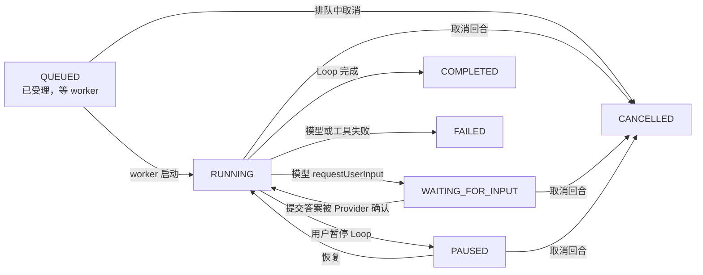
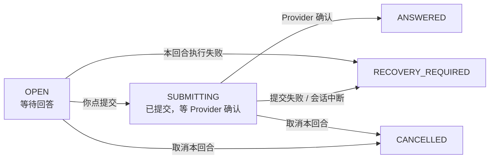
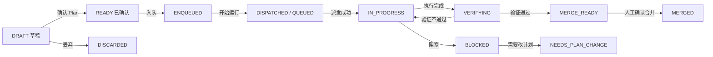
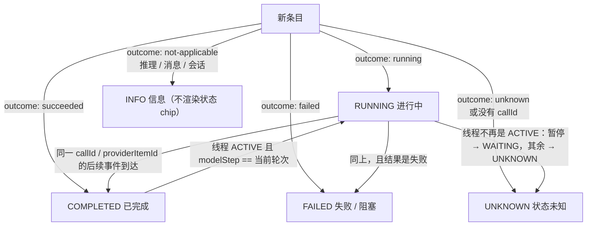
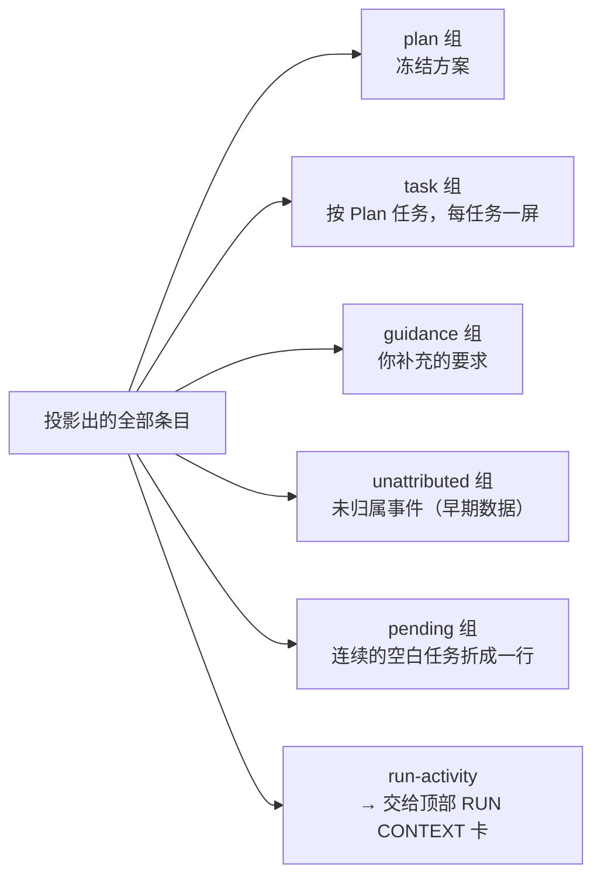
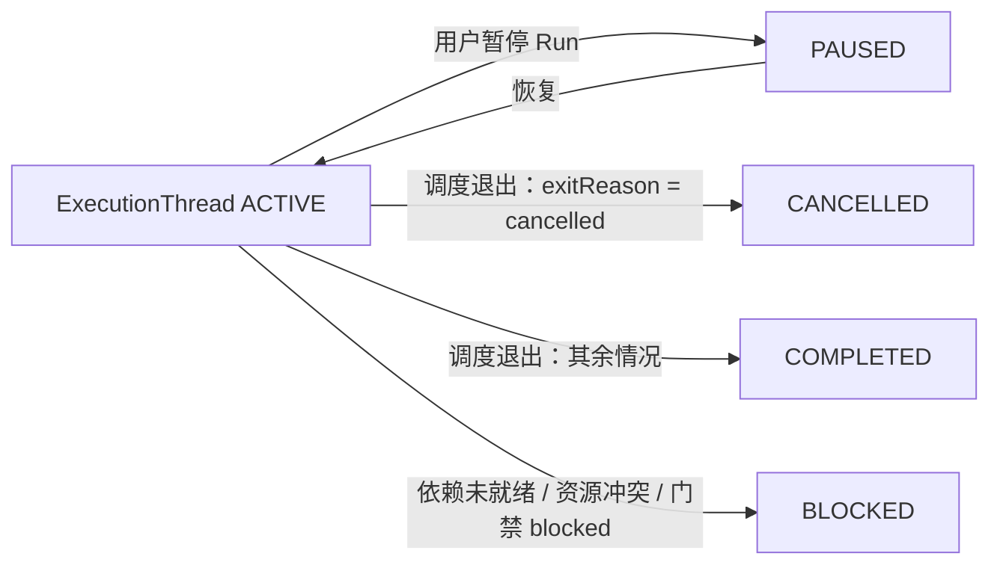
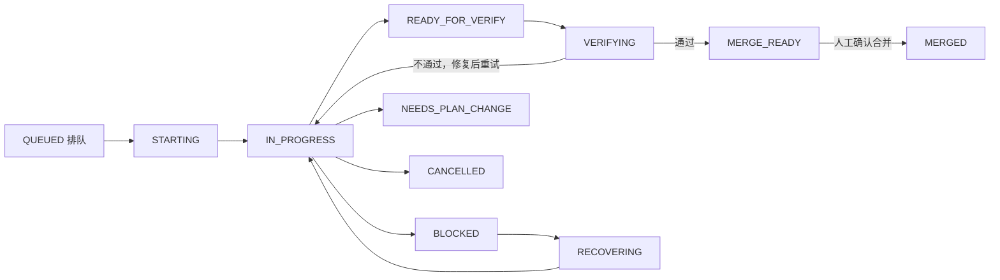
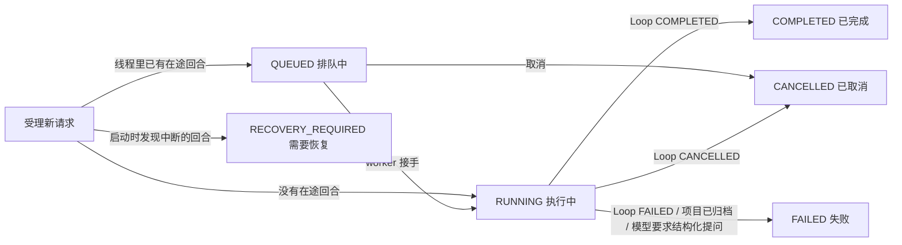
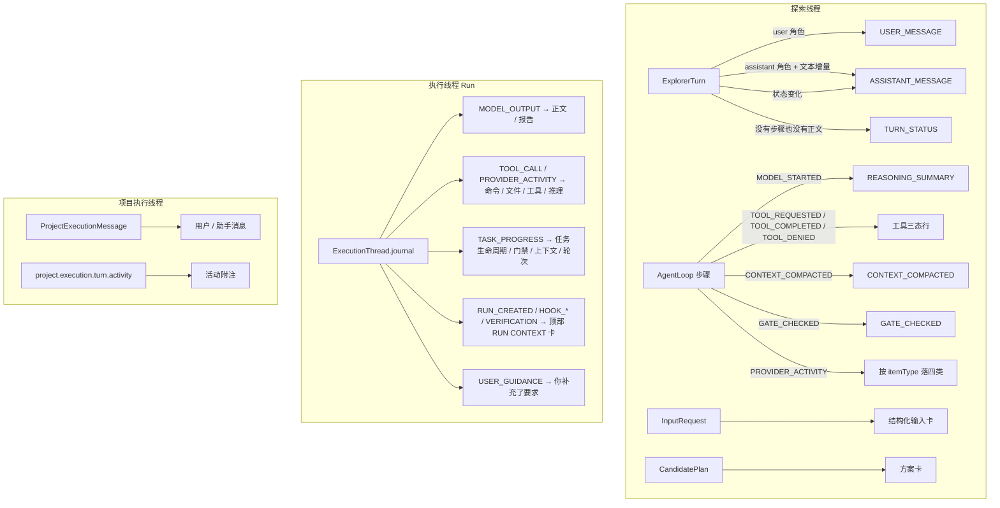
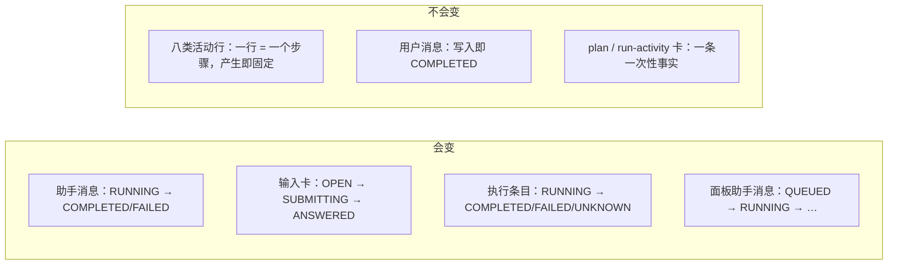

# 消息类型及事件状态机流程图

> 一份**以实现为准**的清点：探索线程与执行线程的对话框里一共有多少种消息类型，每一种是干什么用的、什么时候会出现、由哪个组件渲染，以及有多态的类型的完整状态机。
>
> 代码基线：分支 `main-artechure-switch-claude`。行号会随改动漂移，符号名不会。
> 关键文件：`code/apps/web/src/utils/explorerPresentation.ts`、`utils/executionStream.ts`、`views/ExplorerView.vue`、`views/RunDetailView.vue`、`components/ProjectExecutionThreadPanel.vue`；领域侧 `packages/domain/src/explorer/explorer-activity.ts`、`agent/agent-loop.ts`、`agent/executor-agent.ts`、`agent/project-execution-thread.ts`。

---

## 0. 两个对话框 + 探索视图的一个模式

能发消息的界面一共三处，但**只有 A、B 是并列的对话框**，C 是探索视图自己的一个模式——
这个区别很要紧，因为 C 在一列抽屉/标签页里是找不到的：

| # | 界面位置 | 怎么进去 | 组件 | 数据源 | 消息类型数 |
|---|---|---|---|---|---|
| A | **探索对话** · 共享抽屉的「探索对话」tab | 左栏「探索」→ 需求清单里点某个需求的「探索中」 | `ExplorerView.vue` 的 `.timeline` | `ExplorerActivityItem` + `ExplorerInputRequest` + `Plan` | **14** |
| B | **Run 执行会话** ·「EXECUTION CONVERSATION」 | 需求抽屉的「Run」页签，或 Run 详情页 | `RunDetailView.vue` 的 `.execution-conversation` | `ExecutionThread.journal` → `projectExecutionJournal()` | **17** |
| C | **项目执行线程** · 探索视图的**模式** | 左栏「探索」面板**顶部第一项**「项目执行线程 · 在项目目录中直接执行」 | `ProjectExecutionThreadPanel.vue` | `ProjectExecutionMessage` + activity 事件 | **2 类消息** ×6 状态 + 3 种活动行 |

合计 **31 种**消息类型（A + B；C 是另一套更简单的模型，单列在 §3）。

**C 为什么算"模式"而不是第三个对话框**：它是同一个 `ExplorerView` 在路由参数
`?workspace=project-execution` 下的另一种形态——中间对话区换成面板、右侧需求面板隐藏、**连共享抽屉都不渲染**
（模板里抽屉写的是 `v-if="!projectExecutionMode"`）。它复用同一个左栏，所以入口就在左栏里，而不是某个新标签页。
点左栏线程清单里任意一个线程即可退出该模式（`explorerRouteQuery` 会删掉 `workspace` 参数）。

A 与 B 已经做到「**消息类型 → 呈现档位**只由一张表决定」，视图不自己判断某类要不要显示；C 还没有这张表。

| 界面 | 清单表 |
|---|---|
| A | `EXPLORER_DISPLAY_MODES`（`card` / `tool` / `reasoning` / `divider` / `gate` / `turn-status` / `hidden`） |
| B | `EXECUTION_DISPLAY_MODES`（`card` / `line` / `folded` / `hidden`） |
| C | 无（按角色 + 状态渲染，活动行在 `activityLabel()` 里分三支） |

---

## 1. 探索线程（对话框 A）：14 种

时间线由 `buildExplorerTimeline()` 把两样东西合成一条：**活动条目**、**结构化输入卡**。渲染时按 `EXPLORER_DISPLAY_MODES` 过滤，再按行型分流。

### 1.1 清单表

| # | 类型 | 档位 | 作用 | 什么时候出现 |
|---|---|---|---|---|
| 1 | `USER_MESSAGE` | `card` | 你发出的那条需求描述 | 你每次发送消息 |
| 2 | `ASSISTANT_MESSAGE` | `card` | Plan Explorer 的正文 | 模型每产出一段文本 |
| 3 | `candidate-plan` | `card` | 助手消息里**内嵌**的候选方案卡 | 该回合产出了 Plan 且绑定到这条消息 |
| 4 | `input-request` | `card` | 结构化输入卡（提问 + 回答 + 当前状态） | 模型用原生 requestUserInput 反问 |
| 5 | `REASONING_SUMMARY` | `reasoning` | 模型在思考 / Provider 的推理流 | `MODEL_STARTED` 步骤，或 `itemType` 含 reason 的 Provider 活动 |
| 6 | `TOOL_STARTED` | `tool` | 一次工具调用开始了 | `TOOL_REQUESTED` 步骤，或 Provider 活动 `phase: started` |
| 7 | `TOOL_COMPLETED` | `tool` | 一次工具调用结束了 | `TOOL_COMPLETED` 步骤，或 Provider 活动 `phase: completed` |
| 8 | `TOOL_DENIED` | `tool` | 工具被策略拒绝 | `TOOL_DENIED` 步骤 |
| 9 | `MCP_ACTIVITY` | `tool` | MCP 工具的调用 | Provider 活动的 `itemType` 含 `mcp` |
| 10 | `CONTEXT_COMPACTED` | `divider` | 上下文在这里被压缩了一轮 | 每轮 Loop 结束时写一条 |
| 11 | `GATE_CHECKED` | `gate` | 终止门禁的判定结论 | 每轮模型步骤结束后 |
| 12 | `TURN_STATUS` | `turn-status` | 回合状态占位行 | 回合既没有步骤也没有正文时 |
| 13 | `INPUT_REQUIRED` | `hidden` | 结构化输入的生命周期行 | `INPUT_REQUIRED` 步骤 |
| 14 | `INPUT_RESOLVED` | `hidden` | 同上，回答完成 | `INPUT_RESOLVED` 步骤 |

> 13、14 被 4 取代：投影层在存在输入卡时就不产出这两行（`buildExplorerTimeline`），表里标 `hidden` 是兜底。
>
> 曾经还有第 15 种 `plan-created`（游离方案卡），只在"方案没绑到任何助手消息"时出现；现代代码里绑不上是不可能的，已删除——见 §5 最后一条。

### 1.2 逐个：含义、呈现、示例

**① `USER_MESSAGE` — 你发的消息**
- **含义**：`ExplorerTurn` 里 `role: "user"` 的那条，原文照存。
- **组件**：`<article class="message-card user-message">`，内部是一个 `<button class="user-message-summary">`（首行标题 + 其余行合成的预览，点「展开」才渲染完整 `MarkdownMessage`）。左侧 `LS` 头像，整卡右对齐（`margin-left: auto`）。

```
                                        LS  把探索侧那 8 类活动各行拉开呈现
                                             16:00                    展开 ▾
```

**② `ASSISTANT_MESSAGE` — Plan Explorer 的正文**
- **含义**：模型在一个回合里的输出。相邻的文本增量合并成一条；中间夹了工具/门禁等步骤就另起一条。
- **组件**：`<article class="message-card assistant-message">` + `MarkdownMessage`（`streaming` 时带打字动效）。状态 chip 三态：`Running` / `Read only` / `Failed`。正文先过 `readableAssistantText()` 剥掉 Plan 协议块。

```
●  Plan Explorer   [Read only]   16:01
   先看现有的活动投影，再决定每类各摆什么。
```

**③ `candidate-plan` — 内嵌候选方案卡**
- **含义**：这条助手消息产出的 Plan 契约摘要。
- **组件**：助手消息内的 `<div class="inline-plan-card">`，眉标 `CANDIDATE PLAN · REVISION n`，带 `.candidate-stats` 四格统计和 `View full plan` / `Confirm plan` 按钮。

```
   CANDIDATE PLAN · REVISION 3                        [DRAFT]
   探索侧活动行分档
   执行步骤 4 │ Scope entries 2 │ Verification 1 checks │ Merge Human review
   [View full plan]  [Confirm plan]
```

**④ `input-request` — 结构化输入卡**
- **含义**：模型反问 + 你的回答 + 这一问当前的状态，三者合成一张卡，按**提问时间**插进时间线（回答时间只显示在卡内）。
- **组件**：`<article class="input-request-card timeline-input-request">` + `.input-stream-questions`；有待答问题时行尾出现「回答」按钮，点开 `ExplorerInputDialog`（固定尺寸 `el-dialog`）。

```
✔  Plan Explorer input   [Answered]
   问题生成 10:02    回答提交 10:04
   本轮结构化问题与回答已按原始时间线保留。
   问题与回答
   1  Goal   What should we build?      回答：A
```

**⑤ `REASONING_SUMMARY` — 推理行**
- **含义**：模型在思考，或 Provider 的推理流。是背景音，不是内容。
- **组件**：`<article class="timeline-note">`，一个圆点 + 一行灰字，`RUNNING` 时圆点脉冲；超长截断，无边框无卡片。
- **没有说明时**：Provider 没给摘要的行**退回标签**，显示成 `Reasoning  16:02`——纯文本行空着就只剩一个点和时间，那样比补一句占位句更糟。

```
·  Plan Explorer started step 2.                              16:02
·  Reasoning                                                  16:03
```

**⑥⑦⑧⑨ 工具 / MCP 行**
- **含义**：一次调用。`TOOL_STARTED` 是开始、`TOOL_COMPLETED` 是结束、`TOOL_DENIED` 是被策略拒绝、`MCP_ACTIVITY` 是 MCP 服务端的调用。
- **组件**：`<article class="loop-activity-card activity-tool">`，图标盒 + 标签 + **工具名 chip** + 时间 + 状态 chip + 正文 + 灰色调用 id 尾巴。拒绝与门禁是警告图标，完成是成功图标。
- **没有说明时**：Provider 只报了"有这么一次调用"、没给摘要的行，**正文留空**——名字与调用 id 已经说清了，不补"Provider activity completed."这种句子（见 §5）。

```
⚙  Tool started  read_file    16:04  [Running]
   call-read-1

✓  Tool completed             16:05  [Completed]
   call-read-1

⚠  Tool denied  shell         16:06  [Failed]
   策略不允许写仓库目录以外的文件。
   call-write-1

ⓘ  MCP activity  github/create_issue  16:07  [Completed]
   已创建 issue #42：活动行需要各自成行
   item-mcp-1
```

**⑩ `CONTEXT_COMPACTED` — 分隔行**
- **含义**：Loop 把上下文压缩后继续。它是会话边界，不是事件。
- **组件**：`<article class="timeline-divider">`，左右两条横线夹一个标签 + 时间。

```
—————————  CONTEXT CHECKPOINT · 18 messages  —————————  16:10
```

**⑪ `GATE_CHECKED` — 门禁判定行**
- **含义**：Factory 自己的终止门禁对这一轮的判定（`complete` / `continue` / `blocked`），决定 Loop 是结束、再跑一轮、还是阻塞。
- **组件**：`<article class="loop-activity-card activity-gate">`，左侧带一道竖线，判定动作单独占一格。

```
│ ⚠  Gate checked  blocked    16:09  [Failed]
│    连续两步没有进展，停下等人确认。
```

**⑫ `TURN_STATUS` — 回合状态行**
- **含义**：回合既没有步骤也没有正文时的占位（“模型正在处理 / 等待输入 / 排队中”），或 `MODEL_COMPLETED` 步骤。
- **组件**：`<article class="loop-activity-card activity-turn-status">`，虚线边框、透明底，比工具行更淡。

```
ⓘ  Turn status   16:12  [Completed]
   The model step completed.
```

### 1.3 状态机

探索侧只有**两类**消息真的会「变」：助手消息与结构化输入卡。八类活动行是**一次性的投影**——一条 Loop 步骤产出一行，状态在产生时就固定，不会再迁移（同一件事出现第二行，是又发生了一次）。理解这一点，下面的图才有意义。

#### A. 助手消息（由 `ExplorerTurn.status` 驱动）

回合状态存在 `ExplorerTurn` 上，投影时由 `assistantActivityStatus()` 折成活动行的 4 档 chip。



| 回合状态 | 卡片 chip | 触发条件 |
|---|---|---|
| `QUEUED` | `Waiting` | 回合已受理但 worker 还没接手 |
| `RUNNING` | `Running` | 开始执行；也是「等待输入结束」的回归态 |
| `WAITING_FOR_INPUT` | `Waiting` | 模型发起结构化提问 |
| `PAUSED` | `Running` | 用户暂停 Loop |
| `COMPLETED` | `Read only` | Loop 正常结束 |
| `FAILED` | `Failed` | 模型调用失败 / 启动恢复判定为中断 |
| `CANCELLED` | `Read only` | 用户取消 |

> 注意 `PAUSED` 在界面上仍显示 `Running`——`assistantActivityStatus` 只把它归到 4 档里的 RUNNING，暂停感只体现在头部状态卡。

#### B. 结构化输入卡（5 状态 + 1 个客户端伪状态）



| 状态 | 卡片文案 | 触发条件 | 下一个状态 |
|---|---|---|---|
| `OPEN` | Waiting for answer | 模型提问，写入 `input_requests` | `SUBMITTING` / `CANCELLED` / `RECOVERY_REQUIRED` |
| `SUBMITTING` | Submitting | 你提交答案，服务端标记 | `ANSWERED` / `RECOVERY_REQUIRED` / `CANCELLED` |
| `ANSWERED` | Answered | Provider 确认收到答案 | 终态 |
| `CANCELLED` | Cancelled | 取消回合（`cancelTurn`） | 终态 |
| `RECOVERY_REQUIRED` | Recovery required | 提交失败、回合失败、或启动时发现未闭合请求 | 终态（需人工恢复） |

另外有一个**不落库的客户端状态**：提交后、服务端还没变 `SUBMITTING` 之前，前端用 `inputAnswerInFlight` 抢先显示 `Submitting`（`inputStatusLabel` 的第二个参数）。它只存在于浏览器内存，刷新即消失。

#### C. 八类活动行：为什么没有状态机

| 类型 | 状态集合 | 说明 |
|---|---|---|
| `REASONING_SUMMARY` | RUNNING / COMPLETED | `MODEL_STARTED` 给 RUNNING，Provider 活动按 phase |
| `TOOL_STARTED` | RUNNING | 一次事实 |
| `TOOL_COMPLETED` | COMPLETED | **另一行**，不是上一条的迁移 |
| `TOOL_DENIED` | FAILED | 一次事实 |
| `MCP_ACTIVITY` | RUNNING / COMPLETED | 按 phase |
| `CONTEXT_COMPACTED` | COMPLETED | 一次事实 |
| `GATE_CHECKED` | COMPLETED / FAILED | `action: blocked` → FAILED，其余 → COMPLETED |
| `TURN_STATUS` | RUNNING / WAITING / FAILED / COMPLETED | 由回合状态或 `MODEL_COMPLETED` 决定 |

**「工具调用」这个概念的完整生命周期是 `TOOL_REQUESTED → TOOL_COMPLETED` 两个步骤，但在会话里是两行、彼此独立。** 执行侧（对话框 B）按 `callId` 把它们合并成一条，探索侧没有——这就是为什么同一个工具会占两行。

#### D. 方案卡（`candidate-plan`）

卡片本身无状态机，它显示的是 **Plan 的生命周期状态**（右上角 el-tag）。这个状态由多个写入点推进（`updatePlanStatus` 只是带 `fromStatus → toStatus` 事件写库，**没有集中的转换表**）：



卡片上还会因 Plan 是「对话产物」而多一条警告（`candidate-notice`）：这种 Plan 确认后仍不能入队执行。

> 上图只是主路径。`PlanStatus` 的完整取值是：`DRAFT` / `DISCARDED` / `DESIGNED` / `PLANNED` / `READY` / `ENQUEUED` / `DISPATCHED` / `QUEUED` / `IN_PROGRESS` / `VERIFYING` / `MERGE_READY` / `MERGED` / `BLOCKED` / `NEEDS_PLAN_CHANGE`——因为**没有集中的转换表**，中间几个状态由各自的写入点直接落库，读代码时不要假设上图的边是唯一路径。

> **已修 #1：方案卡曾经只在方案处于 `DRAFT` 或 `READY` 时出现。** 入队 / 派发之后卡片会从聊天流里
> 消失——不是被删了，是它压根进不了绑定表。链路是：
>
> 1. `allPlans` = candidate ∪ confirmedPlans ∪ enqueued ∪ dispatched；
> 2. `/confirmed-plans` **只返回 `status === "READY"`** 的 plan（服务端筛一次，web 又筛一次），
>    所以过了 READY 的 plan 只能从 `enqueued` / `dispatched` 两个桶进来，而这两个桶都来自 `/plans`；
> 3. `/plans` 的行由 `plan/service.ts` 的**查询投影路径**拼出（`decoratePlanRows` 只做 `...row`），
>    而查询投影表没有 `explorer_plan_id` 这一列，那条路径**没有复制 `explorerPlanId`**
>    ——同一个文件里从 `store.listPlans()` 出发的那条构造函数是复制的；
> 4. web 侧 `belongsToExplorerPlan(plan.explorerPlanId, activeExplorerPlanId)` 拿到 `undefined` 判否，
>    plan 被挡在 `activeTaskPlans` 之外 → `planBindings` 为空 → 助手消息里那张卡不渲染。
>
> **修法**：那一行里 `plan` 已经取到了，顺手带上 `plan.explorerPlanId`。**定位与修复都实测过**——
> 修前 `/plans` 返回的四条 MERGE_READY plan **连这个键都没有**，那条已合并的需求渲染 0 张卡；
> 修后四条都带上了值，同一需求渲染出 1 张 `CANDIDATE PLAN`。（`/confirmed-plans` 那批行一直是
> 完整的 `CandidatePlan` 对象，所以 READY 的方案从来不受影响。）

---

## 2. 执行线程（对话框 B）：Run 执行会话 — 17 种

时间线不是「一条条事件」，而是 `projectExecutionJournal()` 对 `ExecutionThread.journal` 的**投影**：合并重复、按 `callId` 合并工具调用、把 Provider 原生词翻成中立类别，再按 Plan 任务分组。

### 2.1 清单表

| # | 类型 | 档位 | 作用 | 什么时候出现 | 渲染组件 |
|---|---|---|---|---|---|
| 1 | `plan` | `card` | 冻结方案摘要 | 每个 Run 一条（投影时前置） | `Plan 卡 + MarkdownMessage + 展开摘要` |
| 2 | `model-prose` | `card` | Executor 在做什么、发现了什么 | `MODEL_OUTPUT` 里没有执行报告标记 | `MarkdownMessage` |
| 3 | `model-report` | `card` | 结构化完成报告 | `MODEL_OUTPUT` 带 `<pipeline-factory-execution-report>` | `MarkdownMessage` |
| 4 | `guidance` | `card` | **你**在执行线程里发的消息 | `USER_GUIDANCE` | `MarkdownMessage` |
| 5 | `command` | `line` | 跑了一条命令 | Provider 活动 `activityKind: command` | 活动行（标题 + `detail`） |
| 6 | `file-change` | `line` | 改动了文件 | Provider 活动 `activityKind: file-change` | 同上 |
| 7 | `tool` | `line` | 工具 / MCP 调用 | Provider 活动 `tool`/`mcp`，或 `TOOL_CALL` | 同上 |
| 8 | `reasoning` | `folded` | 模型的推理摘要 | Provider 活动 `activityKind: reasoning` | `details` 折叠列表 |
| 9 | `provider-message` | `hidden` | Provider 回显的用户消息 | Provider 活动 `activityKind: message` | 不渲染 |
| 10 | `session` | `hidden` | Provider 会话重建 | Provider 活动 `activityKind: session` | 不渲染 |
| 11 | `task-lifecycle` | `line` | 任务开始 / 完成 / 阻塞 | `TASK_PROGRESS` 的 `task-lifecycle`、`task-status` | 活动行 |
| 12 | `gate` | `folded` | 执行门禁判定与暂停/恢复 | `agent.gate.checked`、`paused`、`resumed` | `details` 折叠列表 |
| 13 | `context` | `folded` | 上下文压缩、旧版修订提示 | `agent.context.compacted`、`legacy_plan_revision` | `details` 折叠列表 |
| 14 | `loop` | `folded` | 模型轮次开始 / 结束 | `agent.step.started`、`agent.model.completed` | `details` 折叠列表 |
| 15 | `run-activity` | `card` | Run 级事件：创建、钩子、验证 | `RUN_CREATED` / `HOOK_*` / `VERIFICATION` | **不在会话里**，渲染在顶部 RUN CONTEXT 卡 |
| 16 | `unclassified` | `folded` | 认不出来的活动 | 未知 `itemType` 或未知 journal 类型 | `details` 折叠列表 |
| 17 | `recovery` | `card` | 阻塞、取消、需要恢复 | `RECOVERY`、`state: BLOCKED/CANCELLED` | 活动行（红） |

> **第 15 类要在入口处理解**：`run-activity` 的判定是「`kind === "activity"` 且**没有** taskId」，这些条目被 `RunDetailView` 从会话里滤掉，交给头部 `ExecutionHeaderStatus` 的「Run 级活动」一节。所以它虽然是一类消息，却不在对话框中。

### 2.2 逐个示例

```
PL  Plan received                          16:00  [已完成]
    把探索侧那 8 类活动各行拉开呈现
    4 tasks │ 3 acceptance criteria │ 1 verification commands
    [展开 Plan 摘要]  [View full plan]

EX  执行说明                                16:01  [进行中]
    先读一遍现有的活动投影，再决定每一类各摆什么。

EX  执行报告                                16:04  [已完成]  详情
    八类已各自成行。
    Completed 4 task(s) · 5 changed path(s)

LS  你补充了要求                            16:05  [已完成]
    不要动 styles.css 的既有行。

·   命令 · pnpm --filter @pipeline-factory/web test   16:06  [已完成]
    执行成功
·   文件变更 · apps/web/src/utils/explorerPresentation.ts  16:07  [已完成]
·   工具调用 · read_file · Provider              16:08  [已完成]
    Turn #1 · Call call-1

▸ 3 条过程记录
   16:01  模型轮次 · #1        模型轮次已结束
   16:02  推理 · 对照档位表      执行成功
   16:03  Execution gate      blocked · PATH_OUTSIDE_SCOPE
```

### 2.3 状态机

#### A. 消息条目状态（6 档）

条目的状态**不是运行时字段**，而是投影时由 `(journal, threadState)` 算出来的纯函数。所以「状态机」表现为一组**重算规则**：



三条容易看漏的规则：

1. **RUNNING → COMPLETED/FAILED 靠合并**：`TOOL_CALL` 与 `PROVIDER_ACTIVITY` 按 `callId` / `providerItemId` 找同一条，后到的状态覆盖先到的。
2. **RUNNING → UNKNOWN 只在线程非 ACTIVE 时发生**：这是「Loop 已经停了，这条调用没记录结束」的诚实表达，不是失败。唯一例外是 `loop` 类条目：PAUSED 时给 `WAITING`。
3. **反向的 RUNNING 是乐观标注**：线程仍 ACTIVE 且条目属于当前 `modelStep` 时，模型条目被现标成 RUNNING。

#### B. 对话分组（5 种分组头）

会话不是平铺的，而是先分组再渲染：



task 组头是折叠开关，显示「N 条 / N 条过程记录」；`folded` 档的条目折进组尾的 `details`。

#### C. 上层：ExecutionThread 与 Run

会话条目的状态最终由这两层驱动。



写入点只有两处：`scheduler.setThreadState()`（暂停、恢复、阻塞、退出）与 `executor-agent` 收尾时按 Run 状态同步（`READY_FOR_VERIFY → COMPLETED`、`BLOCKED → BLOCKED`、其余 → `CANCELLED`）。**BLOCKED 没有回首 ACTIVE 的边**——这正是恢复流程（`recovery-coordinator`）存在的原因。

另外：这条线上的 Executor Loop 启动时带 `allowStructuredInput: false`。模型若发起结构化提问，会被当作**能力不匹配**而阻塞（`STRUCTURED_INPUT_UNSUPPORTED`），不会停在一个没有回答入口的等待态上。



界面上方的四阶段条（准备 / 执行 / 验证 / 合并）就是按 Run 状态 + 验证结果 + Merge 状态推出来的。

---

## 3. 模式 C：项目执行线程面板

**入口与形态见 §0**：它是探索视图在 `?workspace=project-execution` 下的形态，不是独立页面，
所以在抽屉或标签页里找不到它——入口在左栏「探索」面板的顶部第一项。

这是**另一套模型**：它没有 journal 投影，直接渲染 `ProjectExecutionMessage`（只有 user / assistant 两个角色），活动作为附注挂在所属助手消息下面。

### 3.1 清单

| 类型 | 作用 | 什么时候出现 | 组件 |
|---|---|---|---|
| 用户消息 | 你在项目根目录下达的请求 | 每次提交 | `<article class="project-execution-message user-message">` + Markdown |
| 助手消息 | 模型的回应 + 本轮活动附注 + 取消按钮 | 每次提交产生一条 | 同上 + `.project-execution-activities` + `取消本轮` 按钮 |
| 活动附注 | 本轮里发生的工具 / 输入事件 | 收到 `project.execution.turn.activity` 事件 | `.project-execution-activity`（圆点 + 一行字） |

活动附注只有 **3 个渲染分支**（`activityLabel()`）：取 `title` → 取 `summary` → `agent.tool.*` 显示「工具 xxx」→ 兜底「执行进度」。没有"等待输入"那一支——见 §3.2 的说明。

```
你                                16:00
把 README 的安装步骤补上。

项目执行助手                       16:00  [执行中]
（正文流式输出中…）
• 命令        pnpm install
• 工具completed
• 执行进度
[取消本轮]
```

### 3.2 状态机（助手消息，6 状态）



| 状态 | chip 文案 | 触发条件 | 下一个状态 |
|---|---|---|---|
| `QUEUED` | 排队中 | 受理时线程里已有在途回合（同线程串行） | `RUNNING` / `CANCELLED` |
| `RUNNING` | 执行中 | 受理时无在途；或 worker 接手排队项 | `COMPLETED` / `FAILED` / `CANCELLED` |
| `COMPLETED` | 已完成 | Loop 正常结束 | 终态 |
| `FAILED` | 失败 | Loop 失败、项目已归档/不存在、**或模型要求结构化提问** | 终态 |
| `CANCELLED` | 已取消 | 用户取消 | 终态 |
| `RECOVERY_REQUIRED` | 需要恢复 | 进程重启时发现有 `RUNNING` 的回合 | 终态 |

> **没有 `WAITING_FOR_INPUT`**：这条线没有回答入口（API 只有提交 / 取消 / 偏好三条路由），
> 挂进"等待输入"就是把回合停在一个永远等不到答案的状态上。所以它启动 Loop 时传
> `allowStructuredInput: false`，模型真要提问时 Loop 直接以 `STRUCTURED_INPUT_UNSUPPORTED`
> 阻塞，回合以 FAILED 收尾——**至少看得见、取消得掉**。

---

## 4. 汇总：三张总图

### 4.1 一条消息从哪来、到哪去



### 4.2 所有多态类型一览

| 对话框 | 类型 | 状态数 | 状态集合 | 由谁驱动 |
|---|---|---|---|---|
| A | 助手消息 | 4 档 chip（7 个原始状态） | Running / Waiting / Read only / Failed | `ExplorerTurn.status` |
| A | 结构化输入卡 | 5 | OPEN / SUBMITTING / ANSWERED / CANCELLED / RECOVERY_REQUIRED | `input_requests` |
| A | 工具行 | 2–3 | Running / Completed / Failed | 步骤类型固定 |
| A | 方案卡 | 12 | Plan 生命周期状态 | `CandidatePlan.status` |
| B | 全部条目 | 6 | 进行中 / 已完成 / 失败 / 等待中 / 信息 / 状态未知 | journal + threadState 重算 |
| B | 分组头 | 5 | plan / task / guidance / unattributed / pending | 投影分组 |
| B | ExecutionThread | 5 | ACTIVE / PAUSED / BLOCKED / CANCELLED / COMPLETED | Run 控制 |
| B | Run | 11 | QUEUED … MERGED + BLOCKED / NEEDS_PLAN_CHANGE / STALE / RECOVERING / CANCELLED | 执行引擎 |
| C | 助手消息 | 6 | 排队中 / 执行中 / 已完成 / 失败 / 已取消 / 需要恢复 | `ProjectExecutionMessage.status` |
| C | 活动附注 | 4 分支 | title / summary / input_required / agent.tool.* | 事件载荷 |

### 4.3 一条消息的状态迁移能力（关键差异）



**这条差异是所有呈现决策的前提**：只有「会变」的类型值得为它设计过渡态（脉冲、等待、重连提示）；「不会变」的类型每次都是新行，重复出现要靠合并或折叠来解决，而不是靠状态。

---

## 5. 附录：清点出来的空转项（已清理）

做这份清点时发现 8 处「声明了但没有生产者 / 到不了 / 不该编」的东西，已一并清掉：

| 项 | 位置 | 处理 |
|---|---|---|
| `AUTO_RESOLVED` | `ExplorerInputRequestStatus` | **删除**——类型、界面文案、样式类都写好了，全仓没有任何写入点 |
| `REPAIR` / `COMMIT` | `JournalEntryType` | **删除**——没有写入点；真出现只会掉进执行会话的 `unclassified` |
| `suspend` | `GateDecision` | **删除**——没有任何门禁返回它，Loop 也没有对应分支 |
| `WAITING_FOR_INPUT` 的两条死路 | `ProjectExecutionTurnStatus` + Run 的 executor Loop | **删除状态**，并让**两处**启动 Loop 时都带 `allowStructuredInput: false`（`project-execution-thread` 与 `executor-agent` 的两个入口）：模型真要提问时直接以 `STRUCTURED_INPUT_UNSUPPORTED` 阻塞，回合/循环以 FAILED 收尾 |
| `TaskLifecycleCard.vue` | `apps/web/src/components/` | **删除**组件、它的测试和配套 CSS——只有自己的测试引用 |
| `buildExplorerMessageTimeline()` | `utils/explorerTimeline.ts` | **删除**函数、类型与测试——定义了「消息 / 提问 / 回答」三态导航，没有调用方 |
| `Provider activity started.` / `completed.` | `explorer-activity.ts` 的 `PROVIDER_ACTIVITY` 分支 | **删除占位句**——Provider 没给摘要时改交**空串**。那两句把"有没有摘要"这个可判定的事实，变成了一句要靠字符串识别才能认出的文案，而它本身什么都没说 |
| `plan-created`（游离方案卡） | `EXPLORER_DISPLAY_MODES` + 时间线投影 + 卡片模板 | **删除**——见下 |

**最后一条单独说明，因为它的判据不是"没有写入点"，而是"这个状态已经到不了"：**

方案卡绑到哪条助手消息，判据是 `planTimeline.ts` 的 `planActivityBindings`：Plan 要有 `sourceTurnId`，
且那个回合里要有一条 title 相同、`status === READY` 的 `planProtocol` 活动。而领域侧写 plan 时
（`thread-service.ts` 的 `finalizeExplorerLoop` → `createCandidatePlan` / `reviseCandidate`），
**标题与 `sourceTurnId` 都来自同一次协议解析**——`reviseCandidate` 更是每次都用新回合原地改写这两个字段。
三条创建路径（新建、修订、确认修订草稿）都满足绑定条件，`createCandidatePlan` 全仓也只有一个调用方、
必然带上 source。所以"绑不上"只可能出现在 `source_turn_id` 这一列还不存在的年代
（`sqlite-store.ts:570` 有一次 `ALTER TABLE candidate_plans ADD COLUMN source_turn_id`，说明那批老数据确实存在过）。

实测：本机库里 **21 个候选计划，0 个绑不上**（按上面对齐领域逻辑的规则，用 `agent_loop_steps`
里的文本增量复原回合文本后逐条比对）。既然那条卡片一次都不会出现，它连同
`buildExplorerTimeline` 的第三个参数、`useExplorerTimeline` 的 `detachedPlans`、
模板里的 `PLAN CREATED` 分支与配套 CSS 一起删掉了。

代价：极老的库里若真有 `source_turn_id` 为空的 plan，它在聊天流里不再有卡片——但它仍然出现在右侧的
候选 / 已确认等列表里，确认与入队也照常点得到，功能没有少。

顺带清掉的第 9 处：`explorerPresentation.inputRequestTarget()` 与 `explorerTimeline` 里的同名函数是**重复定义**，前者只被自己的测试引用。

对最后一条的配套处理：空串在呈现层表示"没有可说的"——工具行本来就靠名字 + 调用 id 说清了，
推理行是纯文本行，空着只剩一个点和时间，所以**退回标签**顶上（见 §1.2 ⑤）。

> 顺带记一条**现在只有探索线程能做的事**：结构化提问（`turn.input.required`）只在这一个对话框里
> 有回答入口。Run 执行会话与项目执行线程都把 `allowStructuredInput` 传成 `false`，模型在那两处
> 发起提问会被当作一次明确的能力不匹配而阻塞，不会留在"等待输入"上。

---

## 6. 附：V1 兼容路径清点

V2 的命名被扶正之后（§5 最后一条），代码里仍留着一整套 **V1 形状的读写路径**。本节把它们逐条列出来。
判据是**本机所有库里的实际数据**：

> 4 个库（本机运行库 + acceptance / dialog / routing 三个 fixture），合计 35 份候选计划、35 个 Revision：
> `contract.schemaVersion = 1` 的 **0 份**、没有 `generatedSpec` 的 **0 份**、
> `provenance = 'LEGACY'` 的 Revision **0 个**。

### 6.1 逐条清单

| # | 路径 | 位置 | 什么时候会走到 | 数据里的情况 | 处置 |
|---|---|---|---|---|---|
| 1 | `PlanContract`（V1 扁平合同，已 @deprecated） | `plan/types.ts` | —— | 没有一份是 V1 | **已删**（含 `PlanTask`） |
| 2 | `validatePlanContract`（V1 结构的运行时校验） | `plan/contract.ts` | 每次 confirm / 确认修订草稿 / 配置修订都跑 | live：校验的正是那份镜像 | **已删**（任务图校验由 `validateGeneratedPlanSpec` 承担） |
| 3 | 扁平产物解析分支 | `plan/completion.ts` | 助手文本里没有 `schemaVersion: 2` | 从未走到 | **已删** |
| 4 | `{ contract, schemaVersion: 1 }` 回退产物 | `plan/completion.ts` | 同上 | 从未走到 | **已删** |
| 5 | `defaultPlanContract`（兜底合同） | `plan/service.ts` | 建 Plan 时既无 `generatedSpec` 也无 `contract` | 只服务老路径 | **已删**：没有契约就直接拒绝建 Plan |
| 6 | **`executionContractFromResolved`（已解析契约 → V1 形状）** | `plan/service.ts` | **每次建 / 改 Plan 都走** | **live：每份 Plan 都写了这个镜像** | **已删**（B 的第二步） |
| 7 | 三处「V1 只读」闸门 | `plan/service.ts` 的 `confirm` / `enqueue` / `dispatch` | `contract.schemaVersion === 1` | 从未触发 | **已删**：没有可表达的 V1 形状，闸门成了空转 |
| 8 | 落盘回退到 V1 投影 | `plan/plan-archive.ts` | 没有 `resolvedContract` 时 | 从未走到 | **已删**：落盘只认 `resolvedContract` |
| 9 | web 的 V1 解析与摘要分支 | `utils/planProtocolDisplay.ts` | 助手文本是 V1 形状 | 从未走到 | **已删** |
| 10 | `Legacy V1 · read only` 文案 | `PlanDetailContent.vue` | 既无 `resolvedContract` 也无 `generatedSpec` | 从未走到 | **已删** |
| 11 | **V1 镜像的读取（无条件）** | `plan/query.ts` 的 `planQueryProjectionFor`：`goal` 与 `priority` | 每次落投影 / 每次查询 | **live** | **已改**：改成优先读 `resolvedContract` |
| 12 | 其余读点（优先 `resolvedContract`，缺它才回退到镜像） | `run/scheduler.ts` 的 `missingVerificationCommands`、`plan/plan-archive.ts`、`plan/contract.ts`、web 的 `utils/planContract.ts` | 没有 `resolvedContract` 时 | 从未走到 | **已删**（只剩 `resolvedContract → generatedSpec` 两层） |

### 6.2 分三类看（含本轮处置）

**A. 只为老数据存在的读取路径（1、3–5、7–10）—— 已删。**
（第 1 条的**类型**当时留下陪镜像，随 B 的第二步一起删；这里说的是它的读取路径。） 数据里归零（3 个库、35 份计划，
`schemaVersion = 1` 的 0 份），按"不再支持老库"收掉：

- 助手文本的 **V1 解析分支**：`assessPlanArtifact` 只认 `schemaVersion: 2` 的 generated spec；
  web 的 `planProtocolDisplay` 与领域侧 `explorer-activity` 是**一对镜像**，两边同步去掉各自的
  V1 字段回退——parity 测试把 V1 那一格挪进了"两边都判为非法"，比原来更能说明问题。
- web 的 **V1 契约视图**：`planContractView` 只剩 `resolvedContract → generatedSpec` 两层，
  `'Legacy V1 · read only'` 文案删掉。
- **旧数据也一并清**：启动时删除 V1 扁平合同的 CandidatePlan，连同它的 revisions / drafts /
  versions / dispatch / query 投影。**带 Run 的跳过**——`runs.plan_id` 没有外键约束，
  硬删会让 Run 指向一个不存在的 Plan。本机库上是空操作（0 份 V1）。
  这一步的实现（`pruneLegacyV1Plans`）已在 B 的第二步里删掉：它靠
  `json_extract(contract_json, ...)` 找行，列一没就没有识别依据。

**B. 仍在用的 V1 形状（2、6、11）—— 两步都已完成，镜像整个收掉。**
`contract` 字段是**已解析契约的有损投影**（`dependsOnPlanIds` 填 []、`priority` 归 0），
`executionContractFromResolved` 每次建 / 改 Plan 都重新投影它，`validatePlanContract` 每次确认都校验它。

- **第一步**：`planQueryProjectionFor` 改成优先读 `resolvedContract`——它曾是这份镜像**最后一个
  无条件读者**。顺带发现 `priority` 对当前形状**恒为 0**（模型不提供优先级），也就是说
  "按优先级排序"一直是空转，排序靠时间兜底；Plan Center 的 `priority` 排序选项因此名不副实。
- **第二步（已做）**：镜像整个删掉——类型、投影函数、兜底合同、V1 校验器、四张表的
  `contract_json` 列（老库启动时 `DROP COLUMN`），以及 domain / api / web 的约 60 处读点。
  `Plan.contract` 这个 API 响应字段没了，web 侧只剩 `resolvedContract → generatedSpec` 两层。
  `priority` 的去处：`PlanIndexRow.priority` 保留（响应形状与 `sort=priority` 选项还引用它）
  但恒为 0，dispatch 的优先级排序也一并删掉——它是空转。

  **第二步暴露的一个真问题**：`dependsOnPlanIds` 与 `dependencies` 原先共用镜像的同一个字段，
  而 `resolvePlanContract` 往 `dependencies` 里填的是模型写的**自然语言先决条件**
  （"需要 Node.js 22"）。镜像一删，这两条读点就会把先决条件当成 Plan id 去等一个不存在的 Plan
  （`dispatch-coordinator.test.ts` 的"不把 V2 自然语言先决条件当 Plan 依赖"正是这条用例）。
  处置：`ResolvedPlanContract` 新增 Factory-owned 的 `dependsOnPlanIds`（解析时恒为 `[]`，
  只有 `setDependencies` 能写），`dependencies` 保持原义。

  实测升级：拿本机运行库的副本跑一遍新 store，21 份 Plan 全部读得出契约，`contract_json` 四列成功丢弃。

  同轮还收掉了 `PlanArtifact.contract`（上一轮为了给测试夹具留入口而保留）：现在程序化调用方
  交的是 `resolvedContract`——它本来就是要执行的那份形状，不是"另一种输入"。代价是测试侧要显式
  给契约，因此新增了跨包夹具 `plan/plan-fixture.ts`（不再有兜底合同之后，造一个 Plan 必须给契约）。

**C. `revision_lifecycle_projection` 只写不读（与 V1 无关，同一类毛病）—— 已删。**
表（老库启动时 `DROP TABLE`）、5 个写入点、启动回填、两个 store 方法、类型与导出、以及 API 与 web
客户端里那个没人消费的 `lifecycle` 字段一起删。顺带修掉回填把"直接确认"的 Plan 标成 `LEGACY`
的那个 bug（实测 17 行、含前一天刚建的）。同族的 `plan_revisions.provenance` 也删了：
回填没有了之后它恒为 CURRENT、且从不参与任何分支。

**D. 旁支的 LEGACY 标记：四个都不触发，建议两删两留。**
实测：本机 3 个库、24 条 ExplorerThread、35 条 Revision、5 个项目。

| 标记 | 实测 | 建议 |
|---|---|---|
| `ExplorerThread.contextMode === "LEGACY"` | 写它的启动迁移在，但**读它的代码只有 `=== "FRESH"` 一处**；库里 0 行 | **可删**：连同那条启动 UPDATE（老行另置 `FRESH`，行为等价），或只删类型里的成员 |
| `LEGACY_AUTO_TITLES`（`records.ts`） | 0 条命中 | **建议留**：它做的是"读时把老自动标题换成占位标题"，是一行的显示兜底；它不是"读老形状"，删了只会在遇到老标题时露出垃圾标题 |
| `LEGACY_DEEPSEEK_MODEL_SLUG`（`project.ts`） | 0 个项目仍配它（迁移早已完成） | **可删**：一次性迁移，对象已不存在；留着也只是每个项目一次字符串比较 |
| `projectConfigStatus: "LEGACY"` | 0 条缺快照的 Revision | **建议留**：它表达的是"这条 Revision 没有配置快照"这个**事实**，不是版本标记；删掉会让缺快照的修订显示成 CURRENT/CHANGED，那是在说谎 |
